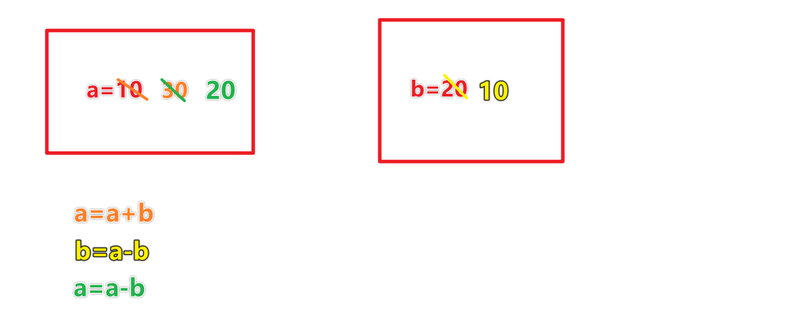
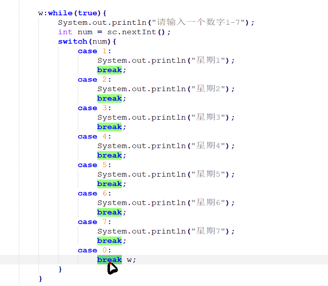
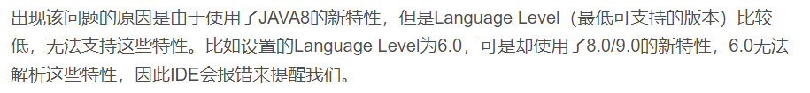
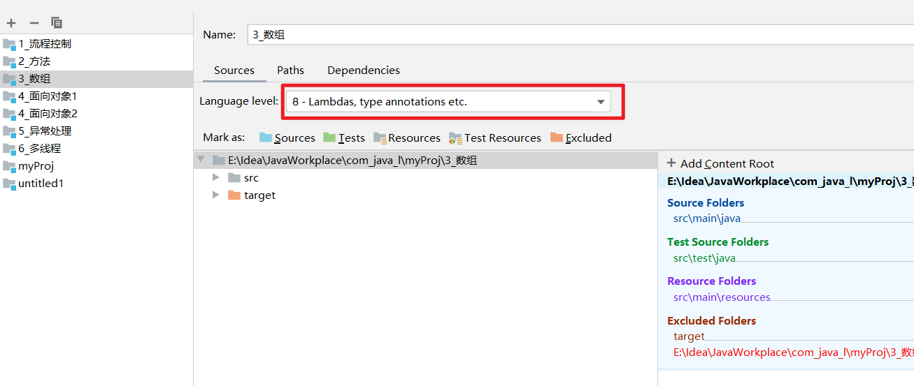

# 2.流程控制

## 交换变量的三种方法

```java
int a=10,b=20;
```

method1：

```java
int temp=a;
a=b;
b=temp;
```

method2：

```java
a=a+b;
b=a-b;
a=a-b;
```



method3：

```java
a=a^b;
b=a^b;
a=a^b;
```


## 退出循环

****

# 3.数组

## 数组的拷贝

- 遍历拷贝
- System.arraycopy()方法
- Arrays.copyOf()方法

```java
public class 数组的拷贝 {
    public static void main(String[] args) {
        int[] arr1 = {1, 21, 31, 46, 74, 56};
//        copyArray1(arr1);
        copyArray2(arr1);

    }

    //System.arraycopy()方法
    public static void copyArray1(int[] arr) {
        //目标数组
        int[] arr2 = new int[arr.length + 5];

        /*
         * src:原数组
         * srcPos：原数组的起始位置
         * dest:目标数组
         * destPos：目标数组起始位置
         *length：拷贝长度
         * */
        System.arraycopy(arr, 1, arr2, 3, 4);
        for (int i = 0; i < arr2.length; i++) {
            System.out.print(arr2[i] + "\t");
        }
    }

    //2、Arrays类提供数组拷贝方法
    public static void copyArray2(int[] arr) {
        /*
         * original:数组
         * newLength:新数组的长度
         * 返回值：返回新数组
         * */
        arr = Arrays.copyOf(arr, arr.length);
        for (int i = 0; i < arr.length; i++) {
            System.out.print(arr[i] + "\t");
        }
    }
}
```

## 数组的扩容

> 数组的扩容和缩容
>
> - 步骤1：定义一个新数组，然后新数组的长度比原数组增加或者是减小
> - 步骤2：将原来数组的元素拷贝到新数组中
> - 步骤3：将原数组的变量指向新数组

```java
public class 数组的扩容 {
    //method1，自定义遍历扩容
    public static void enlargeArray(int[] arr) {
        //定义新数组  使其长度为原数组长度+1
        int[] arr2 = new int[arr.length + 1];

        //将原数组的元素拷贝到新数组中（遍历赋值）
        for (int i = 0; i < arr.length; i++) {
            arr2[i] = arr[i];
        }

        //索引替换，将新数组的索引赋给原数组
        arr = arr2;
        for (int i = 0; i < arr.length; i++) {
            System.out.print(arr[i] + "\t");
        }
    }

    //method2，使用Arrays.copyOf()方法扩容
    public static void enlargeArrayByCopyOf(int[] arr) {

        arr = Arrays.copyOf(arr, arr.length + 1);
        System.out.println(Arrays.toString(arr));
    }

    public static void main(String[] args) {
        int[] arr = {1, 21, 31, 46, 74, 56};
        //method1
        // enlargeArray(arr);
        //method2
        enlargeArrayByCopyOf(arr);
    }
}
```


> maven中使用copyOf（）方法的错误提示：



设置Language Level大于报错提示



配置maven的pom，maven默认Module的Language Level设置为5

```xml
<build>
    <plugins>
        <plugin>
            <groupId>org.apache.maven.plugins</groupId>
            <artifactId>maven-compiler-plugin</artifactId>
            <version>3.8.1</version>
            <configuration>
                <source>1.8</source>
                <target>1.8</target>
            </configuration>
        </plugin>
    </plugins>
</build>
```


