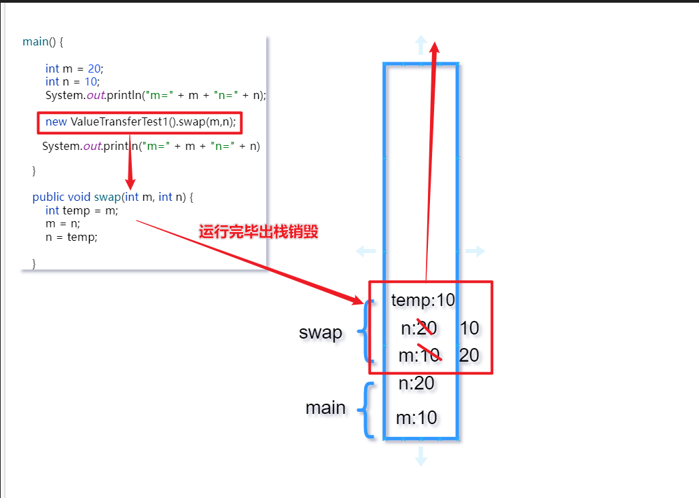
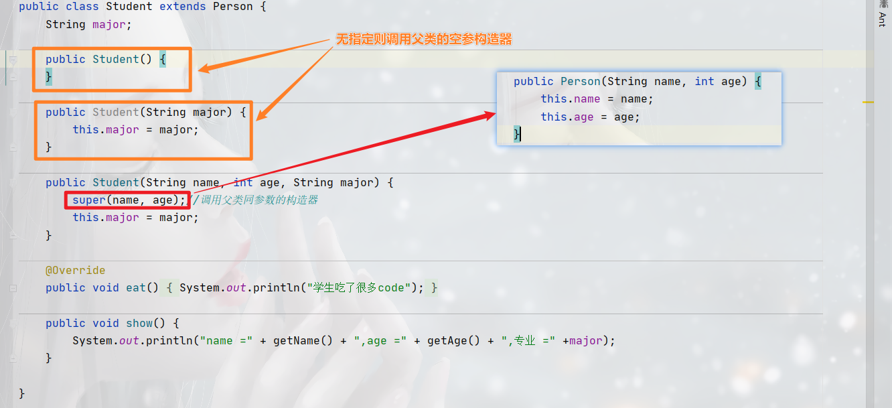

# 4.面向对象

## 一、对象的创建和使用

### 1.内存解析：


- 堆（Heap），此内存区域的唯一目的 就是存放对象实例，几乎所有的对象 实例都在这里分配内存。这一点在 Java虚拟机规范中的描述是：所有的对象实例以及数组都要在堆上分配。 
- 通常所说的栈（Stack）,是指虚拟机栈。虚拟机栈用于存储局部变量等。 局部变量表存放了编译期可知长度的 各种基本数据类型（boolean、byte、 char 、 short 、 int 、 float 、 long 、 double）、对象引用（reference类型， 它不等同于对象本身，是对象在堆内 存的首地址）。 方法执行完，自动释 放。 
- 方法区（Method Area），用于存储已 被虚拟机加载的类信息、常量、静态 变量、即时编译器编译后的代码等数 据。

```java
Person p1=new Person();
Person p2=new Person();
Person p3=p1  //没创建新对象，而是将p1的索引给p3
```


==tips:==堆中的数据不能直接去访问，只能通过一个引用地址去间接的去访问

### 2.匿名对象

>1.  创建对象时，没有显示的赋给一个变量名，即匿名对象
>2.  特征：匿名对象只能调用一次

```java
public class CircleTest {
    public static void main(String[] args) {
//        CircleArea circleArea = new CircleArea();
//        circleArea.radius = 2;
//        circleArea.calArea();
        /*匿名对象的使用*/
//        new CircleArea().radius = 2;
//        new CircleArea().calArea();
//        new CircleArea().calPerimeter();//此时运行结果为0.0，匿名对象只能调用一次
//        System.out.println(new CircleArea().radius);//radius值也为零

        new circleCalc().calc(new CircleArea());//使用circleCalc对象实现circleArea的调用，传入的参数为circleArea的匿名对象
    }
}

class circleCalc {
    public void calc(CircleArea circleArea) {
        circleArea.radius = 3;
        circleArea.calArea();
        circleArea.calPerimeter();
    }
}

class CircleArea {
    double radius;

    public void calArea() {
        System.out.println(Math.PI * radius * radius);
    }

    public void calPerimeter() {
        System.out.println(Math.PI * radius * 2);
    }
}k
```

## 二、类的属性与方法

### 1.变量的分类

> 在方法体外，类体内声明的变量称为成员变量。 
>
> 在方法体内部声明的变量称为局部变量。


*区别：*


*成员变量与局部变量的重名问题：*

- 成员变量不允许重复
- 局部变量：不同作用域可以重名
- 局部变量与成员变量重名时：遵循就近原则0

*生命周期:*

- 成员变量：跟随对象，对象，对象被销毁成员变量就被销毁
- 局部变量：方法结束即销毁

### 2.类的方法

> 对象数组内存解析

引用类型变量，只可能存储两类值：null 或地址值（含变量类型）

> *问题描述*
>
> 定义类Student1，包含三个属性：学号number(int)，年级grade(int)，成绩
> score(int)。 创建20个学生对象，学号为1到20，年级和成绩都由随机数确定。
> 问题一：打印出3年级(state值为3）的学生信息。
> 问题二：使用冒泡排序按学生成绩排序，并遍历所有学生信息
> 提示：
>
> 1) 生成随机数：Math.random()，返回值类型double;
> 2) 四舍五入取整：Math.round(double d)，返回值类型long。

```java
class Student {
    int number;
    int grade;
    int score;

    public String infoString() {
        return "学号：" + number +
                ", 年级：" + grade +
                ", 分数：" + score;
    }
}
```

```java
public class StudentTest {
    public static void main(String[] args) {
        //创建对象数组
        Student[] students = new Student[20];

        //创建学生对象
        for (int i = 0; i < students.length; i++) {
            //给数组元素赋值（每一个值即一个学生对象
            students[i] = new Student();
            //给number属性赋值
            students[i].number = i + 1;
            //年级
            students[i].grade = (int) (Math.random() * (7 - 1) + 1);
            //成绩
            students[i].score = (int) (Math.random() * (101 - 0));
        }

        System.out.println("3年级(state值为3）的学生信息。");
        for (int i = 0; i < students.length; i++) {
            if (students[i].grade == 3)
                System.out.println(students[i].infoString());
        }

        for (int i = 0; i < students.length; i++) {
            for (int j = 0; j < students.length - 1 - i; j++) {
                if (students[j].score > students[j + 1].score) {
                    //交换Studen对象
                    Student temp = students[j];
                    students[j] = students[j + 1];
                    students[j + 1] = temp;
                }
            }
        }
        System.out.println("==================");
        for (Student s : students) {
            System.out.println(s.infoString());
        }

    }
}
```

### 3.自定义数组工具类

```java
public class ArrayUtil {

    //数组的最大值
    public int getMax(int[] arr) {
        int max = arr[0];
        for (int i = 0; i < arr.length; i++) {
            if (arr[i] > max) {
                max = arr[i];
            }
        }
        return max;
    }

    //数组的最小值
    public int getMin(int[] arr) {
        int min = Integer.MAX_VALUE;
        for (int i = 0; i < arr.length; i++) {
            if (arr[i] < min) {
                min = arr[i];
            }
        }
        return min;
    }

    //数组的的总和
    public int arraySum(int[] arr) {
        int sum = 0;
        for (int i = 0; i < arr.length; i++) {
            sum += arr[i];
        }
        return sum;
    }

    //数组的平均值
    public int arrayAvg(int[] arr) {
        return arraySum(arr) / arr.length;
    }

    //反转数组
    public void reverse(int[] arr) {
        int left = 0;
        int right = arr.length - 1;
        int temp;
        while (left < right) {
            temp = arr[left];
            arr[left] = arr[right];
            arr[right] = temp;
            left++;
            right--;
        }
    }

    //复制数组
    public int[] copy(int[] arr) {
        int copyarr[] = new int[arr.length];
        for (int i = 0; i < arr.length; i++) {
            copyarr[i] = arr[i];
        }
        return copyarr;
    }

    //数组排序
    public void sort(int[] arr) {
        //冒泡排序

        for (int i = 0; i < arr.length - 1; i++) {
            int temp;
            for (int j = 0; j < arr.length - 1 - i; j++) {
                if (arr[j] > arr[j + 1]) {
                    temp = arr[j];
                    arr[j] = arr[j + 1];
                    arr[j + 1] = temp;
                }
            }
        }
    }

    //遍历数组
    public void print(int[] arr) {
        System.out.print("[");
        for (int i = 0; i < arr.length - 1; i++) {
            System.out.print(arr[i] + ", ");
        }
        System.out.print(arr[arr.length - 1] + "]\n");
    }

    //查找指定元素
    public int getIndex(int[] arr, int dest) {
        for (int i = 0; i < arr.length; i++) {
            if (dest == arr[i]) {
                return i;
            }
        }
        return -1;
    }
}
```

## 三、可变个数形参的方法

具体使用：

- 可变形参的格式：数据类型 ... 变量名

  ```java
  public void show(String... strs){}
  ```

- 当调用可变个数形参的方法时,传入参数可以是:0个,1个,2个, ...

- 可变个数形参的方法与本类方法名相同,形参不同的方法间构成重载

- 可变个数形参的方法和本类方法名相同,形参也相同的数组之间不构成重载*(可变个数形参是指上是一维数组)*.即二者不能共存

  

- 可变个数形参在方法的形参中,只能声明在末尾

  

- 可变个数形参在方法的形参中,只能声明一个可变个数形参变量

eg:可变个数形参方法传入值的遍历同一维数组

```java
public class MethodArgsTest {
    public static void main(String[] args) {
        MethodArgsTest methodArgsTest = new MethodArgsTest();
        methodArgsTest.show("aaa", "asd", "ada");
    }
    
    public void show(String... strs) {
        for (int i = 0; i < strs.length; i++) {
            System.out.println(strs[i]);
        }
    }
}
```

输出结果：


## 四、方法参数的值传递机制  

### 1.变量的赋值

>如果变量是基本数据类型，赋值的是变量所保存的数据值（传值）
>
>如果变量是引用数据类型，赋值的是变量所保存的地址值（传址）

```java
public class ValueTransferTest {
    public static void main(String[] args) {
        System.out.println("************基本数据类型************");
        int m = 10;
        int n = m;
        System.out.println("m=" + m + ",n=" + n);
        n = 20;
        System.out.println("m=" + m + ",n=" + n);
        System.out.println("************引用数据类型************");
        Order o1 = new Order();
        o1.orderId = 1001;
        Order o2 = o1;//赋值以后，o1和o2的地址相同，都指向了堆空间中的同一个对象实体。
        System.out.println("o1.orderId=" + o1.orderId + ",o2.orderId=" + o2.orderId);
        o2.orderId = 1002;
        System.out.println("o1.orderId=" + o1.orderId + ",o2.orderId=" + o2.orderId);
    }
}

class Order {
    int orderId;
}
```

基本数据类型


引用数据类型


### 2、方法形参的传递机制

> ```
> 1.
> 形参：方法定义时，声明的小括号内的参数
> 实参：方法调用时，实际传递给形参的数据
> 2.值传递机制
> 如果参数是基本数据类型，此时实参赋给形参的是，实参真实存储的数据值
> 如果参数是引用数据类型，此时实参赋给形参的是，实参保存的地址值
> ```

  ⑴基本数据类型

```java
public class ValueTransferTest1 {
    public static void main(String[] args) {

        int m = 20;
        int n = 10;
        System.out.println("m=" + m + "n=" + n);
//        int temp=m;
//        m=n; 
//        n=temp;
        new ValueTransferTest1().swap(m,n);

    }

    public void swap(int m, int n) {
        int temp = m;
        m = n;
        n = temp;
        System.out.println("m=" + m + "n=" + n);
    }
}
```



⑵引用数据类型


***案例eg1:***


> 方法1：

```java
public static void method(int a,int b){
    a=a*10;
    b=b*20;
    System.out.println(a);
    System.out.println(b);
    //直接结束程序，main方法不执行（关机）
    System.exit(0);
}
```

> 方法2：


***案例eg2:***

> 定义一个int型的数组：int[] arr=new int[]{12,3,3,34,56,77,432}:让数组的每个位置上的值去除以首位置的元素，得到的结果，作为该位置上的新值。遍历新的数组。

```java
public class Eg1 {
    public static void main(String[] args) {
        int[] arr = {12, 3, 3, 34, 56, 77, 432};
        //错误写法
//        for (int i = 0; i <arr.length; i++) {
//            arr[i]=arr[i]/arr[0];
//        }

        //方法1
        for (int i = arr.length-1; i >=0; i--) {
            arr[i]=arr[i]/arr[0];
        }
        //方法2
//        int temp=arr[0];
//        for (int i = 0; i < arr.length; i++) {
//            arr[i]=arr[i]/temp;
//        }
        System.out.println(Arrays.toString(arr));
    }
}
```

## 五、递归方法的使用

递归方法：一个方法体内调用它自身

- 方法递归包含了一种隐式的循环，它会重复执行某段代码，但这种执行无需循环控制
- 递归一定要向<u>已知方向</u>递归，否则这种递归就变成了无穷递归（死循环）

**案例eg1**

> 计算1-100所有自然数的和

```java
public int sum(int num) {
    if (num == 1) {
        return 1;
    } else {
        return num + sum(num - 1);
    }
}
```

**案例eg2**

> 已知一个数列：f(0)=1;f(1)=4,f(n+2)=2*f(n+1)+f(n),
> 其中n是大于0的整数，求f(10)的值

```java
public int method1(int n) {
    if (n == 0) {
        return 1;
    } else if (n == 1) {
        return 4;
    } else {
        return 2 * method1(n - 1) + method1(n - 2);
    }
}
```

**案例eg3**

> 计算斐波那契数列的第n个值
> f0=1,f1=1,f2=2,f3=3,f4=5

```java
public int method2(int n){
    if(n==0){
        return 1;
    }else if(n==1){
        return 1;
    }else {
        return method2(n-1)+method2(n-2);
    }
}
```

## 六、构造器

- 作用：创建对象

- 语法规则：

  - 与类名相同

    > public 类名(){ }    //无参构造方法

|      |     无参构造     |            有参构造            |
| :--: | :--------------: | :----------------------------: |
| 语法 | public 类名(){ } | public 类名(int a,String b){ } |
| 使用 |   new 类名();    |         new 类名(a,b);         |

## **七、面向对象的三大特征**

### 1.封装与隐藏

程序设计追求“高内聚，低耦合”。

- 高内聚：类的内部数据操作细节自己完成，不允许外部干涉；
- 低耦合：仅对外暴露少量的方法用于使用

封装的设计思想：

隐藏对象内部的复杂性，支队外公开简单的接口。便于外界调用，从而提高系统的可扩展性、可维护性。


#### 1.2.权限修饰符 

java规定四种权限：private、default、protected、public，用来限制对象对该类成员的访问权限

|  修饰符   | 类内部 | 同一个包 | 不同的包子类 | 同一个工程 |
| :-------: | :----: | :------: | :----------: | :--------: |
|  private  |   √    |    ×     |      ×       |     ×      |
|  default  |   √    |    √     |      ×       |     ×      |
| protected |   √    |    √     |      √       |     ×      |
|  public   |   √    |    √     |      √       |     √      |

4种权限都可以用来修饰类的内部结构：属性、方法、构造器、内部类

==tips：==

> 对于class的修饰只可以用public或default。
>
> - public可以在任意地方被访问
> - default只可以被同一个包访问

#### 1.3 JavaBean

JavaBean是一种java语言写成的可重用组件。

JavaBean是符合如下标准的java类：

- 类是公共的
- 有一个无参的公共的构造器
- 有属性且对应的get、set方法

用户可以使用JavaBean将功能、处理、值、数据库访问和其他任何可以用java代码创造的对象进行打包，并且其他的开发者可以通过内部的jsp页面、Servlet、其他的JavaBean、applet程序或者应用来使用这些对象。用户可以认为JavaBean提供了一种随时随地的赋值和粘贴功能，而不用关心任何的改变

eg:

```java
public class Customer {

    private int id;
    private String name;

    public Customer() {

    }

    public int getId() {
        return id;
    }

    public void setId(int id) {
        this.id = id;
    }

    public String getName() {
        return name;
    }

    public void setName(String name) {
        this.name = name;
    }

}
```

#### 1.4 this关键字

##### 1.4.1 this关键字的使用：

1. this关键字可以用来<u>修饰、调用</u>：属性、方法、构造器

2. this修饰属性和方法：

   ​	this可以理解为当前对象

在类的方法中可以使用“this.属性”或“this.方法”的方式，调用当前对象的属性或方法。但在通常情况下，this可以省略。当方法的形参和类的属性同名时，*必须使用this.变量的方式*，表示此变量为对象的属性。


##### 1.4.2 this调用构造器


==tips:==

1. 在类的构造器中，可以显示的使用“this(形参列表)”的方式，调用本类中指定的其他构造器
2. 构造器不能通过“this(形参列表)”调用自己
3. 如果一个类中又n个构造器，则最多有n-1个使用了“this(形参列表)”
4. “this(形参列表)”必须声明在<u>当前构造器的首行</u>

### 2.继承

####  2.1 继承的体现：

1. 一旦子类A继承了父类B后，子类A中就获取了父类B中声明的所有属性和方法。

   特别的，父类中为private的属性或方法，子类继承父类以后，仍认为获取了父类中私有的结构

   只是因为封装的影响，使得子类不能直接的调用父类的结构而已

2. 子类继承父类后还可以声明自己独有的属性或方法，实现功能的拓展。

   子类和父类的关系，不同于子集和集合的关系


##### **eg1:**

根据下图创建类，兵输出圆柱的体积


```java
public class Circle {
    private double radius;

    public Circle() {
        radius=1;
    }

    public double getRadius() {
        return radius;
    }

    public void setRadius(double radius) {
        this.radius = radius;
    }


    //计算面积
    public double getArea() {
        return Math.PI*radius*radius;
    }
}
```

```java
public class Cylinder extends Circle {
    private double length;

    public Cylinder() {
        length=1;
    }

    public double getLength() {
        return length;
    }

    public void setLength(double length) {
        this.length = length;
    }

    //计算体积
    public double getVolume() {
        return getArea() * length;
    }
}
```

测试类

```java
public class TestVolume {
    public static void main(String[] args) {
        Cylinder cylinder = new Cylinder();

        //cylinder.setRadius(3);
        cylinder.setLength(10);
        double volume = cylinder.getVolume();
        System.out.println("圆柱的体积是"+volume);
    }
}
```

#### **2.2 方法的重写**

重写：子类继承父类以后，可以对父类中*同名同参数*的方法，进行覆盖操作

1. 子类重写的方法的方法名和*形参列表*与父类被重写的方法的方法名和*形参列表相同*
2. 子类重写的方法的权限修饰符*不小于*父类被重写的方法的权限修饰符
3. 返回值类型
   1. 父类被重写的方法的返回值是*void*，则子类重写的方法返回值类型只能是*void*
   2. 父类被重写的返回值类型是*A类型*，则子类重写的方法的返回值类型可以是*A类或A类的子类*
   3. 父类被重写的是返回值类型*是基本数据类型(double等)*，则子类重写方法的返回值类型必须为相同类型(*int不是double的子类*)
4. 子类重写的方法抛出的异常类型*不大于*父类被重写的方法抛出的异常类型

==tips：==

子类和父类中同名同参数的方法要么都声明为非static的（考虑重写），要么都声明为static的（*静态方法不能被重写*）。

```java
public class Person {
    String name;
    int age;

    public Person() {

    }

    public Person(String name, int age) {
        this.name = name;
        this.age = age;
    }
    public  void eat(){
        System.out.println("吃饭");
    }

    public  void walk(int distance){
        System.out.println(name+"走了"+distance+"km");
    }

}
```

```java
public class Student extends Person {
    String major;

    public Student() {
    }

    public Student(String name, String major) {
        this.name = name;
        this.major = major;
    }

    public void study() {
        System.out.println(name + "专业是" + major);
    }

	//重写父类方法
    public void eat() {
        System.out.println("学生吃了很多代码");
    }
}
```


#### 2.3 super关键字

##### 2.3.1 super调用属性和方法

1. 在子类的方法或构造器中。通过使用“super.属性'' 或 “super.方法”的方式，显示的调用父类的属性和方法。但在通常的情况下，习惯性省略“super.”
2. 当子类和父类属性*同名*时，要在子类调用父类的对象，必须使用“super.”的方式，表示调用的是父类声明的属性。
3. 当子类*重写*了父类中的方法时，在子类中调用父类中被重写的方法时，必须显式的使用“super.”的方式，表示调用的时父类中被重写的方法。

##### 2.3.2 super调用构造器

1. 在子类的构造器中可以显示的调用“*super(形参列表)*”的方式，调用父类中声明的构造器
2. “super(形参列表)”的使用，必须声明在子类构造器的*首行*
3. 在类的构造器中，针对“this(形参列表)”或“super(形参列表)”*只能2选1*，不能同时出现

4. 在构造器的首行，*没有显示的声明*“this(形参列表)”或“super(形参列表)”，则默认*调用*的是父类中的*空参构造器*：super()

```java
public class Person {
    private String name;
    private int age;

    public Person() {
        System.out.println("I'm Everywhere!");
    }

    public Person(String name) {
        this.name = name;
    }

    public Person(String name, int age) {
        this.name = name;
        this.age = age;
    }

    public String getName() {
        return name;
    }

    public void setName(String name) {
        this.name = name;
    }

    public int getAge() {
        return age;
    }

    public void setAge(int age) {
        this.age = age;
    }

    public void eat() {
        System.out.println("吃饭");
    }

    public void walk() {
        System.out.println("走路");
    }

}
```




**☆☆☆**==*当子类未指定调用父类构造器同时父类不存在空参构造器时，编译、运行报错*==


### 3.多态

#### 3.1 关于多态

1. 对象的多态性：父类的引用指向子类的对象（或子类的对象赋给父类的引用）

2. 多态的使用：*虚拟方法调用*

   > 有了对象的多态性后，在编译期，只能调用父类中声明的方法，但在运行期间，执行的时子类重写父类的方  法

   > 总结：编译看左边，运行看右边

3. 多态性使用的前提：① *类的继承关系* ② *方法的重写* ③*父类的引用指向子类的对象*

4. 对象的多态性：只适用于方法，不适用于属性（编译和运行都看左边）

5. 多态是运行时行为

#### 3.2 虚拟方法调用：

##### **虚拟方法调用**

> 子类中定义了于父类同名同参数的方法，在多态情况下，将此时的方法成为虚拟方法，父类根据赋给它的不同子类对象，动态的调用属于子类的该方法。这样的方法在编译期是无法确认的

``` java
Person e=new Student();
e.getInfo()  //调用Student类额getInfo()方法
```

##### **动态绑定**

编译时类型和运行时类型

> 编译时e为Person类型，而方法的调用是在运行时确定的，所以调用的是Student类的getInfo()方法----*动态绑定*

#### 3.3 向下转型(强转)

有了对象的多态性以后，内存中实际上是加载了子类特有的属性和方法，但由于变量声明为父类类型，导致。

编译时，只能调用父类中声明的属性和方法。子类特有的属性和方法不能调用。

*要父类声明的变量调用子类特有的属性和方法*，需要使用强转

> Person p=new Student();
>
> Student s=(Student)p;

###### instanceof关键字

**使用场景**：为了避免在向下转型时出现ClassCastException的异常，我们在向下转型之前，先进行instanceof的判断

a instanceof A:判断对象是否是A类的一个实例。如果是则返回true，进行向下转型，否则false不进行；


#### 多态练习

**eg1 多态性:**

```java
class Base {
    int count = 10;

    public void display() {
        System.out.println(this.count);

    }
}

class Sub extends Base {
    int count = 20;

    public void display() {
        System.out.println(this.count);
    }
}

public class FieldMethodTest {
    public static void main(String[] args) {
        Sub s = new Sub();
        System.out.println(s.count);//20
        s.display();//20
        Base b = s;
        System.out.println(b == s);//true 地址传递
        System.out.println(b.count);//10  多态不适应于属性
        b.display();//20  对象的多态性
    }
}
```

**eg2 方法重写：**

```java
class Base1 {
    public void add(int a, int... arr) {
        System.out.println("base1");
    }
}

class Sub1 extends Base1 {
    public void add(int a, int[] arr) {
        System.out.println("sub_1");
    }

    public void add(int a, int b, int c) {
        System.out.println("sub_2");
    }
}

public class 方法的重写 {
    public static void main(String[] args) {
        Base1 base1 = new Sub1();
        base1.add(1,2,3);//sub_1

        Sub1 s=(Sub1)base1;
        s.add(1,2,3);//sub_2
    }
}
```

## 八、常用工具类

### 1 Object类的使用

> 1.Object类是所有java类的顶级父类
>
> 2.所有类都直接或间接的继承Object类
>
> 3.类的声明中未使用extends关键字指明其父类，则默认其父类为java.lang.Object类
>
> 4.Object类只声明了一个空参构造器

#### 1.equals()方法

**==和equals的区别**

> 1 ==既可以比较基本类型也可以比较引用类型。对于基本类型就是比较值（不一定要类型相同），对于引用类型就是比较内存地址
>
> equals方法，如果该方法没有被重写过默认也是比较地址

> 2 具体要看自定义类里面有没有重写Object类的equals方法来判断
>
> 3  通常情况下，我们自定义的类如果使用equals()的话，也通常是比较两个对象的“实体内容”。那么，就需要对object类中的equals方法进行重写，重写equals()方法的同时也需要重写hashCode()方法。

> 4 像String、Date、File、包装类都重写Object类equal()方法。比较的不是两个引用的地址是否相同，而是比较两个对象的“实体内容”是否相同。


```java
public class EqualsTest {
    public static void main(String[] args) {

        //基本数据类型
        int i = 10;
        int j = 10;
        double d = 10.0;
        System.out.println(i == j);//true
        System.out.println(i == d);//true

        boolean b = true;
//    System.out.println(i == b);

        char c = 10;
        System.out.println(i == c);//true

        char c1 = 'A';
        char c2 = 65;
        System.out.println(c1 == c2);//true

        //引用类型：
        Customer cust1 = new Customer("Tom",21);
        Customer cust2 = new Customer("Tom",21);
        System.out.println(cust1 == cust2);//false  两个不同对象

        String str1 = new String("atguigu");
        String str2 = new String("atguigu");
        System.out.println(str1 == str2);//false
        System.out.println("****************************");
        System.out.println(cust1.equals(cust2));//false
        System.out.println(str1.equals(str2));//true

        Date date1 = new Date(32432525324L);
        Date date2 = new Date(32432525324L);
        System.out.println(date1.equals(date2));//true
    }
}
```

#####  重写equals的原则

（recommend自动生成）

> 比较两个对象的实体内容(name,age)是否相同

> 在java中，约定，如果两个对象equals()比较相等，那么hashcode必须相等

参考String重写：


重写自定义类的equals方法

```java
@Override
public boolean equals(Object obj) {
    //比较地址
    if (this == obj) {
        return true;
    }

    if (obj instanceof Customer) {
        Customer anotherCus = (Customer) obj;
//比较两个对象的每个属性是都相同
//       if(this.name.equals(anotherCus.name)&&this.age==anotherCus.age){
//           return true;
//       }else {
//           return false;
//       }
        return this.name.equals(anotherCus.name) && this.age == anotherCus.age;
    }
    return false;
}
```

#### 2.toString()

> 1.当输出一个对象的引用时,实际上就是调用了当前对象的toString()
>
> 2.Object类中toString的定义
>
> ```java
> public String toString() {
>     return getClass().getName() + "@" + Integer.toHexString(hashCode());
> }
> ```
>
> 3.像<u>*String、Date、File、包装类*</u>都重写Object类toString()方法
>
> ​	使得调用对象的toString时,返回"实体内容"

#### 3.getClass()方法

> 此方法用于返回该对象的真实类型(运行时的类型)

```java
public class getClass方法 {
    public static void main(String[] args) {
        //判断运行时d对象和c对象是否是同一个类型
        Animal d = new Dog();
        Animal c = new Cat();

        //方式1：通过 instanceof 关键字判断
        if ((d instanceof Dog && c instanceof Dog) || (d instanceof Cat && c instanceof Cat)) {
            System.out.println("是同一个类型");
        } else {
            System.out.println("不是同一个类型");
        }
        //方式2：通过getClass方法 判断
        if (d.getClass() == c.getClass()) {
            System.out.println("是同一个类型");
        } else {
            System.out.println("不是同一个类型");
        }
    }
}

class Animal {

}

class Dog extends Animal {

}

class Cat extends Animal {

}
```

###  2 包装类的使用


| 基本类型 | 包装类 |
| :------: | :----: |
|   byte   |        |
|  short   |        |
|   int    |        |
|   long   |        |
|  float   |        |
|  double  |        |
|   char   |        |
| boolean  |        |


#### 1.基本类型↔包装类

##### 基本类型--->包装类

```java
public class Wrapper {
    //基本数据类型--->包装类:调用包装类的构造器
    @Test
    public void test1() {
        int num = 10;
        Integer integer = new Integer(num);
        System.out.println(integer);
        /*-------------Float------------------*/
        Float f1 = new Float(12.3f);
        Float f2 = new Float("12.3");
        System.out.println(f1);
        System.out.println(f2);
        /*-------------Boolean------------------*/
        Boolean b1 = new Boolean(true);
        Boolean b2 = new Boolean("TrUe");
        Boolean b3 = new Boolean("true123");
        System.out.println(b3);//false

        Order order = new Order();
        System.out.println(order.isMale);//false
        System.out.println(order.isFemale);//null
    }
}

class Order {
    boolean isMale;
    Boolean isFemale;
}
```

##### 包装类--->基本类型

```java
//包装类--->转基本数据类型:调用Xxx的xxxValue()
@Test
public  void test2(){
   Integer in=new Integer(12);
   int i1=in.intValue();
    System.out.println(i1);

    Float f1 = new Float("12.3f");
    float f2=f1.floatValue();
    System.out.println(f2);
}
```

##### 自动装箱/自动拆箱

```java
@Test
public void test3() {
    //自动装箱
    int num = 10;
    Integer integer = num;

    boolean b1 = true;
    Boolean b2 = b1;
    //自动拆箱
    System.out.println(integer.toString());
    
    int num2=integer;
}
```

#### 2.基本类型&包装↔String

##### -->String

```java
@Test
public void test4() {
    int num = 10;
    //方式1:连接运算
    String str1 = num + "";
    
    //方式2:调用String的valueOf()
    float f1 = 12.3f;
    String str2 = String.valueOf(f1);

	//方式3:包装类的toString()
    double num2=10.3;
    String str3=((Double)num2).toString();
}
```

##### -->基本类型、包装类

 **1.调用 包装类的parseXx()方法**

```java
String str1 = "123";
//1.调用 包装类的parseXx()方法
int num = Integer.parseInt(str1);
```

==tips:==

> 调用此方法需注意转换的内容是否可以进行转换
>
> ```java
> String str2 = "123a";
> int num2 = Integer.parseInt(str2);
> System.out.println(num2);//NumberFormatException
> ```
>
> 这种情况下会抛出异常

**2.调用 包装类的valueOf()**

```java
String str1 = "123";
int num3=Integer.valueOf(str1);
System.out.println(num3);
```

#### 关于包装类的面试题

**eg1:**如下两个题目方法输出结果相同?

```java
public class InterviewTest {
    @Test
    public void test1() {
        Object o1 = true ? new Integer(1) : new Double(2.0);
        System.out.println(o1);//1.0   三元运算符编译时要求两边同一成一个类型
        //int先提升成double 然后赋值给o1
    }

    @Test
    public void test2() {
        Object o2;
        if (true)
            o2 = new Integer(1);
        else {
            o2 = new Double(2.0);
        }
        System.out.println(o2);//1
    }
}
```

**eg2:**如下输出结果是什么?

```java
public void method1() {
    Integer i = new Integer(1); 
    Integer j = new Integer(1);
    System.out.println(i == j);//false
    Integer m = 1;
    Integer n = 1;
    System.out.println(m == n);//true
    Integer x = 128;
    Integer y = 128;
    System.out.println(x == y);//false
}
```


**exer1:**

> 利用
> Vector 代替数组处理：从键盘读入学生成绩（以负数代表输入结束），找出
> 最高分，并输出学生成绩等级。
> 提示：数组一旦创建，长度就固定不变，所以在创建数组前就需要知道它的
> 长度。而向量类 java.util.Vector 可以根据需要动态伸缩。
> 
> 创建 Vector 对象： Vector v=new Vector();
> 
> 给向量添加元素 v.addElement(Object obj ); // obj 必须是对象
> 
> 取出向量中的元素： Object obj= v.elementAt (
> 
> 注意第一个元素的下标是 0 ，返回值是 Object 类型的。
> 
> 计算向量的长度： v.size()  90-60/10=3
> 
> 若与最高分相差 10 分内： A 等； 20 分内： B 等；
> 30分内： C 等；其它： D 等

```java
public class VectorTest {
    public static void main(String[] args) {
        Vector vector = new Vector();
        Scanner in = new Scanner(System.in);

        Double scores, max = Double.MIN_VALUE;

        while (true) {
            System.out.println("请输入学生成绩:");
            scores = in.nextDouble();
            if (scores < 0) {
                break;
            }
            //写入数据
            vector.addElement(scores);
            max = max > scores ? max : scores;
        }
        //获取集合
        getScores(vector);
        System.out.println("最高成绩:" + max);
        //重新写入分数
        setScores(vector, max);
        //输出集合
        getScores(vector);
    }

    //定义集合输出分数的方法
    public static void getScores(Vector vector) {
        //循环输出vector原集合内容
        System.out.print("[");
        for (int i = 0; i < vector.size(); i++) {
            Object o = vector.elementAt(i);
            System.out.print(o);
            if (i != vector.size() - 1) {
                System.out.print(",");
            }
        }
        System.out.print("]");
        System.out.println();
    }

    //将分数等级存入集合
    public static void setScores(Vector vector, Double max) {
        //循环输出vector成绩等级
        for (int i = 0; i < vector.size(); i++) {
            //集合中的分数
            Double o = (Double) vector.elementAt(i);
            vector.set(i, getLevel(o, max));
        }
    }

    //评判分数级别
    public static char getLevel(Double score, Double max) {
        int judgeLevel = (int) (max > score ? max - score : score - max);
        switch (judgeLevel / 10) {
            case 0:
                return 'A';
            case 1:
                return 'B';
            case 2:
                return 'C';
            default:
                return 'D';
        }
    }
}
```

### 3 String类


#### 3.1 String类的使用

| 方法                 | 描述                                                        |
| -------------------- | ----------------------------------------------------------- |
| `charAt()`           | 获取指定下标对应的字符，返回char类型                        |
| `indexOf()`          | 获取指定字符串在原字符串中的下标,如果不包含该字符串则返回-1 |
| `lastIndexOf()`      | 返回指定子字符串在此字符串中*最右边*出现处的索引。          |
| `equalsIgnoreCase()` | 判断两个字符串是否相等,忽略大小写                           |
| ` isEmpty()`         | 判断字符串是否为空串  ""                                    |
| `startsWith()`       | 判断字符串是否以指定的字符串开头(可以指定开始位置)          |
| `endsWith()`         | 判断字符串是否以指定的字符串结尾                            |
| ` contains()`        | 判断字符串中是否包含自定的字符串                            |

```java
String str1="abvjs123";
System.out.println(str1.charAt(4));//s
```

```java
String str2="Hello world";
System.out.println(str2.indexOf("word"));//-1
System.out.println(str2.indexOf("world"));//6
```

```java
String str3="Hello world";
System.out.println(str3.lastIndexOf("o"));//7
```

```java
System.out.println("abc".equalsIgnoreCase("ABC"));//true
```

```java
String str4="Hello world";
System.out.println(str4.isEmpty());//false
```

```java
String str5="12345678";
```

```java
System.out.println(str5.startsWith("12"));
```

```java
System.out.println(str5.startsWith("34",2));
```

```java
String str6="absnsbkk";
System.out.println(str6.contains("sb"));//true
```

#### String 类练习:

**exer1:**给定一个由数字组成的字符串

> 如:"1239586838923173478943890234092"；统计出每个数字出现的次数。

### 4 StringBuffer

> 常用方法:
>
> - append(String str);  *//拼接字符串*
> - delete(int start, int end) ; *//*
> - insert(int offset, String str) 
> - reverse() 
> - toString()

## 九、单元测试的使用

**Java类的要求:**

> ①此类是public的 	②此类提供公共的无参构造器

**单元测试方法的要求:**

> 方法的权限是*public*,*没有返回值*,*没有形参*,*方法上需声明注解"* @Test *"*


```xml
<dependencies>
    <dependency>
        <groupId>junit</groupId>
        <artifactId>junit</artifactId>
        <version>4.12</version>
    </dependency>
</dependencies>
```

==单元测试使用Scanner需要==


在idea64.exe.vmoptions中添加

> ```
> -Deditable.java.test.console=true
> ```

## 十一、接口和内部类

### 1. 接口概述

==接口 (interface) 是 抽象方法 和 常量值 定义的集合==

> 接口的特点
>
> 1. 用interface来定义。
> 2. 接口中的所有成员变量都*默认*是由public static final修饰的。
> 3. 接口中的所有抽象方法都*默认*是由public abstract修饰的。
> 4. 接口中没有构造器。
> 5. 接口采用多继承机制。

> 6. 与继承关系类似，接口与实现类之间存在多态性
>
> 7. 接口和类是并列关系，或者可以理解为一种特殊的类。从本质上讲，接口是一种特殊的抽象类，这种抽象类中只包含常量和方法的定义(JDK7.0及之前)，而没有变量和方法的实现

接口多继承：

```java
public interface Runnable extends Serializable ,Cloneable{
	//跑
    void run();
}
```


### 2.**接口匿名实现类**

```java
public class 接口匿名实现类 {
    public static void main(String[] args) {
        Computer com = new Computer();
        //1.创建了接口的非匿名实现类的非匿名对象
        Printer printer = new Printer();
        com.transferData(printer);

        //2. 创建了接口的非匿名实现类的匿名对象
        com.transferData(new Printer());

        //3. 创建了接口的匿名实现类的非匿名对象
        USB phone = new USB() {
            public void start() {
                System.out.println("手机开始工作");
            }

            public void stop() {
                System.out.println("手机停止工作");
            }
        };
        com.transferData(phone);

        //4. 创建了接口的匿名实现类的匿名对象
        com.transferData(new USB() {
            public void start() {
                System.out.println("mp3开始工作");
            }

            public void stop() {
                System.out.println("mp3结束工作");
            }
        });
    }
}
```

```Java
class Computer {
    public void transferData(USB usb) {
        usb.start();

        System.out.println("具体传输数据的细节");

        usb.stop();
    }
}

class Printer implements USB {

    public void start() {
        System.out.println("打印机开启工作");
    }

    public void stop() {
        System.out.println("打印机结束工作");
    }
}

interface USB {
    //常量：定义了长、宽、最大最小的传输速度等

    void start();

    void stop();

}
```

### 3.接口的应用

#### 3.1代理模式

> 概述:代理模式是 Java 开发中使用较多的一种设计模式。代理设计就是为 其
> 他对象提供一种代理以控制对这个对象的访问。


> eg1:


应用场景：

- 安全代理：屏蔽对真实角色的直接访问。

- 远程代理：通过代理类处理远程方法调用（RMI）

- 延迟加载：先加载轻量级的代理对象，真正需要再加载真实对象

分类

- 静态代理（静态定义代理类）

- 动态代理（动态生成代理类）

- JDK自带的动态代理，需要反射等知识


# 内部类

> 内部类的概念:
>
> - 在一个类中定义的类，称之为内部类(InnerClass)，外面的类的称之为外部类(OutClass)
>
> 内部类的分类：
>
> - 1、成员内部类
> - 2、静态内部类
> - 3、局部内部类
> - 4、匿名内部类
>
> 内部类的特点：
>
> - 1、内部类可以访问到外部类的私有成员，且不破坏封装性
> - 2、内部类也会生成.class文件。名为:外部类名$内部类名.class
>
> 外部类的特点：
>
> - 一个java 文件中可以编写多个类，但是只能有一个类能使用public修饰，称之为主类。主类名必须与文件名一致
> - 建议：以后开发中，一个java文件就编写一个类

# At the bottom.....


