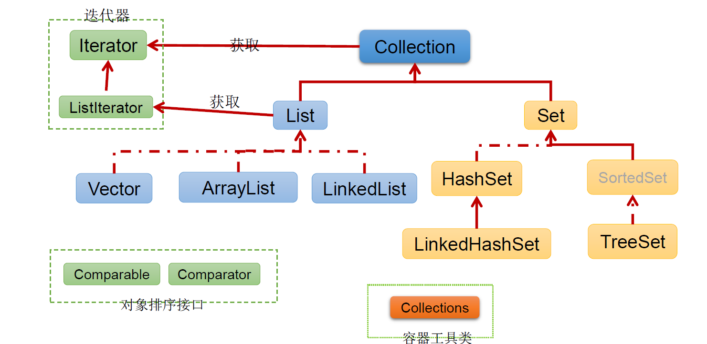
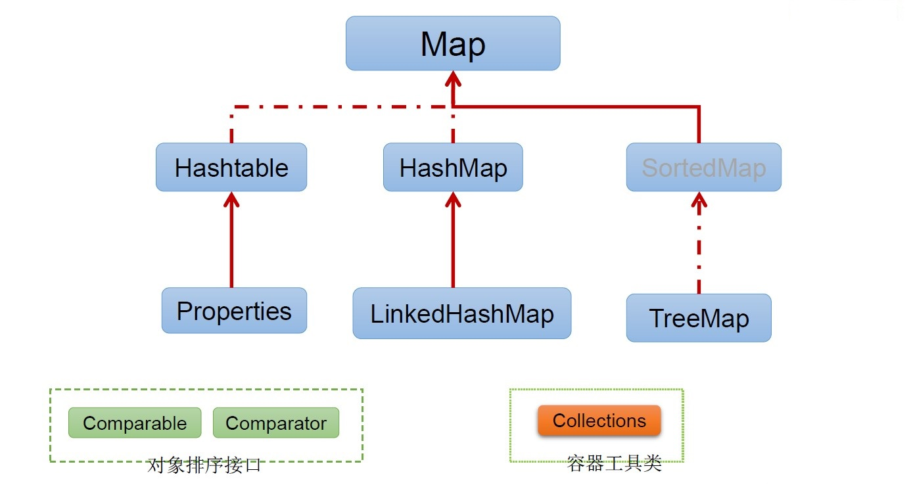
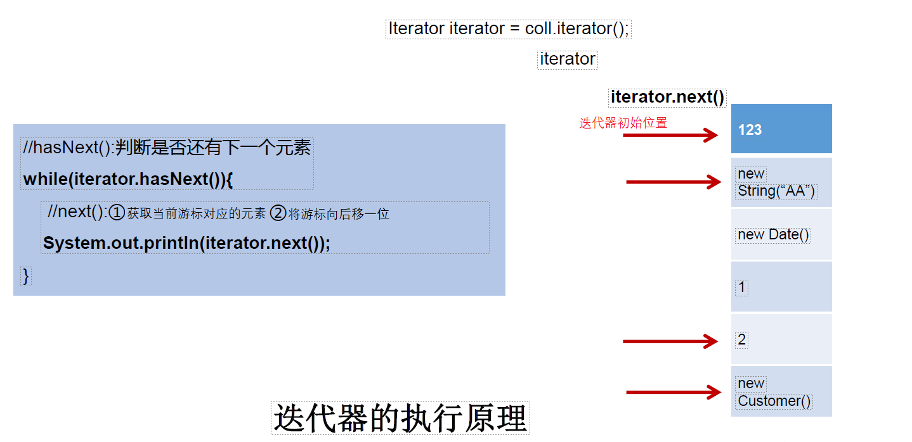
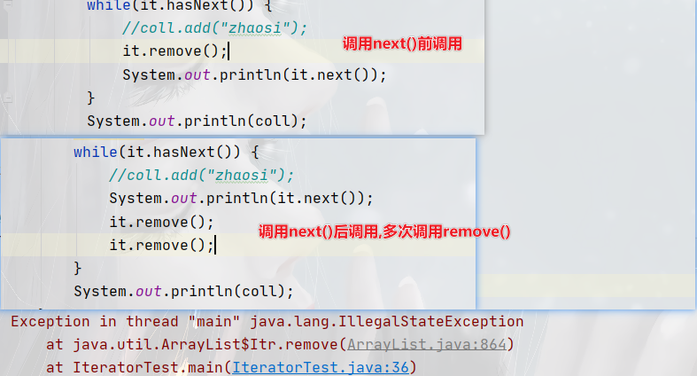
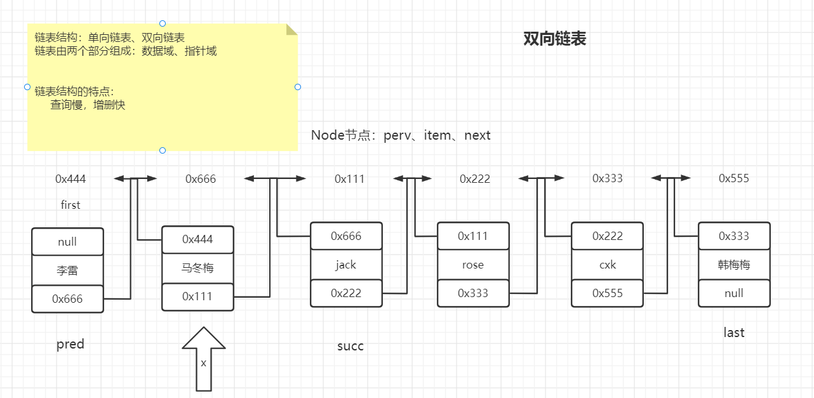
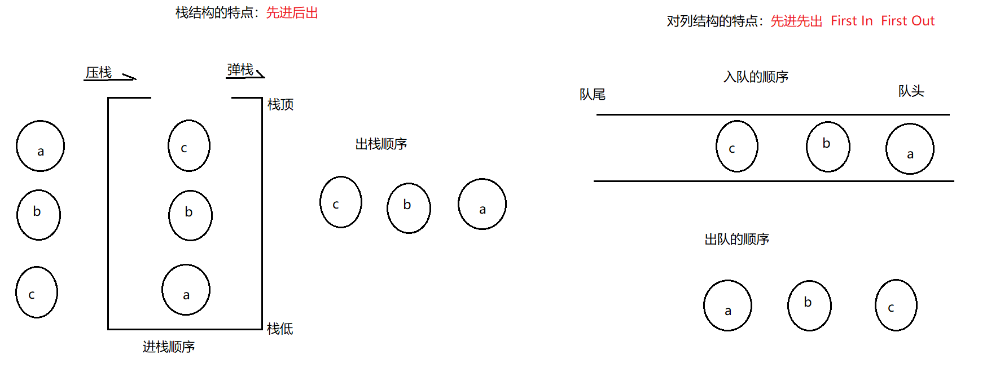
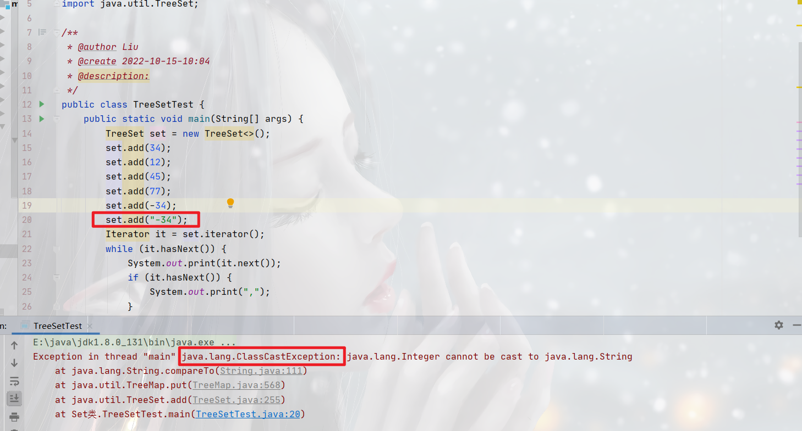
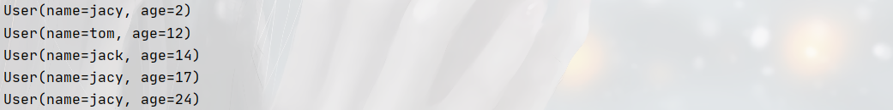
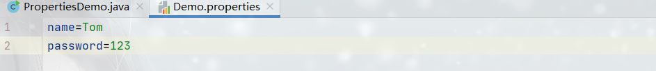
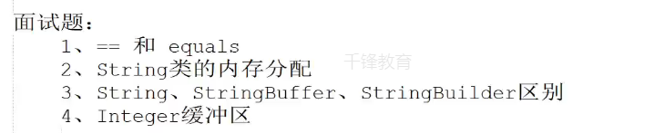

# 5.集合

## 1.集合框架

### 1.1集合框架概述

> + 集合是一种对象容器，用于存放对象
> + 数组的缺点：
>   +  1、数组定长，一旦定义不能改变
>   +  2、数组中没有方法
>   +  3、数组中只能存放相同的数据类型的数据
> + 集合特点：
>   +  1、长度可以改变
>   +  2、集合中丰富的操作元素的方法
>   +  3、集合中只能存储引用数据类型的数据		
> + 集合的分类
>   + 1、单列集合 (集合中一个元素保存一个数据)     Collection
>   + 2、双列集合 (集合中一个元素保存两个数据)     Map

### 1.2 Collenction继承架构树



### 1.3 Map接口继承树



## 2、Collection接口

### 2.1 常用方法

> - add方法向集合集合中添加元素
> - clear方法,清空集合中所有元素
> - isEmpty判断集合是否为空
> - remove方法 移除集合中元素，返回boolean类型。如果集合中不包含次元素，则删除失败
> - size()返回集合中元素的个数
> - addAll  向一个集合中添加另一个集合

> - contains方法 判断集合是否包含某个元素
> - containsAll 判断一个集合中是否包含另一个集合
> - removeAll  从一个集合中移除另一个集合
> - retainAll 交集
> - Arrays.asList(T ...a)  将数组转换成集合

```java
/**
 * @author Liu
 * @create 2022-10-13-23:20
 * @description:
 */
public class CollectionDemo {
    public static void main(String[] args) {
        //创建Collection对象
        Collection coll = new ArrayList();

        //Collection接口下常用的方法

        //add   向集合中添加元素
        coll.add("jack");
        coll.add(10);
        coll.add("rose");

        //clear方法 清空集合元素
        coll.clear();
        System.out.println(coll);

        //isEmpty  判断集合的元素个数是否为0     
        System.out.println(coll.isEmpty());

        //remove   移除集合中指定的元素，如果存在返回true、否则返回false
        coll.remove("jack1");
        System.out.println(coll);

        //size    获取集合中元素个数
        System.out.println(coll.size());

        Collection coll1 = new ArrayList();
        coll1.add("lilei");
        coll1.add("hanmeimei");

        //addAll   将另一个集合中元素添加到当前集合中
        coll1.addAll(coll);
        System.out.println(coll1);

    }
}
```

```java
/**
 * @author Liu
 * @create 2022-10-13-23:20
 * @description:
 */
public class CollectionDemo {
    public static void main(String[] args) {
        Collection c = new ArrayList();
        c.add(123);
        c.add(456);
        c.add(new String("Tom"));
        Person p = new Person();
        c.add(p);
        c.add(false);

        //contains(Object,obj):判断当前集合中是否包含obj
        System.out.println(c.contains(123));  //true
        System.out.println(c.contains(new String("Tom")));//true
        System.out.println(c.contains(new Person()));   //false
        System.out.println(c.contains(p));  //true

        //containsAll(Collection c) 判断col中所有元素是否都在当前集合中
        Collection col = Arrays.asList(123, 111);
        System.out.println(c.containsAll(col));

        //removeAll(Collection coll1) :从当前集合移除coll1中所有元素(差集)
        System.out.println(c);
        Collection coll1 = Arrays.asList(123, 4567);
        c.removeAll(coll1);
        System.out.println(c); //[456, Tom, Person@1540e19d, false]

        //retainAll  交集
        c.retainAll(coll1);
        System.out.println(c); //[123]
    }
}

class Person {

}
```

## 3、 迭代器

> 1.Iterator对象称为迭代器(设计模式的一种)，主要用于遍历 Collection 集合中的元素。
>
> 2.GOF给迭代器模式的定义为：提供一种方法访问一个容器(container)对象中各个元素，而又不需暴露该对象的内部细节。迭代器模式，就是为容器而生
>
> 3.Collection接口继承了java.lang.Iterable接口，该接口有一个iterator()方法，那么所有实现了Collection接口的集合类都有一个iterator()方法，用以返回一个实现了Iterator接口的对象。
>
> 4.*Iterator 仅用于遍历集合*，Iterator 本身并不提供承装对象的能力。如果需要创建Iterator 对象，则必须有一个被迭代的集合。
>
> 5.*集合对象每次调用iterator()方法都得到一个全新的迭代器对象*，默认游标都在集合的第一个元素之前。

```java
//迭代器的作用：获取集合中的所有的元素		
Collection coll = new ArrayList();
coll.add("jack");
coll.add("rose");
coll.add(10);
coll.add(20.2);
//1、获取迭代器对象
Iterator it = coll.iterator();
while(it.hasNext()) {
    System.out.println(it.next());
}
System.out.println(coll);
```



### 3.2迭代器使用常见问题

> - 1、迭代器迭代完成之后，迭代器的位置在最后一位。  所以迭代器只能迭代一次
> - 2、迭代器在迭代的时候，不要调用多次next方法，可能会出错 NoSuchElementException
> - 3、在迭代器迭代的时候，不能向集合中添加或者删除元素否则会出现   ConcurrentModificationException异常
> - 4、调用next()之前调用remove()方法或者在上一次调用 next 方法之后多次调用remove()方法,会出现IllegalStateException



## **4、List接口**

### **4.1ArrayList类**

> 1.ArrayList 是 List 接口的典型实现类、主要实现类
> 2.本质上，ArrayList是对象引用的一个”变长”数组
> 3.ArrayList的JDK1.8之前与之后的实现区别？JDK1.7：ArrayList像饿汉式，直接创建一个初始	容量为10的数组
> 4.JDK1.8：ArrayList像懒汉式，一开始创建一个长度为0的数组，当添加第一个元素时再创建一	个始容量为10的数组
> 5.Arrays.asList(…) 方法返回的 List 集合，既不是ArrayList 实例，也不是Vector 实例Arrays.asList(...) 返回值是一个固定长度的 List 集合                  

#### 4.1.1 常用方法

> - add(int index, E element) :*在index位置插入element元素*
> - addAll(int index,Collection e):*从index开始将e的所有元素添加进来*
> - size():*获取长度*
> - get(int index):*获取指定位置的元素*

```java
@Test
public void test1() {
    ArrayList list = new ArrayList();
    list.add(123);
    list.add(456);
    list.add("AA");
    list.add(456);

    System.out.println(list);

    //void add(int index, Object element):在index位置插入element元素
    list.add(1, "BB");
    System.out.println(list);

    //boolean addAll(int index, Collection element):从index位置开始将element中的所有元素添加进来
    List list1 = Arrays.asList(1, 2, 3);
    list.addAll(list1);
    //        list.add(list1);
    System.out.println(list.size());//9

    //Object get(int index):获取指定index位置的元素
    System.out.println(list.get(0));
}
```

> - indexOf(Object obj):*返回obj在集合中首次出现的位置*
> - lastIndexOf(Object obj):*返回在obj在集合中末尾出现的位置*
> - remove(int index) :*移除指定位置的元素,并返回此元素*
> - set(int index, E element) :*设置index位置的元素为 element*
> - subList(int beginIndex,int endIndex):*返回从beginIndex到endIndex位置的子集合*

```java
@Test
public void test2(){
    ArrayList list = new ArrayList();
    list.add(123);
    list.add(456);
    list.add("AA");
    list.add(456);
    //int indexOf(Object obj):返回obj在集合中首次出现的位置。如果不存在，返回-1.
    int index = list.indexOf(4567);
    System.out.println(index);

    //int lastIndexOf(Object obj):返回obj在当前集合中末次出现的位置。如果不存在，返回-1.
    System.out.println(list.lastIndexOf(456));

    //Object remove(int index):移除指定index位置的元素，并返回此元素
    Object obj = list.remove(0);
    System.out.println(obj);
    System.out.println(list);

    //Object set(int index, Object ele):设置指定index位置的元素为ele
    list.set(1,"CC");
    System.out.println(list);

    //List subList(int beginIndex,int endIndex):返回从beginIndex到endIndex位置的左闭右开区间的子集合
    List subList = list.subList(2, 3);
    System.out.println(subList);
    System.out.println(list);

}
```

> - 遍历:
>   1. Iterator迭代器
>   2. foreach
>   3. fori

```java
/**
 * @author Liu
 * @create 2022-10-13-23:20
 * @description:
 */
@Test
public void test3() {
    List<String> list = new ArrayList<>();
    list.add("123");
    list.add("464");
    list.add("aa");

    Iterator it = list.listIterator();
    while (it.hasNext()) {
        System.out.println(it.next());
    }

    for (int i = 0; i < list.size(); i++) {
        System.out.println(list.get(i));
    }

    for (String s : list) {
        System.out.println(s);
    }
}
```

### 4.2LinkedList类

> 常用的方法与ArrayList一致。自己独有一些向首尾添加移除等方法(可以模拟对列、堆栈等数据结构)

> 对于频繁的插入或删除元素的操作，建议使用LinkedList类，效率较高

#### 4.2.1新增方法:

> addFirst(Object obj): *向首添加*
>
> addLast(Object obj): *向尾添加*
>
> list.getFirst(): *获取首位元素*
>
> list.getLast():*获取尾部元素*

```java
LinkedList<String> list = new LinkedList<>();
list.add("jack");
list.add("tom");
list.add("jerry");
list.add("alice");
System.out.println(list);

list.addFirst("paul");
list.addLast("jacy");
System.out.println(list);
System.out.println("================");
System.out.println(list.getFirst());
System.out.println(list.getLast());

System.out.println("================");
list.removeFirst();
list.removeLast();
System.out.println(list);
```

#### 4.2.2模拟栈结构:

> void	push(Object obj): *压栈*
>
> Object	pop(): *弹出(后进先出)*

```java
LinkedList list = new LinkedList<>();
list.push("123");
list.push(111);
list.push("abc");
System.out.println(list.pop());
System.out.println(list.pop());
System.out.println(list.pop());
```

#### 4.2.3模拟队列:

> boolean	offer(Object obj):*向对列的尾部添加元素*
>
> poll(): *获取并移除对列的头部的元素*
>
> peek():*获取但不移除对列的头部的元素*

```java
LinkedList list = new LinkedList<>();
list.offer("123");
list.offer(111);
list.offer("abc");
list.offer("tom");
System.out.println(list.poll());
System.out.println(list.poll());
System.out.println(list.poll());
System.out.println(list); //[tom]

System.out.println(list.peek());//tom
```

#### 4.3.4LinkedList实现原理



#### 4.2.5堆栈和队列结构



## 5、Set接口

### 5.1 HashSet

> 常用方法与Collection接口中定义的方法一致
>
> 特点:
>
> - 无序 （插入顺序）
> - 无下标
> - 不可重复
>
> 要求：<u>向set中添加数据，其所在类一定要重写hashCode()和equals().并且重写的hashCode和equals()尽可能保持一致:相等的对象必须具有相同的散列码.</u>

```java
HashSet<String> set = new HashSet<String>();
set.add("jack");
set.add("rose");
set.add("cxk");
set.add("jack");
System.out.println(set);//[cxk, rose, jack]
```

#### HashSet 去重原理

> HashSet底层去重：
>
> ​			首先会比较两个对象的*hashCode*的值，如果hashCode值*不一样*，则直接认为两个对象是*不同的对象*，如果HashCode值一样，那么就会比较两个方法的*equals方法*， 如果equals方法返回*false*，则表示两个对象是*不同的对象*，如果equals方法返回true，则表示两个对象是相同的对象，则不会向HashSet中添加
>
> 总之：HashSet确定对象是否重复，是先判断hashcode再判断equals，两者都相等则认为是相同对象

### 5.2LinkedHashSet

> LinkedHashSet
>
> 特点：:
>
> - 1、有序
> - 2、无下标
> - 3、不可重复 
>
> 与父类的方法一致,去重的原理，也与父类一致

```java
/**
 * @author Liu
 * @create 2022-10-13-23:20
 * @description:
 */
public class LinkedHashSetDemo {
	public static void main(String[] args) {
		//LinkedHashSet  有序(链表维护顺序)  不能重复
		LinkedHashSet<String> set = new LinkedHashSet<>();
		set.add("jack");
		set.add("大娃");
		set.add("二娃");
		set.add("rose");
		set.add("爷爷");
		set.add("爷爷");
		for (String s : set) {
			System.out.println(s);
		}
        //1、底层实现 (LinkedHashMap)
        //2、去重原理 (与hashSet一致)
	}
}
```

### 5.3 TreeSet

> TreeSet特点：
>
> - 1、无序(但是有字典顺序)
> - 2、无下标
> - 3、不可重复
> - *不能添加不同类的对象*(有点自带泛型的意思)

> TreeSet 是 SortedSet 接口的实现类， TreeSet 可以确保集合元素处于排序 状态。
>
> TreeSet 底层使用 红黑树 结构存储数据
>
> 新增的方法如下： 了解
>
> 1. Comparator comparator
> 2. Object first()
> 3. Object last()
> 4. Object lower(Object e)
> 5. Object higher(Object e)
> 6. SortedSet subSet (fromElement , toElement)
> 7. SortedSet headSet (toElement)
> 8. SortedSet tailSet (fromElement)
>
> *TreeSet 两种排序方法： <u>自然排序</u>(实现Compared接口) 和 <u>定制排序</u> 。默认情况下， TreeSet 采用自然排序*。



**eg1:**

```java
public class TreeSetTest {
    public static void main(String[] args) {
        TreeSet set = new TreeSet<>();
        set.add(34);
        set.add(12);
        set.add(45);
        set.add(77);
        set.add(-34);
        Iterator it = set.iterator();
        while (it.hasNext()) {
            System.out.print(it.next());
            if (it.hasNext()) {
                System.out.print(","); //-34,12,34,45,77
            }
        }
    }
}
```

#### TreeSet的使用

> TreeSet存储*自定义对象*时<u>必须实现Comparable接口或提供Comparator</u>

> 自然排序中,比较两个对象是否相同的标准为: *compareTo()返回0*,不再是equals();

##### 1.自然排序(Comparable)

**eg:实现compareTo接口**

```java
@Test
public void test1() {
    TreeSet set = new TreeSet<>();
    set.add(new User("tom",12));
    set.add(new User("jack",14));
    set.add(new User("jacy",17));
    set.add(new User("jacy",24));
    set.add(new User("jacy",2));
    Iterator it = set.iterator();
    while (it.hasNext()) {
        System.out.println(it.next());
    }

}
```

```java
@Data//提供getter|setter方法
class User implements Comparable<User>{
    private String name;
    private int age;

    public User() {
    }

    public User(String name, int age) {
        this.name = name;
        this.age = age;
    }

    //按姓名从小到大排序
    @Override
    public int compareTo(User o) {
        //姓名相同比较年龄
        if(this.name.equals(o.name)){
            return Integer.compare(this.age,o.age);
        }else {
            return this.name.compareTo(o.name);//此处compareTo调用的是String的compareTo,非递归调用
        }
    }
}
```


##### 2 定制排序(提供Comparator)

> 需求：当元素自身不具备比较性，或者元素自身具备的比较性不是所需的。

> 那么这时只能让容器自身具备。
>
> 定义一个类实现Comparator 接口，覆盖compare方法。
>
> 并将该接口的*子类对象作为参数*传递给TreeSet集合的*构造函数*。
>
> 使用定制排序 判断*两个元素相等的标准 是*：通过 Comparator 比较两个元素返回了 0
>
> 当Comparable比较方式，及Comparator比较方式同时存在，*以Comparator比较方式为主*。

**eg1:提供Comparator**

```java
//比较器类
class UserComparator implements Comparator<User> {

    @Override
    public int compare(User o1, User o2) {
        return o1.getName().compareTo(o2.getName());
    }
}
```

```java
/**
 * @author Liu
 * @create 2022-10-15-14:46
 * @description:
 */
public class ComparatorTest {
    public static void main(String[] args) {
        //将Comparator实现类对象传入TreeSet
        TreeSet set = new TreeSet<>(new UserComparator());

        set.add(new User("tom", 12));
        set.add(new User("jack", 14));
        set.add(new User("jacy", 17));
        set.add(new User("jacy", 24));
        set.add(new User("jacy", 2));

        Iterator it = set.iterator();
        while (it.hasNext()) {
            System.out.println(it.next());
        }
    }
}
```


**eg2:Comparator匿名类**

```java
@Test
public void test2(){
    Comparator<User> comparator = new Comparator<User>() {
        @Override
        public int compare(User o1, User o2) {
            return o1.getAge()-o2.getAge();
        }
    };

    TreeSet set = new TreeSet<>(comparator);//传入comparator的匿名对象
    set.add(new User("tom", 12));
    set.add(new User("jack", 14));
    set.add(new User("jacy", 17));
    set.add(new User("jacy", 24));
    set.add(new User("jacy", 2));

    Iterator it = set.iterator();
    while (it.hasNext()) {
        System.out.println(it.next());
    }
}
```



### Set接口练习题

**exer1:在list中去除重复数字值,要求尽量简单**

```java
public class SetExer1 {
    public static List duplicateNum(List list) {
        HashSet set = new HashSet<>(list);
        //set.addAll(list);
        return new ArrayList(set);
    }

    public static void main(String[] args) {
        List list = new ArrayList();
        list.add(new Integer(1));
        list.add(new Integer(2));
        list.add(new Integer(2));
        list.add(new Integer(4));
        list.add(new Integer(4));
        System.out.println(list);
        list = duplicateNum(list);
        System.out.println(list);
    }
}
```

##  **6、Map接口**

Map接口概述

> Map 与 Collection 并列存在。用于保存具有 映射关系 的 数据 :key value
> Map 中的 key 和 value 都可以是任何引用类型的数据
>
> Map 中的 key 用 Set 来存放， 不允许重复 ，即同一个 Map 对象所对应
> 的类，须重写 hashCode 和 equals 方法
>
> 常用 String 类作为 Map 的“键”
>
> key 和 value 之间存在单向一对一关系，即通过指定的 key 总能找到
> 唯一的、确定的 value
>
> Map 接口的常用实现类： HashMap 、 TreeMap 、 LinkedHashMap 和
> Properties 。 其中， HashMap 是 Map 接口使用频率最高的实现 类

### **6.1 HashMap**

> map的主要实现类:线程不安全,效率高;可以存储null的key和value

#### 6.2.1常用方法

##### 1.增删改:

> -  Object put(Object key,Object value) ：*将 指定 key value 添加到 或修改 当前 map 对象中*
> -  void putAll(Map m): *将 m 中的所有 key value 对存放到当前 map 中*
> -  Object remove(Object key) ：*移除指定 key 的 key value 对，并返回 value*
> -  void clear()：*清空当前 map 中的所有数据*

```java
@Test
public void test1() {
    HashMap<String, String> map = new HashMap();
    //添加
    map.put("AA", "123");
    map.put("Ab", "1213");
    map.put("AA", "123");
    System.out.println(map);
    //修改
    map.put("AA","1111");
    System.out.println(map);

    //addAll
    HashMap<String,String> map1=new HashMap<>();
    map1.put("tom","145");
    map1.put("jack","784");
    map.putAll(map1);

    System.out.println(map);
    System.out.println("=========================");

    //移除
    String aa = map.remove("AA");
    System.out.println(aa);
    System.out.println(map);

    //清空
    map.clear();
    System.out.println(map);
}
```

##### 2.元素查询:

> -  Object get(Object key) ：*获取指定 key 对应的 value*
> -  boolean containsKey(Object key)：*是否包含指定的 key*
> -  boolean containsValue(Object value) value)：*是否包含指定的 value*
> -  int size()：*返回 map 中 key value 对的个数*
> -  boolean isEmpty()：*判断当前 map 是否为空*
> -  boolean equals(Object obj)：*判断当前 map 和参数对象 obj 是否相等*

```java
@Test//元素查询
public void test2() {
    HashMap<String, String> map = new HashMap();
    map.put("AA", "123");
    map.put("tom","145");
    map.put("jack","784");
    map.put("jerry","784");
    //get
    System.out.println(map.get("tom"));

    //containsKey
    System.out.println(map.containsKey("tom"));

    //containsValue
    System.out.println(map.containsValue("784"));

    //isEmpty
    map.isEmpty();
}
```

##### 3.元视图操作

> - Set keySet()：*返回所有 key 构成的 Set 集合*
>
> - Collection values()：*返回所有 value 构成的 Collection 集合*
> - Set entrySet()：*返回所有 key value 对构成的 Set 集合*

```java
@Test
public void test3() {
    HashMap<String, String> map = new HashMap();
    map.put("AA", "123");
    map.put("tom", "145");
    map.put("jack", "784");
    map.put("jerry", "784");

    // keySet:返回map集合中所有的key
    Set<String> set = map.keySet();
    Iterator<String> it = set.iterator();
    while (it.hasNext()) {
        System.out.print(it.next());
        if (it.hasNext()) {
            System.out.print(",");
        }
    }
    System.out.println();

    //values():返回map集合中所有的value
    Collection<String> values = map.values();
    Iterator<String> it2 = values.iterator();
    while (it2.hasNext()) {
        System.out.print(it2.next());
        if (it2.hasNext()) {
            System.out.print(",");
        }
    }

    //entrySet():返回map集合中所有的key和value
    Set<Map.Entry<String, String>> entrySet = map.entrySet();

    //1.foreach遍历
    for (Map.Entry<String, String> entry : entrySet) {
        System.out.println(entry.getKey() + "=" + entry.getValue());
    }

    System.out.println("====================");
    //2.Iterator遍历
    Iterator<Map.Entry<String, String>> iterator = entrySet.iterator();
    while (iterator.hasNext()){
        Map.Entry entry = iterator.next();
        System.out.println(entry.getKey() + "=" + entry.getValue());
    }

    System.out.println("====================");
    //3.通过key获取value
    Set<String> keySet = map.keySet();
    for (String key : keySet) {
        System.out.println(key+"="+map.get(key));
    }
}
```


HashMap的底层实现

### 6.2 LinkedHashMap

> 保证在遍历map元素的时候,可以按照添加的顺序实现遍历.
>
> ​	原因:在原有的HashMap底层的结构基础上,添加了一对指针,指向前一个和后一个元素
>
> ​	对于频繁的遍历操作,此类执行效率高于HashMap

### 6.3 TreeMap

> 保证按照添加的key-value进行排序,实现排序遍历.此时考虑<u>key</u>的*自然排序*或*定制排序*

> 向TreeMap中添加key-value,要求必须是由同一个类创建的对象

```java
/**
 * @author Liu
 * @create 2022-10-15-15:26
 * @description:
 */
@Data
class User implements Comparable<User>{
    private String name;
    private int age;

    public User() {
    }

    public User(String name, int age) {
        this.name = name;
        this.age = age;
    }
    //按姓名从小到大排序
    @Override
    public int compareTo(User o) {
        //姓名相同比较年龄
        if(this.name.equals(o.name)){
            return Integer.compare(this.age,o.age);
        }else {
            return this.name.compareTo(o.name);//此处compareTo调用的是String的compareTo,非递归调用
        }
    }
}
```

#### 自然排序:

```java
//自然排序
@Test
public void test1() {
    TreeMap<User, Integer> map = new TreeMap();
    User u1 = new User("tom", 23);
    User u2 = new User("jerry", 22);
    User u3 = new User("alice", 20);
    User u4 = new User("jerry", 19);
    User u5 = new User("jack", 24);

    map.put(u1, 98);
    map.put(u2, 89);
    map.put(u3, 99);
    map.put(u4, 101);
    map.put(u5, 106);

    Set<User> set = map.keySet();
    for (User o : set) {
        System.out.println(o + "=" + map.get(o));
    }
}
```

#### 定制排序

```java
//定制排序
@Test
public void test2() {
    TreeMap<User, Integer> map = new TreeMap(new Comparator<User>() {
        @Override
        public int compare(User o1, User o2) {
            if (o1.getName().equals(o2.getName())) {
                //名字相同按年龄降序
                return o2.getAge() - o1.getAge();
            } else {
                return o1.getName().compareTo(o2.getName());
            }
        }
    });
    User u1 = new User("tom", 23);
    User u2 = new User("jerry", 22);
    User u3 = new User("alice", 20);
    User u4 = new User("jerry", 19);
    User u5 = new User("jack", 24);

    map.put(u1, 98);
    map.put(u2, 89);
    map.put(u3, 99);
    map.put(u4, 101);
    map.put(u5, 106);


    Set<User> set = map.keySet();
    Iterator<User> iterator = set.iterator();
    while (iterator.hasNext()){
        User key = iterator.next();
        System.out.println(key+"---->"+map.get(key));
    }
}
```

### ~~6.4 HashTable~~

> 作为古老的实现类:线程单圈,效率低;不能存储null的key和value

### 6.5 Properties

> 常用来处理配置文件.key和value都是String类型



```java
public class PropertiesDemo {
    public static void main(String[] args) throws IOException {
        Properties prop = new Properties();

       InputStream input = new FileInputStream(".\\7_集合\\src\\main\\java\\Map类\\Demo.properties");
        prop.load(input);//加载流对应的文件
        String name = prop.getProperty("name");
        String password = prop.getProperty("password");
        System.out.println(name+"--->"+password);

    }
}
```


## 7、Collections工具类

### 常用方法:

排序操作:

> - reverse(List):   *反转 List 中元素的顺序*
>
> - shuffle(List):   *对 List 集合元素进行随机排序*
>
> - sort(List):  *根据元素的自然顺序对指定 List 集合元素按升序排序*
>
> - sort(List , Comparator):   *根据指定的 Comparator 产生的顺序对 List 集合元素进行排序*
>
> - swap(List int int):   *将指定 list 集合中的 i 处元素和 j 处元素进行交换*

```java
@Test
    public void test1() {
        List list = new ArrayList();
        list.add("111");
        list.add("123");
        list.add("44");
        list.add("tom");

        System.out.println(list);
        //reverse(List):反转
        /*Collections.reverse(list);
        System.out.println(list);  //[tom, 44, 123, 111]  */

        //shuffle(List)
        Collections.shuffle(list);
        System.out.println(list); //[123, tom, 44, 111]

        //sort
        Collections.sort(list);
        System.out.println(list);
    }
}
```

查找,替换

> Object max(Collection) 根据元素的自然顺序，返回给定集合中的最大元素
> 
> Object max(Collection, Comparator) 根据 Comparator 指定的顺序，返回
> 给定集合中的最大元素
> 
> Object min(Collection)
> 
> Object min(Collection , Comparator)
> 
> int frequency(Collection , Object) 返回指定集合中指定元素的出现次数
> 
> void copy(List dest,List src )：将 src 中的内容复制到 dest 中
> 
> boolean replaceAll (List list, Object oldVal ,Object newVal ) 使用新值替换
> List 对象的所有旧值

同步控制

> synchronizeXxx():

> Collections 类中提供了多个 synchronizedXxx () 方法，该方法可使将指定集合包装成线程同步的集合，从而可以解决多线程并发访问集合时的线程安全问题

```java
//返回的lis1就是线程安全的
List list1 = Collections.synchronizedList(list);
```

## 8、泛型

> 泛型：参数化类型  JDK1.5之后
>
> - 用途：
>   - 因为如果不使用泛型，那么向集合中添加元素，实际当做Object对象传递进去的，此时发生向上转型了当从集合中获取数据，得到的是Object类型，那么在使用的需要向下转型，才能正常使用。因此频繁向上向下转型。可能会出现类转换异常。	这个时候就需要使用泛型。
>   - 泛型的作用实际上就是讲类型转换的检查提前到了编译期
> - 泛型擦除： JDK1.7之后
>   - 集合类型<泛型>  变量名  =  new 集合类型<>();
> - 泛型需要注意的问题：
>   - 1、泛型上不存在多态
>     - Collection<Person> coll = new ArrayList<Student>();//错误
>   - 2、泛型只能是引用数据类型
>     - 如果是基本数据类型，则使用它的包装类

### 8.1泛型的使用

> 自定义泛型结构

#### 8.1.1泛型类

>   类名<T>

```java
public class Box<T> {  //T：表示任意的java类型       E、K、V
	private T data;

	public T getData() {
		return data;
	}

	public void setData(T data) {
		this.data = data;
	}
}
```

#### 8.1.2 泛型接口

> interface List<T> 和 class GenTest<K,V> 
> 其中，T,K,V不代表值，而是表示类型。这里使用任意字母都可以。常用T表示，是Type

```java
public interface MyInterface<T> {
    public void show(T t);
}
```

#### 8.1.2 泛型方法

> 方法，也可以被泛型化，不管此时定义在其中的类是不是泛型类。在泛型方法中可以定义泛型参数，此时，参数的类型就是传入数据的类型。
> 泛型方法的格式:
>
> ```java
> [访问权限] <泛型> 返回类型 方法名([泛型标识 参数名称]) 抛出的异常
> ```
>
> 泛型方法声明泛型时也可以指定上限

 ```java
 public class DAO {
     public <E> E get(int id, E e) {
         E result = null;
         return result;
     }
 }
 ```

### 8.2 泛型类和泛型方法的使用情况

```java
public class DAO<T> {//表的共性操作的DAO

    //添加一条记录
    public void add(T t){

    }

    //删除一条记录
    public boolean remove(int index){

        return false;
    }

    //修改一条记录
    public void update(int index,T t){

    }

    //查询一条记录
    public T getIndex(int index){

        return null;
    }

    //查询多条记录
    public List<T> getForList(int index){

        return null;
    }

    //泛型方法
    //举例：获取表中一共有多少条记录？获取最大的员工入职时间？
    public <E> E getValue(){

        return null;
    }

}
```

```java
public class CustomerDAO extends DAO<Customer>{//只能操作某一个表的DAO
}
```

```java
public class StudentDAO extends DAO<Student> {//只能操作某一个表的DAO
}                                                                
```

### 8.3 泛型在继承上的体现

> 如果B是A的一个子类型（子类或者子接口），而G是具有泛型声明的类或接口，G<B>并不是G<A>的子类型！
> 比如：String是Object的子类，但是List<String >并不是List<Object>的子类。

```java
public void testGenericAndSubClass() {
    Person[] persons = null;
    Man[] mans = null;
    // 而 Person[] 是 Man[] 的父类. persons = mans;
    Person p = mans[0];
    // 在泛型的集合上
    List<Person> personList = null;
    List<Man> manList = null;
    // personList = manList;(报错)
}
```

### 8.4 泛型上下边界

> 泛型上下边界
>
> - 语法： 
>   - 上边界      ? extends 类型 
>   - 下边界     ? super   类型

```java
public class Demo01 {
	//? 表示不确定类型     此时的?表示Object
	public static void test01(List<?> list) {
		
	}
	/**
	 * 定义泛型上边界
	 * 
	 * <? extends 类型>
	 */
	
	public static void test02(List<? extends Number> list) {
		
	}
	/**
	 * 定义泛型下边界
	 * 
	 * <? super 类型>
	 */
	
	public static void test03(List<? super Number> list) {
		
	}
	
	public static <T> void test04(List<? extends Comparable<T>> list) {
		
	}
	public static void main(String[] args) {
		List<String> list1 = new ArrayList<String>();
		List<Integer> list2 = new ArrayList<Integer>();
		List<Number> list3 = new ArrayList<Number>();
		List<Object> list4 = new ArrayList<Object>();
		test01(list1);
		test01(list2);
		test01(list3);
		test01(list4);
		
		//test02(list1);  //错误，方法定义泛型的上边界，泛型只能是Number及其Number子类
		test02(list2);
		test02(list3);
		//test02(list4);  //错误，方法定义泛型的上边界，泛型只能是Number及其Number子类 
		
		//test03(list1);  //错误，方法定义泛型的下边界，泛型只能是Number及其Number父类
		//test03(list2);
		test03(list3);
		test03(list4);
        
		test04(list1);
		test04(list2);
		//test04(list3);    //错误，方法定义泛型的上边界，泛型必须实现Comparable接口
		//test04(list4);      //错误，方法定义泛型的上边界，泛型必须实现Comparable接口
	}	
}
```


# 关于面试题:

## 关于Set的面试题:

```java
/**
 * @author Liu
 * @create 2022-10-15-16:58
 * @description:
 */
public class SetExer2 {
    public static void main(String[] args) {
        HashSet set = new HashSet();
        Person p1 = new Person(1001, "AA");
        Person p2 = new Person(1002, "BB");

        set.add(p1);
        set.add(p2);
        p1.name = "CC";
        set.remove(p1);
        System.out.println(set);//1002, "BB"
        set.add(new Person(1001, "CC"));
        System.out.println(set);
        set.add(new Person(1001, "AA"));
        System.out.println(set);

    }
}

class Person {
    int id;
    String name;

    public Person(int id, String name) {
        this.id = id;
        this.name = name;
    }

    @Override
    public int hashCode() {
        return Objects.hash(id, name);
    }

    @Override
    public boolean equals(Object o) {
        if (this == o) return true;
        if (o == null || getClass() != o.getClass()) return false;
        Person person = (Person) o;
        return id == person.id &&
                Objects.equals(name, person.name);
    }


    @Override
    public String toString() {
        return "Person{" +
                "id=" + id +
                ", name='" + name + '\'' +
                '}';
    }
}
```

### HashMap的底层实现原理

### CurrentHashMap与HashTable的异同

## ==**红黑树**==





