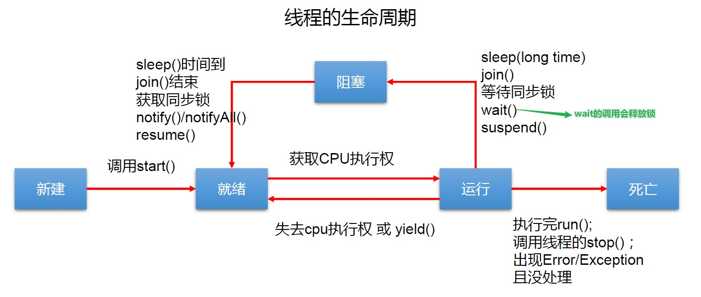

# 6.多线程

## 一、基本概念

### 1.1程序、进程、线程

> `程序`:是 为完成*特定任务*、用*某种语言*编写 的一 组*指令的集合* 。即指 一
> 段静态的代码 ，静态对象。

> `进程`
>
> + 运行中的程序称之为进程
> + 程序是静态的，进程是动态的
> + *进程作为资源分配的单位*，系统在运行时会为每个进程分配不同的内存区域
> + 特点：
>   + 在单核CPU下，通过一个时间点上只能有一个程序在运行。交替执行
>   + 宏观并行、微观串行

> `线程`:进程可进一步细化为线程，是一个程序内部的一条执行路径。
>
> - 若一个进程同一时间*并行*执行多个线程，就是支持多线程的
> - *线程作为调度和执行的单位，每个线程拥有独立的运行栈和程序计数器(pc)*，线程切换的开销小
> - 一个进程中的多个线程共享相同的内存单元/内存地址空间它们从同一堆中分配对象，可以访问相同的变量和对象。这就使得线程间通信更简便、高效。但多个线程操作共享的系统资源可能就会带来*安全的隐患*。

> 进程和线程的区别:
>
> + 进程是系统分配资源的单位，线程是CPU的调度单位
> + 一个程序，至少包含一个进程
> + 一个进程至少包含一个线程。线程是不能独立运行的，必须依附在进程中
> + 进程之间是不能共享数据段地址，但是同一个进程下的线程是可以共享的

### 2.并发与并行

> <u>并行</u>:多个Cpu同时执行多个任务 	eg:多个人同时做不同的
>
> <u>并发</u>:一个CPU(采用时间片)同时执行多个任务     eg:秒杀、多个人做同一件事情

### 3.线程的组成部分

> + CPU时间片
>   + 操作系统会为每个线程分配时间
> + 运行数据
>   + 堆空间：存储线程需使用的对象。多个线程可以共享堆中的对象
>   + 栈空间：存储线程需使用的局部变量。每个线程都拥有自己的栈空间
> + 线程的逻辑代码	

## 二、线程的创建与使用

### 1.Thread类

> 构造器
>
> - `Thread()`：创建新的Thread对象
> - `Thread(String threadname)`：创建线程并指定线程实例名
> - `Thread(Runnable target)`：指定创建线程的目标对象，它实现了Runnable接口中的run方法
> - `Thread(Runnable target, String name)`：创建新的Thread对象

### **2.创建线程的方式**

#### 2.1 继承Thread类

```java
class MyThread extends Thread {
    //重写父类的run方法(线程的逻辑代码)
    @Override
    public void run() {
        for (int i = 0; i < 100; i++) {
            if (i % 2 == 0) {
                //Thread.currentThread()获取当前线程对象    getName();  获取线程的名称
                System.out.println(Thread.currentThread().getName() + ":" + i);
            }
        }
    }
}

public class ThreadTest1 {
    public static void main(String[] args) {
        //创建Thread类的子类对象
        MyThread myThread = new MyThread();
        myThread.setName("子线程");

        //start():①启动线程  ②调用当前线程的run()
        myThread.start();

        Thread.currentThread().setName("主线程");
        for (int i = 'a'; i < 'z'; i++) {
            System.out.println(Thread.currentThread().getName() + ":" + (char) i);
        }
    }
}
```

匿名子类的形式

```java
public class ThreadTest1 {
    public static void main(String[] args) {

        //创建Thread的匿名子类
        new Thread() {
            @Override
            public void run() {
                this.setName("子线程=======");
                for (int i = 0; i < 100; i++) {
                    if (i % 2 == 0) {
                        //Thread.currentThread()获取当前线程对象    getName();  获取线程的名称
                        System.out.println(Thread.currentThread().getName() + ":" + i);
                    }
                }
            }
        }.start();
        
        Thread.currentThread().setName("主线程");
        for (int i = 'a'; i < 'z'; i++) {
            System.out.println(Thread.currentThread().getName() + ":" + (char) i);
        }
    }
}
```

#### 2.2实现Runable接口

```java
class MyRunnable1 implements Runnable{
    @Override
    public void run() {
        for (int i = 0; i <100 ; i++) {
            if(i%2==0){
                System.out.println(i);
            }
        }
    }
}
public class RunnableTest {
    public static void main(String[] args) {
        //创建实现类对象
        MyRunnable1 m1 = new MyRunnable1();
        //将此对象作为参数传递到Thread的构造器中,创建Thread类的对象
        Thread thread = new Thread(m1);
        //启动线程
        thread.start();
    }
}
```

#### 2.3 两种方式的区别

> 两种方式的区别：
>
> +   1、java只支持单继承，所以继承Thread类就没办法继承其他的类，所以使用Runnable接口更灵活
> +   2、继承自Thread类，表示这个类就是一个线程类，可以直接启动线程实现Runnable接口，表示这个类是一个线程任务，需要创建线程对象从而执行这个线程任务

实现方式的好处： 

> - 避免 了单继承的局限性
>
> - 多 个线程可以共享同一个 接口实现类 的对象，非常适合多个相同线
>   程来处理同一份资源。

### 3.线程中常用的方法

> + 1、设置线程名称  （`setName`、`getName`、`Thread.currentThread`获取当前线程对象）
>   + 如果没有设置线程名称，那么默认的名称为Thread-0    Thread-N
> + 2、线程休眠 (`Thread.sleep`(毫秒数))
>   + 让当前线程进入到休眠状态，并让出CPU使用权，直到休眠结束，才会继续抢占CPU
> + 3、线程礼让(`Thread.yeild()`)
>   + 让出CPU使用权，但是立马又会去重新抢占CPU
> + 4、线程加入(`join()`)
>   + 在当前线程中加入另一线程，必须要将另一个线程执行完之后才会继续执行当前线程

### 4.线程的优先级

> MAX_PRIORITY:10
>
> MIN_PRIORITY:1
>
> NORM_PRIORITY:5

> 设置线程的优先级 (`setPriority`、`getPriority`)
>
> - 线程 创建时继承父线程 的 优先级
>
> + 如果没有设置线程的优先级，那么默认的优先级为5
> + 线程有的优先级为1~10之间，设置优先级只是提高了抢占CPU的概率

## **三、线程的生命周期**

> JDK 中用 Thread State 类定义了 线程的几种 状态

> 要想实现 多 线程 必须在主线程中创建新的线程对象 。 Java 语言使用 Thread 类及其子类的对象来表示线程在它的一个完整的生命周期中通常要经历如下的 五种状态

> - *新建*： 当 一个 Thread 类或其子类的对象被声明并创建时，新生的线程对象处于新建
>   状态
> - *就绪*： 处于 新建 状态的线程被 start() 后，将进入线程队列等待 CPU 时间片，此时它已
>   具备了运行 的 条件 ，只是没分配到 CPU 资源
> - *运行*： 当就绪的线程被调度 并 获得 CPU 资源 时 便进入运行状态， run() 方法定义了线
>   程的操作和功能
> - *阻塞*： 在某种特殊情况下，被人为挂起或执行输入输出操作时，让出 CPU 并临时中
>   止自己的执行，进入阻塞状态
> - *死亡*： 线程完成了它的全部工作或线程被提前强制性 地 中止 或出现异常导致结束



[线程的5种状态：创建状态---->就绪状态---->运行状态---->阻塞\等待状态---->终止状态]()

## **四、线程安全问题**

> *当多线程并发访问临界资源,如果破坏原子操作，可能会造成数据不一致*
>
> 临界资源：共享资源(同一个对象)，一次只可以有一个线程操作，才可以保证准确性
>
> 原子操作：不可拆分的步骤，被视作一个整体。其步骤不能打乱和缺省

### 4.1线程同步

<u>Synchronized的使用方法</u>

> *方式一*：==同步代码块==
>
> + synchronized(临界资源对象){  //互斥锁标记
> + ​        //原子代码(*即使用临界资源的所有代码*)
> + }

> *方式二*：==同步方法==
>
> + public synchronized void sale(){ //互斥锁标记是this对象
> + ​        //原子代码
> + }

### 4.2 线程同步买票案例

```java
public class TicketThread implements Runnable {
    int ticket = 100;//创建的是同一个对象,Thread创建时共享ticket

    @Override
    public void run() {
        while (true) {
            if (ticket <= 0) {
                System.exit(0);
            }
            System.out.println(Thread.currentThread().getName() + "卖了" + ticket-- + "票");
        }
    }
}
class test2 {
    public static void main(String[] args) {
        TicketThread2 ticket = new TicketThread2();
        Thread t1 = new Thread(ticket);
        Thread t2 = new Thread(ticket);
        Thread t3 = new Thread(ticket);
        Thread t4 = new Thread(ticket);
        t1.start();
        t2.start();
        t3.start();
        t4.start();
    }
}
```


> *问题的原因*：
> 当多条语句在操作同一个线程共享数据时，一个线程对多条语句只执行了一部分，还没有
> 执行完，另一个线程参与进来执行。导致共享数据的错误 。
> *解决办法*：
> 对多条操作共享数据的语句，只能让一个线程都执行完，在执行过程中，其他线程不可以
> 参与执行

#### 实现Runnable解决

##### 4.2.1 同步代码块解决

```java
public class TicketThread implements Runnable {
    int ticket = 100;//创建的是同一个对象,Thread创建时共享ticket

    @Override
    public void run() {
        while (true) {
            // sale();
            synchronized (TicketThread.class) {//互斥锁对象/同步监视器(可以是任意的java对象，但是要保证对象唯一)
                if (ticket <= 0) {
                    System.exit(0);
                }
                System.out.println(Thread.currentThread().getName() + "卖了" + ticket-- + "票");
            }
        }
    }
}
```

==tips:==

> 实现Runnable接口创建多线程的方式中,可以考虑使用this充当同步监视器

>  当继承Thread类创建多线程的方式中,<u>慎用</u>(*当前类new了多个对象this不唯一*)this充当同步监视器,考虑使用当前类充当同步监视器(*类名.class*)

##### 4.2.2 同步方法解决

```java
public class TicketThread2 implements Runnable {

    int ticket = 100;//创建的是同一个对象,Thread创建时共享ticket

    @Override
    public  void run() {
        while (true) {
            sale();
        }
    }

    private synchronized void sale() {
        if (ticket <= 0) {
            System.exit(0);
        }
        System.out.println(Thread.currentThread().getName() + "卖了" + ticket-- + "票");
    }
}
```

#### 继承Thread解决

```java
public class TicketThread extends Thread {
    static int ticket = 100;

    @Override
    public  void run() {
        while (true) {
            sale();
        }
    }

    private synchronized static void sale() {//设为静态方法的时候同步监视器为:TicketThread.class
        //private synchronized  void sale()//同步监视器为t1,t2,t3,t4.同步监视器不唯一
        if (ticket <= 0) {
            System.exit(0);
        }
        System.out.println(Thread.currentThread().getName() + "卖了" + ticket-- + "票");
    }
}

class test3 {
    public static void main(String[] args) {
        Thread t1 = new TicketThread();
        Thread t2 = new TicketThread();
        Thread t3 = new TicketThread();
        Thread t4 = new TicketThread();

        t1.start();
        t2.start();
        t3.start();
        t4.start();
    }

}
```

### 线程安全案例2

> 银行有一个账户. 有两个储户分别向同一个账户存3000元, 每次存储1000, 存3次.每次存完打印账户余额.

> 问:1.该程序是否有是多线程问题? 有,有两个储户线程
>
> 2.是否有共享数据? 有, 同一个账户
>
> 3.是否有线程安全问题? 有,有共享数据且多个线程操作该数据就产生安全问题
>
> 4.如何解决线程安全问题? `synchronize`同步代码块,`synchronize`同步方法,`Lock`锁三种方式解决

```java
public class AccountTest {
    public static void main(String[] args) {
        Account account = new Account();
        Thread thread1 = new Thread(new Depositor(account), "储户A");
        Thread thread2 = new Thread(new Depositor(account), "储户B");

        thread1.start();
        thread2.start();
    }
}


class Depositor implements Runnable {
    private Account account;

    public Depositor(Account account) {
        this.account = account;
    }

    @Override
    public void run() {
        for (int i = 0; i < 3; i++) {
            double balance = account.deposit(1000);
            System.out.println(Thread.currentThread().getName() + "存储了:" + "账户余额为" + balance);
        }
    }
}


class Account {
    private double balance = 0.0;

    ReentrantLock lock = new ReentrantLock();

    public double deposit(double bal) {
        try {
            //调用lock()方法
            lock.lock();
            balance += bal;
            try {
                Thread.sleep(100);
            } catch (InterruptedException e) {
                e.printStackTrace();
            }
            return balance;
        } finally {
            //解锁
            lock.unlock();
        }
    }
}
```

### `synchronized`锁总结:

> `synchronized`锁的代码需要为被同步的代码,不能过多或过少;
>
> 多个线程必须共用同一把锁;
>
> `synchronized` 关键字加到 `static` 静态方法和 `synchronized(类.class)` 代码块上都是是给 Class 类上;锁;
>
> `synchronized` 关键字加到实例方法上是给*对象实例*上锁。;

## 五、线程死锁

==死锁:==

> 1.不同的线程分别占用对方需要的同步资源不放弃,都在等待对方放弃自己需要的同步资源,就形成了线程的死锁
>
> 2.出现死锁后,不会出现异常,不会出现提示.只是所有线程都处于阻塞状态,无法继续

<u>资源互斥 占有且等待 资源不可剥夺 循环等待</u>

==解决方法:==

> - 专门的算法、原则
> - 尽量减少同步资源的定义
> - 尽量避免嵌套同步

### 5.1死锁的产生test

```java
public class 死锁Test1 {
    public static void main(String[] args) {
        StringBuffer s1 = new StringBuffer();
        StringBuffer s2 = new StringBuffer();

        new Thread() {
            @Override
            public void run() {
                this.setName("线程1");
                System.out.println(Thread.currentThread().getName());
                synchronized (s1) {
                    s1.append("a");
                    s2.append(1);

                    try {
                        Thread.sleep(100);
                    } catch (InterruptedException e) {
                        e.printStackTrace();
                    }

                    synchronized (s2) {
                        s1.append("b");
                        s2.append(2);

                        System.out.println(s1);
                        System.out.println(s2);
                    }
                }
            }
        }.start();

        new Thread(new Runnable() {
            @Override
            public void run() {
                Thread.currentThread().setName("线程2");
                System.out.println(Thread.currentThread().getName());
                synchronized (s2) {
                    s1.append("c");
                    s2.append(3);

                    try {
                        Thread.sleep(100);
                    } catch (InterruptedException e) {
                        e.printStackTrace();
                    }

                    synchronized (s1) {
                        s1.append("d");
                        s2.append(4);

                        System.out.println(s1);
                        System.out.println(s2);
                    }
                }
            }
        }).start();
        //线程1 拿到s1等待s2
        //线程2 拿到s2等待s1
        //造成死锁
    }
}
```

> 线程1 拿到s1等待s2 ;线程2 拿到s2等待s1;造成死锁

## 六、Lock锁

### 6.1 Lock锁

> *java.util.concurrent.locks.Lock* 接口是 控制多个线程对共享资源进行访问的工具。 锁提供了对共享资源的独占访问，每次只能有一个线程对 Lock 对象加锁，线程开始访问共享资源之前应先获得 Lock 对象

> `ReentrantLock` 类实现了 Lock ，它拥有与 `synchronized` 相同的*并发性*和*内存语义*， 在 实现线程安全的控制中，比较常用的是 ReentrantLock 可以显式加锁、释放锁

```java
/**
 * @author Liu
 * @create 2022-10-23-10:57
 * @description:Lock锁
 */
public class LockTest {
    public static void main(String[] args) {
        Window window = new Window();
        Thread thread1 = new Thread(window, "cxk");
        Thread thread2 = new Thread(window, "c");
        Thread thread3 = new Thread(window, "x");
        Thread thread4 = new Thread(window, "k");

        thread1.start();
        thread2.start();
        thread3.start();
        thread4.start();
    }
}

class Window implements Runnable {
    private int ticket = 100;

    //创建ReentrantLock对象
    //1.构造中设置为true则为公平锁
    private ReentrantLock lock = new ReentrantLock(true);


    @Override
    public void run() {
        while (true) {
            try {
                //2.调用lock()方法(类似获取同步监视器)
                lock.lock();

                if (ticket > 0) {
                    System.out.println(Thread.currentThread().getName() + "卖了" + ticket-- + "票");
                } else {
                    break;
                }

            } finally {
                //3.调用解锁的方法解锁
                lock.unlock();
            }
        }
    }
}
```

### 6.2读写锁

> `ReentrantReadWriteLock`：
>
> + 一种支持一写多读的同步锁，读写分离，可分别分配读锁、写锁。
> + 支持多次分配读锁，使多个读操作可以并发执行。
>
> 互斥规则：
>
> + 写-写：互斥，阻塞。
> + 读-写：互斥，读阻塞写、写阻塞读。
> + 读-读：不互斥、不阻塞。
> + *在读操作远远高于写操作的环境中，可在保障线程安全的情况下，提高运行效率。*


### 6.3 重入锁


`synchronized`和`Lock`的区别:

> 1. `Lock`是*显示锁*(需要手动开启和关闭锁),`synchronized`是*隐式锁*,出了作用域自动释放
>
> 2. `Lock`只有代码块锁,`synchronized`有代码块锁和方法锁
> 3. 使用`Lock`锁,JVM将花费较少的时间来调度线程,*性能更好*.并且具有更好的*扩展性*(提供了更多子类)
> 4. `Lock`可以实现公平锁(默认为非公平锁)`sychronized`只能实现非公平锁

优先使用顺序:

> `Lock`═＞同步代码块(已进入方法体,分配了相应的资源)═＞同步方法(在方法体之外)

## 七、线程通信

涉及三个方法:

> `wait()`:一旦执行,当前线程就会进入阻塞状态,并且释放同步监视器.
>
> `notify()`:执行此方法,就会唤醒正在等待中的一个线程.如果有多个等待的线程,则随机唤醒一个
>
> `noyifyAll()`:执行次方法会唤醒所有被`wait()`的线程

*tips:*

> ==1.`wait`,`notify,`notifyAll`三个方法只能用在*同步代码*块或*同步方法*中的==
>
> ==2.`wait`,`notify`,`notifyAll`三个方法的调用者必须是同步代码块或同步方法中的<u>同步监视器</u>,否则会出现`IllegalMonitorStateException`异常==
>
> ==3.`wait`,`notify`,`notifyAll`三个方法都是定义在`java.lang.Object`类中== 

消费者生产者案例:

```java
public class ProductTest {
    public static void main(String[] args) {
        Clerk clerk = new Clerk();
        Thread thread1 = new Thread(new Productor(clerk), "生产者");
        Thread thread2 = new Thread(new Customer(clerk), "消费者");

        thread1.start();
        thread2.start();
    }

}

class Clerk {
    int restProduct = 0;

    public synchronized void addProduct() {
        if (restProduct < 20) {
            //当产品数大于15时唤醒消费者
            if (restProduct > 15) {
                notify();

            }
            System.out.println(Thread.currentThread().getName() + "开始生产第" + ++restProduct + "个产品");
            System.out.println(Thread.currentThread().getName() + "开始生产第" + ++restProduct + "个产品");
        } else {
            try {
                wait();
            } catch (InterruptedException e) {
                e.printStackTrace();
            }
        }
    }

    public synchronized void sellProduct() {
        if (restProduct > 0) {
            //当剩余产品小于5时唤醒生产者
            if (restProduct < 5) {
                notify();
            }
            System.out.println(Thread.currentThread().getName() + "开始消费第" + restProduct-- + "个产品");
        } else {
            try {
                wait();
            } catch (InterruptedException e) {
                e.printStackTrace();
            }
        }
    }


}

class Productor implements Runnable {
    private Clerk clerk;

    public Productor(Clerk clerk) {
        this.clerk = clerk;
    }

    @Override
    public void run() {
        System.out.println("生产者开始生产");
        while (true) {
            try {
                Thread.sleep(10);
            } catch (InterruptedException e) {
                e.printStackTrace();
            }
            clerk.addProduct();
        }

    }

}

class Customer implements Runnable {
    private Clerk clerk;

    @Override
    public void run() {
        System.out.println("消费者开始消费");
        while (true) {
            try {
                Thread.sleep(10);
            } catch (InterruptedException e) {
                e.printStackTrace();
            }
            clerk.sellProduct();
        }

    }

    public Customer(Clerk clerk) {
        this.clerk = clerk;
    }
}
```

## **八、线程池**

> + 如果有非常的多的任务需要多线程来完成，且每个线程执行时间不会太长，这样频繁的创建和销毁线程。
> + 频繁创建和销毁线程会比较耗性能。有了线程池就不要创建更多的线程来完成任务，因为线程可以重用
> + 线程池用维护者一个队列，队列中保存着处于等待（空闲）状态的线程。不用每次都创建新的线程。

==线程池七个核心参数:==

> `corePoolSize `：核心池的 大小(当前线程被创建的时候,创建的线程的数量)
>
> `maximumPoolSize `：最大线程数(当核心线程用完了,再创建一定数量的线程)
>
> `keepAliveTime `：空闲线程没有任务时最多保持多长时间后会终止(销毁除核心线程以外的线程)
>
> `unit`:表示存活时间的单位
>
> `workQueue`:工作队列
>
> `threadFactory`:线程工厂,创建线程,设置线程名等操作
>
> `handler`:拒绝策略   当等待的线程任务超时了之后的淘汰策略(默认是抛出异常)

线程池相关API:

> ExecutorService:：真正的线程池 接口。常见子类 ThreadPoolExecutor
>
> 1. `void execute(Runnable command)` ：执行任务，没有返回值，一般用来执行Runnable
> 2. `<T> Future<T> submit(Callable<T>task)`：执行任务，有返回值，一般用来执行Callable
> 3. `void shutdown() `：关闭连接池

> Executors ：工具类、线程池的工厂类，用于创建并返回不同类型的线程池

| 方法名                                 | 描述                                                         |
| -------------------------------------- | ------------------------------------------------------------ |
| `Executors.newCachedThreadPool ()`     | 创建动态数量的线程池，如不够则创建新的，无上限。             |
| `Executors.newFixedThreadPool(n)`      | 创建固定数量的线程池。参数：指定线程池中线程的数量。         |
| `Executors.newSingleThreadExecutor ()` | 创建一个只有一个线程的线程池                                 |
| `Executors.newScheduledThreadPool(n )` | 创建一个线程池，它可安排在给定延迟后运行命令或者定期地执行。 |

### Callable接口

> 与使用Runnable接口相比,Callable接口功能更强大一些
>
> 1. 相比run()方法,可以有返回值
> 2. 方法可以抛出异常
> 3. 支持泛型的返回值
> 4. 需要借助FutureTask类,比如获取返回结果

### Future接口

> 1. 可以对具体的Runnable、Callable任务执行结果进行取消、查询是否完成、获取结果等
>
> 2. *FutureTast是Future接口的唯一实现类*
>
> 3. `FutureTast`同时实现了`Runnable`,`Future`接口.它既可以作为`Runnable`被线程执行,又可以作为`Future`得到`Callable`的返回值

子线程求偶数和主线程输出和:

```java
public class ThreadNew {
    public static void main(String[] args) {
        //将Callable接口的实现类的对象作为参数FutureTask的构造器中,创建FutureTask对象
        FutureTask<Integer> futureTask = new FutureTask(new Callable() {
            @Override
            public Object call() throws Exception {
                int sum = 0;
                for (int i = 0; i <= 100; i++) {
                    if (i % 2 == 0) {
                        System.out.println(i);
                        sum += i;
                    }
                }
                return sum;
            }
        });

        //将FutureTask的对象作为参数传给Thread创造Thread对象
        new Thread(futureTask).start();

        try {
            //get返回值即为FutureTast构造器参数Callable实现类重写的call()方法的返回值
            Integer sum = futureTask.get();
            System.out.println("总和为:"+sum);
        } catch (InterruptedException e) {
            e.printStackTrace();
        } catch (ExecutionException e) {
            e.printStackTrace();
        }
        
    }
}
```


## 关于多线程的面试题:

### 1.sleep()和wait()的异同?

相同点:

> 1.一旦执行方法,都可以使得当前的线程进入阻塞状态

不同点:

> 1.两个方法的声明位置不同:`sleep`声明在Thread中,`wait`声明在Object中
>
> 2.调用要求不同:`sleep`可以在任何需要的场景下使用,`wait`必须使用在*同步代码*块或*同步方法*中
>
> 3.关于是否释放锁:如果两个方法都使用在同步代码块或同步方法中,`sleep`不会释放锁,`wait`会释放锁(*同步监视器*)


