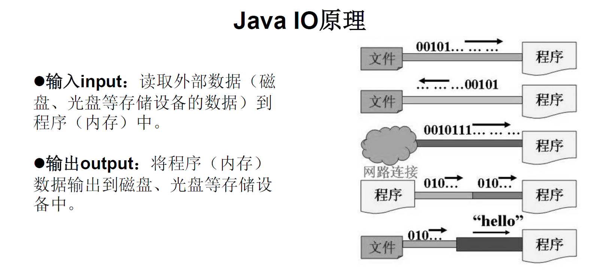
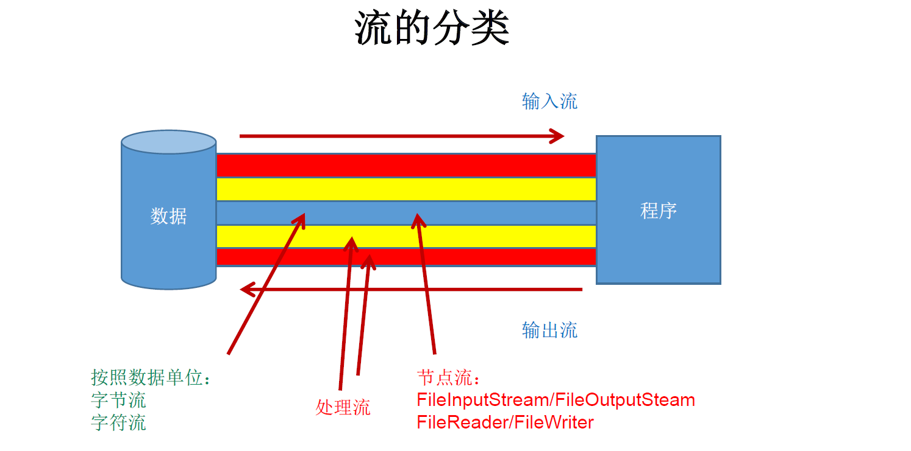
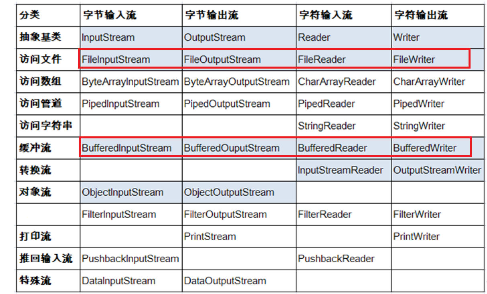
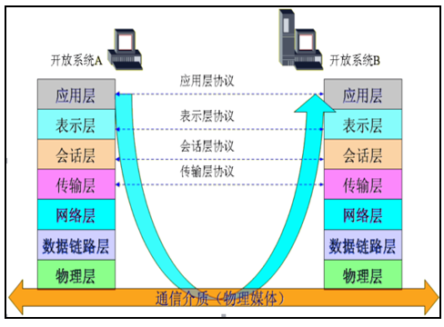
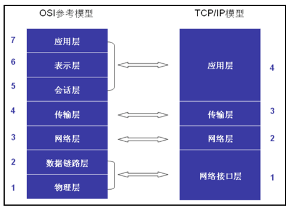
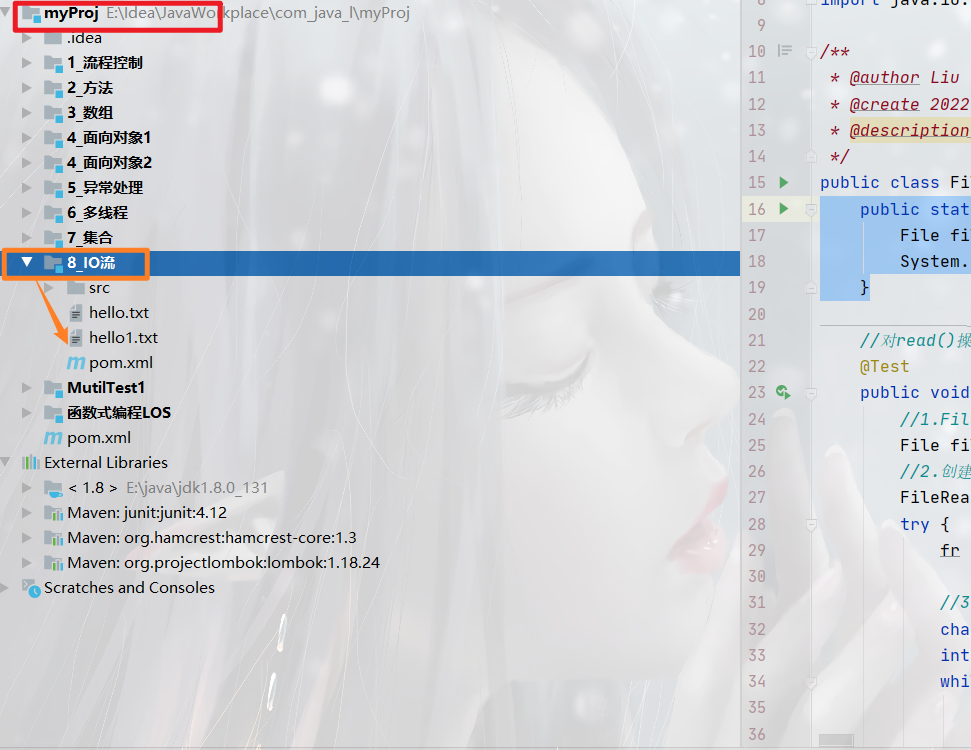
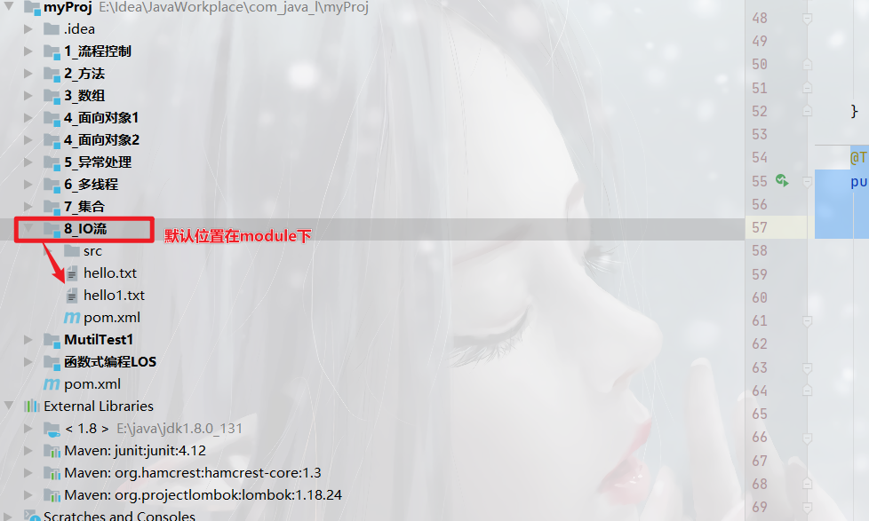

#  IO流

##  1、File类的使用

> ​	java.io.File类：*文件和文件目录路径*的抽象表示形式，与平台无关
> ​	File 能新建、删除、重命名文件和目录，但 File 不能访问文件内容本身。如果需要访问文件内容本身，则需要使用输入/输出流。
> ​	*想要在Java程序中表示一个真实存在的文件或目录，那么必须有一个File对象，但是Java程序中的一个File对象，可能没有一个真实存在的文件或目录*。
> ​	File对象可以作为参数传递给流的构造器

### 1.1常用构造器

> `public File(String pathname)`
>
> 以pathname为路径创建File对象，可以是*绝对路径或者相对路径*，如果pathname是相对路径，则默认的当前路径在系统属性user.dir中存储

- 	绝对路径：是一个固定的路径,从盘符开始
- 	相对路径：是相对于某个位置开始

> `public File(String parent,String child)`
>
> 以parent为父路径，child为子路径创建File对象。

> `public File(File parent,String child)`
>
> 根据一个父File对象和子文件路径创建File对象

```java
public class FileTest {
    //构造器
    @Test
    public  void test1(){
        //构造器1
        File file1 = new File("hello.txt");
        File file2 = new File("./8_IO流/src/main/resources/aa.txt");

        System.out.println(file1);
        System.out.println(file2);
        //构造器2
        File file3 = new File("./8_IO流/src/main","resources");
        System.out.println(file3);

        //构造器3
        File file4 = new File(file3,"aa.txt");
        System.out.println(file4);
    }
}
```

### 1.2路径分隔符

> 路径中的每级目录之间用一个路径分隔符隔开。
> 路径分隔符和系统有关：
> 		windows和DOS系统默认使用“\”来表示
> 		UNIX和URL使用“/”来表示
> Java程序支持跨平台运行，因此路径分隔符要慎用。
> 为了解决这个隐患，File类提供了一个常量：
> 		`*public  static final String separator*`。根据操作系统，动态的提供分隔符。
> 	举例：

```java
File file1 = new File("d:\\atguigu\\info.txt");
File file2 = new File("d:" + File.separator + "atguigu" + File.separator +"info.txt");
File file3 = new File("d:/atguigu");
```

### 1.3 常用方法

| 方法名            | 描述                                                 |
| ----------------- | ---------------------------------------------------- |
| createNewFile()   | 创建一个新文件。                                     |
| mkdir()           | 创建一个新目录。如果父目录不存在，则无法创建         |
| mkdirs()          | 创建一个新目录。如果父目录不存在，则一起创建         |
| delete()          | 删除文件或空目录。                                   |
| exists()          | 判断File对象所对象所代表的对象是否存在。             |
| length()          | 获取文件(夹)的大小(字节)                             |
| getAbsolutePath() | 获取文件的绝对路径。                                 |
| getAbsoluteFile() | 获取文件(夹)的绝对路径：（返回File）                 |
| getName()         | 获取当前file对象的文件名或者是文件夹名               |
| getParent()       | 获取当前file对象的父目录（返回String）               |
| isDirectory()     | 是否是目录。                                         |
| isFile()          | 是否是文件。                                         |
| getPath()         | 获取文件(夹)的相对路径：（返回String）               |
| listFiles()       | 获取 指定目录下的所有文件或者 文件 目录 的 File 数组 |

```java
//创建File对象
File file = new File("d:\\a.txt");
if(!file.exists()) {
    //创建文件
    file.createNewFile();
}
System.out.println("判断文件或者是文件夹是否存在"+file.exists());
System.out.println("判断是否是文件:"+file.isFile());
System.out.println("判断是否是文件夹:"+file.isDirectory());
System.out.println("获取文件或者文件夹的名字："+file.getName());
System.out.println("获取文件大小(字节):"+file.length());
System.out.println("获取文件的相对路径："+file.getPath());
System.out.println("获取文件的绝对路径（String）："+file.getAbsolutePath());
System.out.println("获取文件的绝对路径（File）："+file.getAbsoluteFile());
System.out.println("获取文件的父目录(String):"+file.getParent());
System.out.println("获取文件的父目录(File):"+file.getParentFile());

System.out.println("获取文件所在位置磁盘的总空间："+file.getTotalSpace());
System.out.println("获取文件所在位置磁盘的可用空间："+file.getFreeSpace());
System.out.println("获取文件的最后修改时间(毫秒)"+file.lastModified());
System.out.println("判断文件是否可读"+file.canRead());
System.out.println("判断文件是否可写"+file.canWrite());
System.out.println("判断文件是否可执行"+file.canExecute());
System.out.println("判断文件是否是隐藏文件"+file.isHidden());
```

### 1.4 FileNameFilter接口

> FileNameFilter：文件过滤器接口
>
> + boolean accept(File pathname)。
> + 当调用File类中的listFiles()方法时，支持传入FileNameFilter接口接口实现类，对获取文件进行过滤，只有满足条件的文件的才可出现在listFiles()的返回值中。

> 案例：使用文件过滤器获取所有java文件

```java
File[] files = f.listFiles(new FilenameFilter() {
    @Override
    public boolean accept(File dir, String name) {
        return name.endsWith(".java");
    }
});
for (File file2 : files) {
    System.out.println(file2.getName());
}
```

### 1.4 文件搜索案例

```java
public class FileDemo02 {
	public static void main(String[] args) {
		getJavaFile(new File("d:\\zz"));
	}
	//思考：删除一个文件夹	
	
	//思考：获取文件夹下所有的java文件
	public static void getJavaFile(File file) {
		//遍历当前文件夹下所有的文件或者是文件
		File[] files = file.listFiles();
		//f有两种情况，文件或者是文件夹
		for (File f : files) {
			if(f.isFile()) {
				if(f.getName().endsWith(".java")) {
					System.out.println(f.getName());
				}
			}else {
				//递归调用getJavaFile
				getJavaFile(f);
			}
		}
	}	
}
```

### 1.5 文件搜索案例

> 删除某个文件夹


## 2、IO流的原理及分类

> 	I/O是Input/Output的缩写， I/O技术是非常实用的技术，用于*处理设备之间的数据传输*。如读/写文件，网络通讯等。
> 	Java程序中，对于数据的输入/输出操作以“*流(stream)*” 的方式进行。
> 	java.io包下提供了各种“流”类和接口，用以获取不同种类的数据，并通过*标准的方法*输入或输出数据。



### 2.0  流的分类

#### 2.2.1 按方向

> + 输入流：将<存储设备>中的内容读入到<内存>中。
> + 输出流：将<内存>中的内容写入到<存储设备>中。

#### 2.2.2 按单位

> + 字节流：以字节为单位，可以读写所有数据 。
> + 字符流：以字符为单位，只能读写文本数据 。

####  2.2.3 按功能

> + 节点流：具有实际传输数据的读写功能。`FileInputStream` `FileWriter`
> + 处理流：在节点流的基础之上增强功能。`BufferedInputStream` `BufferedWriter`

| `(抽象基类)` |    字节流    | 字符流 |
| :----------: | :----------: | :----: |
|    输入流    | InputStream  | Reader |
|    输出流    | OutputStream | Writer |



### 2.1 IO流体系



## 3.字节流

> `InputStream`：字节输入流
>
> + public int read(){}。
> + public int read(byte[] b){}。
> + public int read(byte[] b,int off,int len){}。
>
> `OutputStream`：字节输出流
>
> + public void write(int n){}。
> + public void write(byte[] b){}。
> + public void write(byte[] b,int off,int len){}。

### **3.1 文件字节流**

文件字节输入流:

> `FileInputStream`：
>
> + `fis.read()`;
>   +  一次读取一个字节，返回这个字节所对应的ASCII值,如果读到流的末尾返回-1
> + `fis.read(byte[] b)`;
>   + 从流中一次读取自定义缓冲区大小的字节，并返回读取到的字节长度,如果读到流的末尾返回-1
> + `fis.read(byte[] b,int offset,int len)`;
>   + 参数2：读取到数组中指定起始位置
>   + 参数3: 指定读取的字节个数
>   + 从流中一次读取自定义缓冲区大小的字节，并返回读取到的字节长度,如果读到流的末尾返回-1

```java
public class FileInputStreamTest {
    public static void main(String[] args) throws IOException {
        FileInputStream input = new FileInputStream("./8_IO流/src/main/resources/aa.txt");

       /* //read()一次读入一个字节
        int read = input.read();
        System.out.println(read);*/

        //read(byte [] b)
        //从流中一次读取自定义缓冲区大小的字节，并返回读取到的字节长度,如果读到流的末尾返回-1

        //自定义缓冲区
/*        byte[] bytes = new byte[1024];
        int len;
        while ((len=input.read(bytes))!=-1){
            String s = new String(bytes, 0, len);
            System.out.println(s);
        }*/

        //read(buf,offset,len);

        //自定义缓冲区
        byte[] bytes = new byte[1024];
        input.read(bytes, 2, 100);
        System.out.println(Arrays.toString(bytes));
    }
}
```

文件字节输出流

>  `FileOutputStream`：
>
> + `out.write(int b)`; 
>   +   一次写入一个字节，整数表示这个字节对应ASCII码值
> + `out.write(byte b)`;
>   +  一次写入一个字节数组的内容
> + `out.write(b, off, len)`;
>   + 参数2：从数组的指定位置开始  
>   + 参数3：执行写出的字节个数
>   + 一次写入一个字节数组的内容

```java
public static void main(String[] args) {
    //创建输出流对象
    FileOutputStream fos = null;
    try {
        fos = new FileOutputStream("./8_IO流/src/main/resources/bb.txt");
        //通过流对象进行写入

        //write(int b):一次写入一个字节，整数表示这个字节对应Unicode码值
        fos.write(97);

        //write(byte[] b):一次写入一个字节数组的内容
        fos.write("你好输出流".getBytes());

        //write(byte[] b,int off,int len):
        //参数2：从数组的指定位置开始  参数3：执行写出的字节个数
        byte[] b = "你好输出流".getBytes();
        fos.write(b, 0, b.length);

    } catch (FileNotFoundException e) {
        e.printStackTrace();
    } catch (IOException ioException) {
        ioException.printStackTrace();
    } finally {
        //关闭流
        try {
            fos.close();
        } catch (IOException ioException) {
            ioException.printStackTrace();
        }
    }
}
```

### 3.2 IO流细节

> -  1、在使用文件输出流的时候如果文件不存在会自动创建，但是要保证其父目录存在
> -  2、在使用文件输出流的时候，如果想要向文件中追加内容，那么需要将构造参数append设置为true
> -  3、在使用IO读写的时候，读写的操作应当写在try代码块中，关闭资源的代码写在finally代码块中
> -  4、将IO流的创建写在try()中，这样IO流在使用完成之后无需关闭

### **3.3 字节缓冲流**

> 缓冲流：`BufferedOutputStream`/`BufferedInputStream`
>
> + 提高IO效率，减少访问磁盘的次数。
> + 数据存储在缓冲区中，flush是将缓存区的内容写入文件中，也可以直接close。

```java
public class BufferedTest {
    public static void main(String[] args) throws IOException {
        //创建缓冲流输入流对象
/*        FileInputStream fis = new FileInputStream("./8_IO流/src/main/resources/aa.txt");
        BufferedInputStream bis = new BufferedInputStream(fis);


        //缓冲区
        byte[] bytes = new byte[1024];
        int len;
        while ((len = bis.read(bytes)) != -1) {
            String s = new String(bytes, 0, len);
            System.out.println(s);
        }

        //关闭流
        fis.close();
        bis.close(); */

        //1、将文件输出流创建成缓冲流
        BufferedOutputStream bos = new BufferedOutputStream(
                new FileOutputStream("./8_IO流/src/main/resources/bb.txt", true));//设置为true则关闭覆写

        //2、通过缓冲流写入内容
        bos.write("你好".getBytes());
        bos.write("缓冲流".getBytes());

        //刷新(将缓冲区的内容刷新到目的地(硬盘))
        bos.flush();

        //3.关闭流资源
        //关闭流资源的时候，会自动刷新缓冲区内容。(只会刷新一次)
        bos.close();
    }
}
```

### 文件拷贝案例

```java
public class 文件拷贝 {

    public static void main(String[] args) {
        //数据大小674M
        copy1();//6859
        copy2();//1143
    }

    public static void copy1() {
        long start = System.currentTimeMillis();

        //创建输入流
        FileInputStream fis = null;
        FileOutputStream fos = null;
        try {
            fis = new FileInputStream("D:\\AliDownload\\pycharm-professional-2021.3.zip");
            fos = new FileOutputStream("D:\\AliDownload\\OVF\\1.zip");
            //创建缓冲区
            byte[] bytes = new byte[1024];
            int len;
            //读取文件
            while ((len = fis.read(bytes)) != -1) {
                fos.write(bytes, 0, len);
            }
        } catch (FileNotFoundException e) {
            e.printStackTrace();
        } catch (IOException ioException) {
            ioException.printStackTrace();
        } finally {
            //关闭流
            try {
                if (fis != null) {
                    fis.close();
                }
                if (fos != null) {
                    fos.close();
                }

            } catch (IOException ioException) {
                ioException.printStackTrace();
            }
        }
        long end = System.currentTimeMillis();
        System.out.println(end - start);
    }

    public static void copy2() {
        long start = System.currentTimeMillis();
        BufferedInputStream bis = null;
        BufferedOutputStream bos = null;

        try {
            //创建缓冲流
            bis = new BufferedInputStream(new FileInputStream("D:\\AliDownload\\pycharm-professional-2021.3.zip"));
            bos = new BufferedOutputStream(new FileOutputStream("D:\\AliDownload\\OVF\\2.zip"));

            //创建缓冲区
            byte[] bytes = new byte[1024];
            int len;

            //读入流
            while ((len=bis.read(bytes)) != -1) {
                //复制
                bos.write(bytes,0,len);
            }
        } catch (FileNotFoundException e) {
            e.printStackTrace();
        } catch (IOException ioException) {
            ioException.printStackTrace();
        } finally {
            //关闭流
            try {
                if (bis != null) {
                    bis.close();
                }
                if (bos != null) {
                    bos.close();
                }
            } catch (IOException ioException) {
                ioException.printStackTrace();
            }

        }
        long end = System.currentTimeMillis();
        System.out.println(end - start);
    }
}
```

## 4.字符流

> `Reader`：字符输入流
>
> + public int read(){}。
> + public int read(char[]  c){}。
> + public int read(char[] b,int off,int len){}。
>

> `Writer`：字符输出流
>
> + public void write(int n){}。
> + public void write(String str){}。
> + public void write(String str,int offset,int len){}。
> + public void write(char[] c){}。
> + public void write(char[] c,int offset,int len){}。

### **4.1文件字符流**

> 文件字符输入流 `FileReader`

```java
    @Test
    public void testFileReader1() {
        //1.File实例化
        File file = new File("hello.txt");
        //2.创建FileReader对象
        FileReader fr = null;
        try {
            fr = new FileReader(file);


/*            //3数据读入
            //read():返回读入的一个字符.如果达到文件末尾,返回-1
            int data;
            while ((data = fr.read()) != -1) {
                System.out.print((char) data);
            }*/

    //----------------------------------------------------------------
            
/*            //3.读入操作:read(char chars)
            //一次读取一个字符数组，并返回读取到的字符的长度，如果读到流的末尾返回-1
            char[] chars = new char[5];
            int len;
            while ((len = fr.read(chars)) != -1) {
                String s = new String(chars,0,len);
                System.out.println(s);
            }*/
    //----------------------------------------------------------------
            //read(char[] ch,int offset,int len)
            //参数2：指定存放在数组中的起始位置       参数3：指定存放字符的长度
            //一次读取一个字符数组，并返回读取到的字符的长度，如果读到流的末尾返回-1
            char[] chars = new char[5];
            fr.read(chars,2,3);
            System.out.println(chars);
            
        } catch (FileNotFoundException e) {
            e.printStackTrace();
        } catch (IOException ioException) {
            ioException.printStackTrace();
        } finally {
            //4关闭流
            try {
                if (fr != null) {
                    fr.close();
                }
            } catch (IOException ioException) {
                ioException.printStackTrace();
            }
        }
    }
```

> 文件字符输出流 `FileWriter`

```java
@Test
public void testFileWriter() throws IOException {
    //1创建file类对象
    File file = new File("hello1.txt");
    //2.创建FileWriter对象
    FileWriter fw = new FileWriter(file);

    /**
     * write(String str)
     * write(char[] ch)
     *   写入一个字符串
     */
    fw.write("I have a dream!\n");
    fw.write("you need to have a dream");

    //----------------------------------------------------------------

    /**
     * write(char[] ch,int offset,int len)
     * write(String[] str,int offset,int len)
     *        参数2：可以指定数组的起始位置      参数3：可以指定写入的字符长度
     *   写入一个字符数组
     */
    fw.write("you need to have a dream", 4, 5);
    fw.write(new char[]{'你', '真', '的', '好', '棒'}, 0, 4);

    if (fw != null) {
        fw.close();
    }
}
```

# 网络编程

## 1、基础概念

### 1.1计算机网络:

> 把分布在不同地理区域的计算机与专门的外部设备用通信线路互连成一个规模大、功能强的网络系统，从而使众多的计算机可以方便地互相传递信息、共享硬件、软件、数据信息等资源。

### 1.2 网络编程的目的:

> 直接或间接地通过网络协议与其它计算机实现数据交换，进行通讯。

### 1.3 网络编程中的两个主要问题:

> 如何准确地定位网络上一台或多台主机；定位主机上的特定的应用
>
> 找到主机后如何可靠高效地进行数据传输

### 1.4 网络模型

#### 1.4.1 OSI参考模型

> OSI（Open System Interconnect），即开放式系统互联。
>
> + 是ISO组织在1985年研究的网络互联模型。
> + 该体系结构标准定义了网络互联的七层框架（[物理层]()、[数据链路层]()、[网络层]()、[传输层]()、[会话层]()、[表示层]()和[应用层]()）。



> 每层功能：
>
> + 第七层：应用层负责文件访问和管理、可靠运输服务、远程操作服务。（HTTP、FTP、SMTP）。
> + 第六层：表示层负责定义转换数据格式及加密，允许选择以二进制或ASCII格式传输。
> + 第五层：会话层负责使应用建立和维持会话，使通信在失效时继续恢复通信。（断点续传）。
> + 第四层：传输层负责是否选择差错恢复协议、数据流重用、错误顺序重排。（TCP、UDP）。
> + 第三层：网络层负责定义了能够标识所有网络节点的逻辑地址。（IP地址）。
> + 第二层：链路层在物理层上，通过规程或协议（差错控制）来控制传输数据的正确性。（MAC）。
> + 第一层：物理层为设备之间的数据通信提供传输信号和物理介质。（双绞线、光导纤维）。

#### 1.4.2 TCP/IP模型

> + TCP/IP模型是因特网使用的参考模型，基于TCP/IP的参考模型将协议分成四个层次。
>
> + 该模型中最重要的两个协议是TCP和IP协议。



> 每层功能：
>
> + 第四层：应用层负责传送各种最终形态的数据，是直接与用户打交道的层，典型协议是HTTP、FTP等。
> + 第三层：传输层负责传送文本数据，主要协议是TCP、UDP协议。
> + 第二层：网络层负责分配地址和传送二进制数据，主要协议是IP协议。
> + 第一层：接口层负责建立电路连接，是整个网络的物理基础，典型的协议包括以太网、ADSL等等。

### 1.5 网络编程总结 【掌握】

```java
/**
 * 1、什么计算机网络（了解）
 *  为实现资源共享、信息传递通过传出介质将若干台主机连接到一起的一个网络
 *
 * 2、计算机网络模型（了解）
 *  OSI：
 *      应用层           主要指的是是程序
 *      表示层           将数据加密或者解密成二进制的数据
 *      会话层           保持主机之间的连接
 *      传输层           通过网络协议传输数据(TCP协议、UDP协议)
 *      网络层           分配IP地址(IP地址)
 *      网络数据链路层    保证准确性(MAC地址物理地址)
 *      物理层           进行数据传输
 *
 * 3、TCP/IP模型（了解）
 *      应用层
 *      传输层
 *      网络层
 *      物理层
 *
 *
 * 4、网络编程需要什么？（重点）
 *      a、通信协议(TCP\UPD\HTTP)
 *      b、IP地址
 *      c、端口号
 *  网络编程三要素：协议、地址、端口号
 */
```

## 2、IP协议【了解】

### 2.1 IP协议概述

```java
/**
 * 网络三要素之ip地址
 * 1、概念
 *   a、什么是IP地址  (了解)
 *      分配给每一台主机的唯一数字标识
 *
 *   b、ipv4和ipv6  (了解)
 *      ipv4：4个字节32位组成，每一段由8位组成。使用0~255之间的数字表示(应用)
 *      ipv6：16个字节128位组成，每一段由32位组成。使用0~65535之间的数字表示
 *   c、ip地址的分类
 *      A类地址     大型网络：网络地址.主机地址.主机地址.主机地址
 *      B类地址     中型网络：网络地址.网络地址.主机地址.主机地址
 *      C类地址     个人网络：网络地址.网络地址.网络地址.主机地址
 *   d、回路地址(自己与自己通信IP地址)  (重要)
 *                     域名
 *      127.0.0.1     localhost
 *
 *      DNS域名解析器：将域名解析成ip地址。一个ip地址可以对应多个域名  一个域名职能对应一个ip地址
 *      默认情况下：DNS解析回去找到C:\Windows\System32\drivers\etc\hosts文件去查找对应的域名解析，
 *                 如果找不到会去DNS服务器中取查找
 *      常见的DNS域名器：114.114.114.114   8.8.8.8
 *
 *    e、ip相关的命令    (重要)
 *      ipconfig(查看本机的ip地址信息)   ifconfig(Linux操作系统，查看本机的ip地址信息)
 *      ping命令 (检查是否连接上了目标主机)
 *
 *      https://www.baidu.com:80/
 *
 * 2、应用
 *      java是面向对象的编程语言，在java使用InetAddress类表示ip地址信息
 */
```

### 2.2 InetAddress类

```java
public class TestIP {
/**
 *
 *  //方式一：获取本机的InetAddress对象
 *         //通过本地的ip地址信息获取InetAddress对象
 *         InetAddress ia = InetAddress.getLocalHost();
 *         //InetAddress对象的常用方法
 *         //获取主机名(域名)
 *         String hostName = ia.getHostName();
 *         System.out.println(hostName);
 *         //获取ip地址
 *         String hostAddress = ia.getHostAddress();
 *         System.out.println(hostAddress);
 *  //方式二：根据指定的主机名获取InetAddress对象
 *         InetAddress ia = InetAddress.getByName("www.baidu.com");
 *         //InetAddress对象的常用方法
 *         String hostName = ia.getHostName();
 *         System.out.println(hostName);
 *         String hostAddress = ia.getHostAddress();
 *         System.out.println(hostAddress);
 *  //方式三：根据指定的ip地址获取InetAddress对象
 *          InetAddress ia = InetAddress.getByName("14.215.177.38");
 *          System.out.println(ia.getHostName());
 *          System.out.println(ia.getHostAddress());
 */
    public static void main(String[] args) throws UnknownHostException {
        //创建InetAddress对象
        //方式四：根据指定的主机名获取所有的InetAddress
        InetAddress[] ias = InetAddress.getAllByName("www.baidu.com");
        //使用lambda表达式遍历
        /*Arrays.stream(ias).forEach(ia ->{
            System.out.println(ia.getHostAddress());
            System.out.println(ia.getHostName());
        });*/
        //使用foreach循环遍历
        for (InetAddress ia : ias) {
            System.out.println(ia.getHostAddress());
            System.out.println(ia.getHostName());
        }
    }
}
```


# 关于相对地址

## main方法下

在main方法中相对地址是基于*工程主目录*下

```java
public static void main(String[] args) {
    File file = new File("8_IO流\\hello.txt");
    System.out.println(file.getPath());
}
```



## @Test单元测试

```java
@Test
public void testFileReader() {
    //1实例化File类的对象,指明要操作的文件
    File file = new File("hello.txt");//相较于当前的module
}
```




