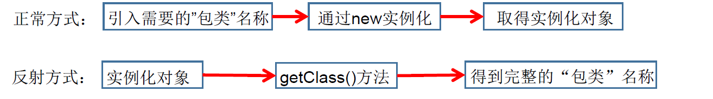

# 反射(Reflection)

## 1、反射的概念

> *※*反射在java中是被视为*动态语言*的关键,,反射机制允许程序在执行期借助Reflection API取得任何类的内部 	信息,并直接操作任意对象的内部属性及方法
>
> *※*加载完类之后，在堆内存的方法区中就产生了一个Class类型的对象(一个类只有一个对象)，这个对象就包含了完整的类的结构信息。我们可以通过这个对象看到类的结构。

==反射:在程序运行期获取类的信息==

关于类对象和类的对象

> 类的对象:基于某个类new出来的对象,也称为实例对象.
>
> 类对象:类加载的产物,封装了一个类的所有信息(类名、父类、接口、属性、方法、构造方法)
>
> 注意：每个类加载到内存都会生成一个唯一的类对象

Java反射机制提供的的功能

> 1. ​	在运行时判断任意一个对象所属的类
> 2. 在运行时构造任意一个类的对象
> 3. 在运行时判断任意一个类所具有的成员变量和方法
> 4. 在运行时获取泛型信息
> 5. 在运行时调用任意一个对象的成员变量和方法
> 6. 在运行时处理注解
> 7. 生成动态代理

# 枚举类