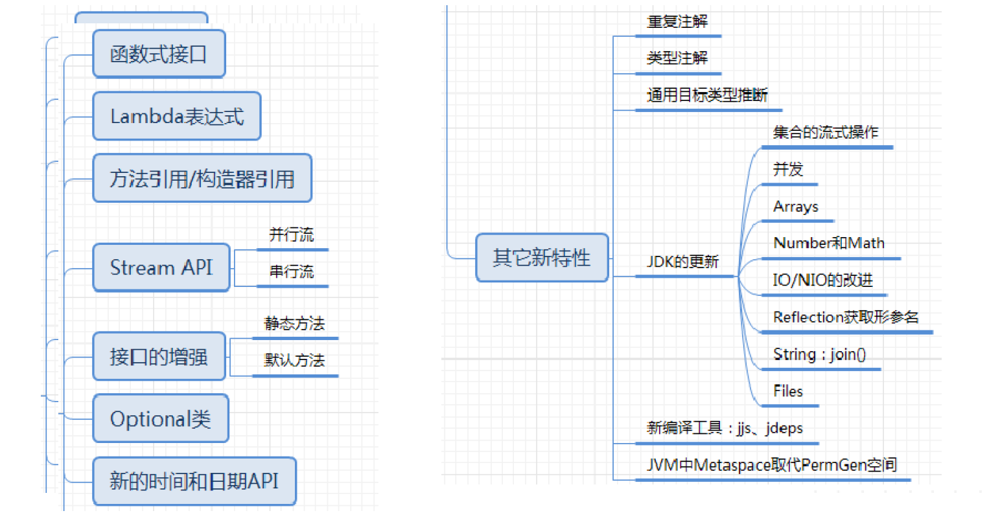
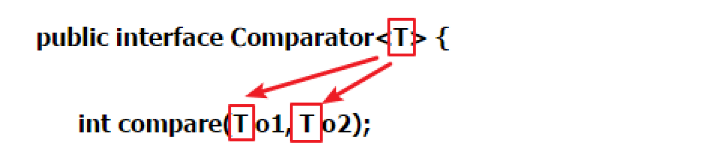
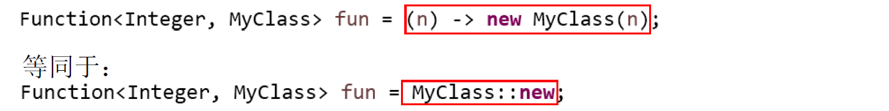
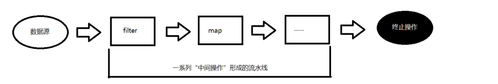
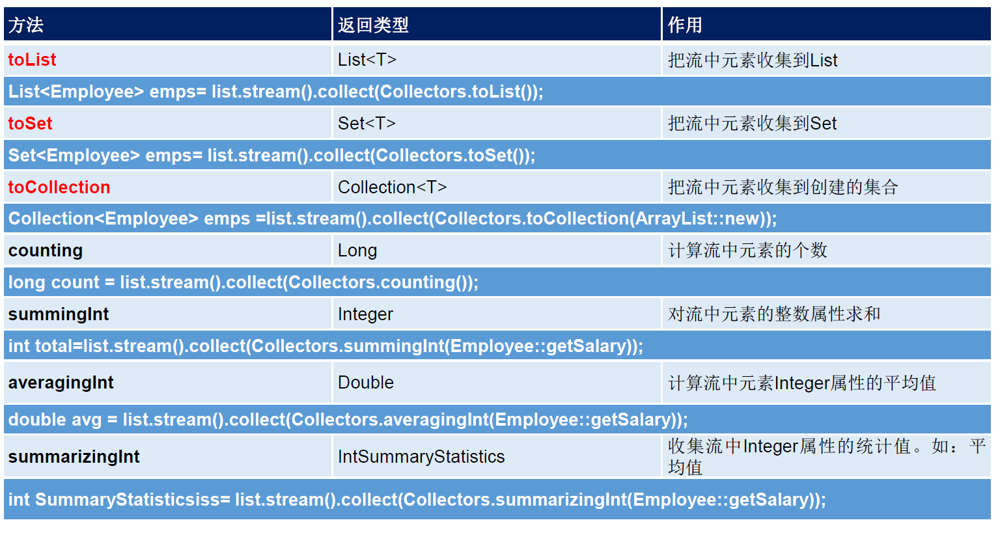
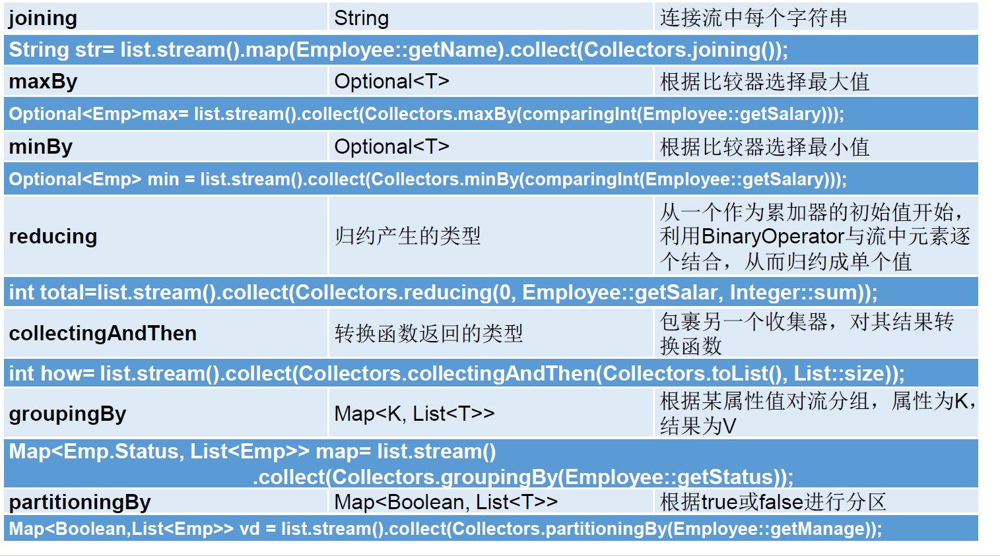
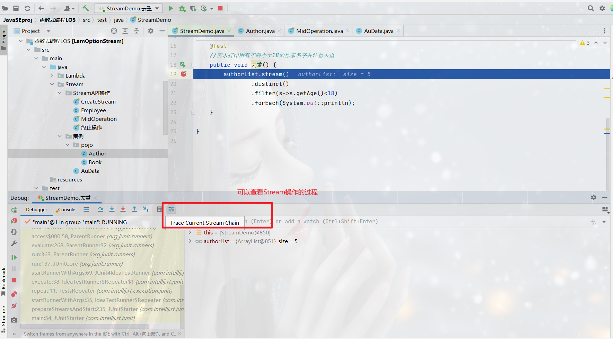
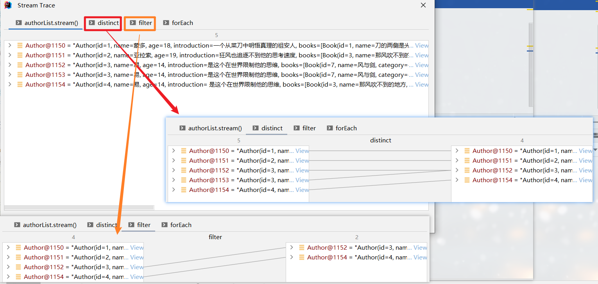

# Java8特性简介



# **1、Lambda表达式**

## 1.1概念

> + Lambda表达式是特殊的匿名内部类，语法更简洁。
> + Lambda表达式允许把函数作为一个方法的参数（函数作为方法参数传递），将代码像数据一样传递。

## 1.2语法格式

> lambda表达式  
>
> + 分为三部分 ：  ()  -> {}	
>   + () 表示接口种方法的形参
>   + {} 表示方法体
> + 使用lambda表示的注意事项
>   + 1、形参的类型可以推断(*类型推断*)，所以可以省略
>   + 2、如果方法的参数*只有一个*，()可以省略
>   + 3、如果参数列表为*空*，必须要写上()、
>   + 4、如果方法体中*只有*一行代码，大括号、分号、可以省，如果有返回return也可以省 。但是要一起省
>   + 5、lambda表达式不会生成class文件

### 1.2.1 关于类型推断:

> 上述Lambda 表达式中的参数类型都是由编译器推断得出的。 Lambda表达式中无需指定类型，程序依然可以编译，这是因为 javac 根据程序的上下文，在后台推断出了参数的类型。 Lambda 表达式的类型依赖于上下文环境，是由编译器推断出来的。这就是所谓的 “类型推断 。



## 1.3 案例

```java
@Test
public void test1() {
    //格式一:无参无返回值
    Runnable r1 = () -> {System.out.println("hello world");};

    //格式二:需要一个参数但是没有返回值
    new Consumer<String>() {
        @Override
        public void accept(String o) {
            System.out.println(o);
        }
    }.accept("谎言和誓言的区别是什么?");

    Consumer<String> con1 = (String s) -> {
        System.out.println(s);
    };
    con1.accept("一个是听的人当真了,一个是说的人当真了。");

    //语法格式三:数据类型可以省略,因为可以由编译器推断出,称为"类型推断"
    Consumer<String> con2 = (String s) -> {
        System.out.println(s);
    };
    con2.accept("一个是听的人当真了,一个是说的人当真了。");
    System.out.println("=====================================");
    Consumer<String> con3 = (s) -> {
        System.out.println(s);
    };
    con3.accept("一个是听的人当真了,一个是说的人当真了。");

    //语法格式四:Lambda 若只需要一个参数,参数的小括号可以省略
    Consumer<String> con4 = s -> {
        System.out.println(s);
    };
    con4.accept("一个是听的人当真了,一个是说的人当真了。");

    //语法格式五:Lambda 需要或两个以上的参数,多条执行语句,并且有返回值
    Comparator<Integer> com1 = new Comparator<Integer>() {
        @Override
        public int compare(Integer o1, Integer o2) {
            System.out.println(o1);
            System.out.println(o2);
            return o1.compareTo(o2);
        }
    };
    System.out.println(com1.compare(14, 6));
    System.out.println("=====================================");

    Comparator<Integer> com2 = ((o1, o2) -> {
        System.out.println(o1);
        System.out.println(o2);
        return o1.compareTo(o2);
    });
    System.out.println(com2.compare(14, 6));

    //语法格式六:当 Lambda 体只有一条语句时,return 与大括号若有都可以省略
    Comparator<Integer> com2 = ((o1, o2) -> {
        return o1.compareTo(o2);
    });
    System.out.println(com2.compare(44, 21));
    System.out.println("=====================================");
    Comparator<Integer> com3 = ((o1, o2) -> o1.compareTo(o2));
    System.out.println(com3.compare(6, 15));
}
```

# 2、函数式接口

## 2.1 概念

> 1.*只包含一个抽象方法的接口称为,函数式接口*
>
> 2.可以通过Lambda表达式来创建接口的对象.(若Lambda表达式抛出一个受检异	常(即非运行时异常),那么要求该异常需要在目标接口的抽象方法上进行声明).
>
> 3.在接口上声明一个`@FunctionlInterface`注解,判断该接口是否是函数式接口.同时javadoc也会包含一条声明说明该接口是个函数式接口

## 2.2 自定义函数式接口

```java
public class 自定义函数式接口 {
    public static void main(String[] args) {
        //匿名类
        m1("zhangsan", new MyInterFace() {
            @Override
            public void show(String name) {
                System.out.println(name);
            }
        });
		//Lambda表达式
        m1("zhangsan",an-> System.out.println(an));
    }

    public static void m1(String name,MyInterFace interFace){
        //接口回调
        interFace.show(name);
    }
}

interface MyInterFace {
    void show(String name);
}
```

## 2.3 常见函数式接口

| 接口                         | 参数类型 | 返回类型 | 说明                                                         |
| ---------------------------- | -------- | -------- | ------------------------------------------------------------ |
| `Consumer< T > `消费型接口   | T        | void     | void accept(T t);对类型为T的对象应用操作                     |
| `Supplier< T > `供给型接口   | 无       | T        | T get();  返回类型为T的对象                                  |
| `Function< T,R > `函数型接口 | T        | R        | R apply(T t);对类型为T的对象应用操作，并返回类型为R类型的对象。 |
| `Predicate< T > `断言型接口  | T        | boolean  | boolean test(T t);确定类型为T的对象是否满足条件，并返回boolean类型。 |

> Consumer< T > 消费型接口

```java
@Test
public void test1() {

    happyTime(500, new Consumer<Double>() {
        @Override
        public void accept(Double aDouble) {
            System.out.println(aDouble);
        }
    });

    happyTime(1000, money -> System.out.println(money));

}

public void happyTime(double money, Consumer<Double> con) {
    con.accept(money);
}
```

> Predicate< T > 断言型接口

```java
@Test
public void test2() {
    List<String> list = Arrays.asList("111", "1", "4444", "1234");
    ArrayList<String> filterString1 = filterString(list, new Predicate<String>() {
        @Override
        public boolean test(String s) {
            if (s.length() > 2) {
                return true;
            } else {
                return false;
            }
        }
    });
    System.out.println(filterString1);

    ArrayList<String> filterString2 = filterString(list, s -> {
        if (s.length() > 2) {
            return true;
        } else {
            return false;
        }
    });
    System.out.println(filterString2);
}

//根据给定的规则,过滤集合中的字符串.此规则由Predicate决定
public ArrayList<String> filterString(List<String> list, Predicate<String> pre) {
    ArrayList<String> filterList = new ArrayList<>();
    for (String s : list) {
        if (pre.test(s)) {
            filterList.add(s);
        }
    }
    return filterList;
}
```

# 3、方法引用

> 1.当要传递`Lambda`体的操作,已经有实现的方法了,可以使用方法引用!
>
> 2.方法引用可以看做是`Lambda`表达式的深层次表达.换句话说,方法引用就是`Lambda`表达式,也就是函数式接口的一个实例,通过方法的名字来指向一个方法,可以认为`Lambda`表达式的一个语法糖
>
> 3.要求:<u>实现接口的抽象的参数列表和返回值类型,必须与方法引用的方法参数列表类型保持一致</u>
>
> 4.格式:使用操作符`"∷"`将类(或对象)与方法名分隔开来

==常见使用情况==

> 对象::实例方法名
>
> 类::静态方法名
>
> 类::实例方法名
>
> 类::new

[Emploee.java](https://bitbucket.org/zdrcgubjo/notes/src/master/Employee.java)

```java
public class MethodRefTest {

    // 情况一：对象 :: 实例方法
    //Consumer中的void accept(T t)
    //PrintStream中的void println(T t)
    @Test
    public void test1() {
        Consumer<String> con1 = s -> System.out.println(s);
        con1.accept("hello world!");

        System.out.println("===================================");
        PrintStream out = System.out;
        Consumer<String> con2 = out::println;
        con2.accept("dlrow olleh");
    }

    //Supplier中的T get()
    //Employee中的String getName()
    @Test
    public void test2() {
        Employee emp = new Employee(1001, "Tom", 23, 5666);
        Supplier<String> sup1 = () -> emp.getName();
        System.out.println(sup1.get());

        System.out.println("===================================");
        Supplier<String> sup2 = emp::getName;
        System.out.println(sup2.get());


    }

    // 情况二：类 :: 静态方法
    //Comparator中的int compare(T t1,T t2)
    //Integer中的int compare(T t1,T t2)
    @Test
    public void test3() {
        Comparator<Integer> com1 = (o1, o2) -> Integer.compare(o1, o2);
        System.out.println(com1.compare(12, 21));

        System.out.println("===================================");
        Comparator<Integer> com2 = Integer::compare;
        System.out.println(com2.compare(21, 12));

    }

    //Function中的R apply(T t)
    //Math中的Long round(Double d)
    @Test
    public void test4() {
        Function<Double, Long> func1=s -> Math.round(s);
        System.out.println(func1.apply(12.5));

        System.out.println("===================================");
        Function<Double,Long> func2=Math::round;
        System.out.println(func2.apply(15.2));

    }

    // 情况三：类 :: 实例方法
    // Comparator中的int comapre(T t1,T t2)
    // String中的int t1.compareTo(t2)
    @Test
    public void test5() {
        Comparator<String> com1=((o1, o2) -> o1.compareTo(o2));
        System.out.println(com1.compare("123", "124"));

        System.out.println("===================================");
        Comparator<String> com2=String::compareTo;
        System.out.println(com2.compare("abc", "axa"));

    }

    //BiPredicate中的boolean test(T t1, T t2);
    //String中的boolean t1.equals(t2)
    @Test
    public void test6() {
        BiPredicate<String,String> bp1=(o1,o2)->o1.equals(o2);
        System.out.println(bp1.test("1234","1234"));

        System.out.println("===================================");
        BiPredicate<String,String> bp2=String::equals;
        System.out.println(bp2.test("123","1234"));


    }

    // Function中的R apply(T t)
    // Employee中的String getName();
    @Test
    public void test7() {
        Employee emp = new Employee(1001, "Tom", 23, 5666);
        Function<Employee,String> func1=e->e.getName();
        System.out.println(func1.apply(emp));

        System.out.println("===================================");
        Function<Employee,String> func2=Employee::getName;
        System.out.println(func2.apply(emp));

    }
    
}
```

# 4、构造器引用

格式:

> ClassName::new

> 与函数式接口相结合,自动与函数式接口中的方法兼容
>
> 可以把构造器引用赋值给定义的方法,要求<u>构造器参数列表要与接口中的抽象方法的参数列表一致!且方法的返回值即为构造器所对应的类的对象</u>



```java
public class ConstructorRefTest {
    //构造器引用
    //Supplier中的T get()
    @Test
    public void test1() {
        Supplier<Employee> sup1 = () -> new Employee();

        System.out.println(sup1.get());

        System.out.println("===================================");
        Supplier<Employee> sup2=Employee::new;
        System.out.println(sup2.get());

    }

    //Function中的R apply(T t)
    @Test
    public void test2() {
        Function<Integer,Employee> func1=id->new Employee(id);
        System.out.println(func1.apply(1001));

        System.out.println("===================================");
        Function<Integer,Employee> func2=Employee::new;
        System.out.println(func2.apply(1002));

    }

    //BiFunction中的R apply(T t,U u)
    @Test
    public void test3() {
        BiFunction<Integer,String,Employee> func1=(id,name)->new Employee(id,name);
        System.out.println(func1.apply(1001, "Tom"));

        System.out.println("===================================");
        BiFunction<Integer,String,Employee> func2=Employee::new;
        System.out.println(func2.apply(1002,"Jerry"));

    }

    //数组引用
    //Function中的R apply(T t)
    @Test
    public void test4() {
        Function<Integer,String[]> func1=n->new String[n];
        System.out.println(func1.apply(10).length);

        System.out.println("===================================");
        Function<Integer,String[]> func2=String[]::new;
        System.out.println(func2.apply(5).length);

    }
}
```

# **5、StreamAPI**

 4.0 Why To Use Stream?

> 1.实际开发中,项目中多数数据源都来源于MySQL,Oracle等。但现在数据来源更多了,有MongoDB,Redis等,这些NoSQL的数据就需要Java层面处理.
>
> 2.`Stream`和`Collection`集合的区别:*Collection是一种静态的内存数据结构,而Stream是有关计算的.*前者面向内存,存储在内存中,后者主要面向CPU,通过CPU实现计算。

## 4.1概念

>是数据渠道，用于操作数据源（集合、数组等）所生成的元素序列。
>
>"*集合讲的是数据,Stream讲的是计算*"

---

==Attention:==

> 1. ==`Stream`不会自己存储元素==
> 2. ==`Stream`不会该表源对象.它会返回一个持有结果的新`Stream`==
> 3. ==`Stream`操作是*延迟执行*的.这意味着他们会等到需要结果的时候才会执行==

## 4.2 Stream的使用

> 1.创建:
>
> - 一个数据源(集合、数组),获取一个流
>
> 2.中间操作:
>
> - 通过一个中间操作链,对数据源进行处理
>
> 3.终止操作
>
> - 使用一个终止操作来产生一个结果。该操作会强制之前的*延迟操作立即执行*，在此之后，该*Stream就不能使用*了。



## 4.3 创建Stram

> 1.通过`Collection`对象的`stream()`或`parallelStream()`方法
>
> 2.通过`Arrays`类的`stream()`方法
>
> 3.通过Stream接口的`of()`、`iterate()`、`generate()`方法
>
> 4.通过`IntStream`、`LongStream`、`DoubleStream`接口中的`of`、`range`、`rangeClosed`方法。

<!--方式1 通过集合:-->

```java
@Test
public void test1() {
    //   List<Employee>
    List<Employee> employees = EmployeeData.getEmployees();
    //default Stream<E> stream():返回一个顺序流
    Stream<Employee> stream = employees.stream();

    //default Stream<E> stream():返回一个并行流
    Stream<Employee> parallelStream = employees.parallelStream();
}
```

==tips:双列集合转换成流==

```java
@Test
public void 双列集合转换成流() {
    HashMap<String, Integer> map = new HashMap<>();
    map.put("xiaoxin", 11);
    map.put("hei", 14);
    map.put("cxk", 17);

    //通过map的entrySet方法转换成单列集合
    Set<Map.Entry<String, Integer>> entries = map.entrySet();

    entries.stream()
            .filter(entry->entry.getValue()>15)
            .forEach(System.out::println);
}
```

<!--方式2 通过数组的Arrays:-->

```java
@Test
public void test2() {
    int[] arr = {1, 2, 3, 4, 5, 6};
    //调用Arrays类的static<T> Stream<T> stream(T[] array):返回一个流
    IntStream stream = Arrays.stream(arr);

    Employee e1 = new Employee(1001, "tom");
    Employee e2 = new Employee(1002, "jerry");
    Employee[] employees = {e1, e2};
    Stream<Employee> stream1 = Arrays.stream(employees);
}
```

<!--方式3 通过Stream的of():-->

```java
@Test
public void test3() {
    Stream<Integer> stream = Stream.of(1, 2, 3, 4, 5, 6);
}
```

<!--方式4 创建无限流:-->

```java
@Test
public void test4() {
    //迭代
    //public static<T> Stream<T> iterate(final T seed, final UnaryOperator<T> f)
    //遍历前十个偶数
    Stream.iterate(0, a -> a + 2).limit(10).forEach(System.out::println);

    //生成
    //public static<T> Stream<T> generate(Supplier<T> s)
    //产生10个随机数
    Stream.generate(() -> (int) (Math.random() * 10 + 1))
            .limit(10)
            .forEach(System.out::println);
}
```

## 4.4 中间操作

> 多个*中间操作*可以连接起来形成一个流水线,除非流水线上	触发终止操作,否则*中间操作不会执行任何处理!*而在执行终止操作时一次性全部执行,称为*"惰性求值"*

```java
@Data
@NoArgsConstructor
@AllArgsConstructor
public class Employee {
    private int id;
    private String name;
    private int age;
    private double salary;

}
```

```java
public List<Employee> getEmployees() {
    List<Employee> list = new ArrayList<>();

    list.add(new Employee(1001, "马化腾", 34, 6000.38));
    list.add(new Employee(1002, "马云", 12, 9876.12));
    list.add(new Employee(1003, "刘强东", 33, 3000.82));
    list.add(new Employee(1004, "雷军", 26, 7657.37));
    list.add(new Employee(1005, "李彦宏", 65, 5555.32));
    list.add(new Employee(1006, "比尔盖茨", 42, 9500.43));
    list.add(new Employee(1007, "任正非", 26, 4333.32));
    list.add(new Employee(1008, "扎克伯格", 35, 2500.32));

    return list;
}
```

### 1.筛选与切片

|        方法         |                             描述                             |
| :-----------------: | :----------------------------------------------------------: |
| filter(Predicate p) |                接收Lambda,从流中排除一些元素                 |
|     distinct()      |  筛选,通过流所生成元素的hashCode()和equals()去掉重复的元素   |
| limit(long maxSize) |                截断流,使其元素不超过指定数量                 |
|    skip(long n)     | 跳过元素,返回一个扔掉了前n个元素的流.若流中元素不足n个,则返回一个空流. |

```java
@Test
public void 筛选与切片() {
    List<Employee> list = getEmployees();
```

过滤

```java
/*filter(Predicate p)  接收Lambda,从流中排除一些元素*/
Stream<Employee> stream = list.stream();
//使用Stream
stream.filter(s -> s.getSalary() > 6000).forEach(System.out::println);

System.out.println("==========================================");
//使用迭代器
for (Employee e : list) {
    if (e.getSalary() > 6000) {
        System.out.println(e);
    }
}
```

去重

```java
/*distinct()  筛选,通过流所生成元素的hashCode()和equals()去掉重复的元素*/
list.add(new Employee(1010, "扎克伯格", 35, 2500.32));
list.add(new Employee(1010, "扎克伯格", 35, 2500.32));
list.stream().distinct().forEach(System.out::println);
System.out.println("==========================================");
```

截取与跳过

```java
/*limit(long maxSize)  截断流,使其元素不超过指定数量*/
//截取前3个元素
list.stream().limit(3).forEach(System.out::println);
System.out.println("==========================================");

/*skip(long n)  跳过元素,返回一个扔掉了前n个元素的流.若流中元素不足n个,则返回一个空流.*/
list.stream().skip(3).forEach(System.out::println);
```

```java
}
```

### **2.映射**

| 方法                        | 描述                                                         |
| :-------------------------- | :----------------------------------------------------------- |
| *map(Function f)*           | 接收一个函数作为参数，该函数会被应用到每个元素上，并将其映射成一个新的元素。 |
| mapToInt(ToIntFunction f)   | 接收一个函数作为参数，该函数会被应用到每个元素上，产生一个新的 DoubleStream |
| mapToLong(ToLongFunction f) | 接收一个函数作为参数，该函数会被应用到每个元素上，产生一个新的 IntStream 。 |
| mapToLong(ToLongFunction f) | 接收一个函数作为参数，该函数会被应用到每个元素上，产生一个新的 LongStream |
| *flatMap(Function f)*       | 接收一个函数作为参数，将流中的每个值都换成另一个流，然后把所有流连接成一个流 |

```java
@Test
public void 映射() {
    /*map(Function f) 接收一个函数作为参数，该函数会被应用到每个元素上，并将其映射成一个新的元素。*/
    List<String> list = Arrays.asList("aa", "bb", "cc", "dd");
    //将元素转换成大写
    list.stream().map(String::toUpperCase).forEach(System.out::println);

    //Exer1:获取姓名长度大于3的员工的姓名
    List<Employee> list1 = getEmployees();
    list1.stream().map(Employee::getName).filter(e -> e.length() > 3).forEach(System.out::println);

    /*flatMap(Function f) 接收一个函数作为参数，将流中的每个值都换成另一个流，然后把所有流连接成一个流 */
    //Exer2:
    //tips:map和flatMap有点类似于list.add和list.addAll
    Stream<Stream<Character>> streamStream = list.stream().map(s -> fromStringToString(s));
    streamStream.forEach(s -> s.forEach(System.out::println));
    System.out.println("===============================================");
    list.stream().flatMap(s -> fromStringToString(s)).forEach(System.out::println);
}

//将字符串的多个字符构成的集合转换成对应的Stream实例
public Stream<Character> fromStringToString(String str) {
    ArrayList<Character> list = new ArrayList<>();

    for (char c : str.toCharArray()) {
        list.add(c);
    }
    return list.stream();
}
```

==tips:==

> ==map和flatMap有点类似于list.add和list.addAll==

### 3.排序

|          方法          |              描述               |
| :--------------------: | :-----------------------------: |
|        sorted()        |  产生一个新流,其中按照自然排序  |
| sorted(Comparator com) | 产生一个新流,其中按照比较器排序 |

```java
@Test
public void 排序() {
    //自然排序
    List<Integer> list = Arrays.asList(12, 43, 22, 67, 11, 22, 12, 77);
    list.stream().sorted().forEach(System.out::println);

    //定制排序
    //根据员工薪资排序
    List<Employee> eList = getEmployees();
    eList.stream().sorted(((o1, o2) -> (int) (o1.getSalary()-o2.getSalary()))).forEach(System.out::println);
}
```

## 4.5 终止操作

### 1.匹配与查找

| 方法                   | 描述                                                         |
| :--------------------- | ------------------------------------------------------------ |
| allMatch(Predicate p ) | 检查是否匹配所有元素                                         |
| anyMatch(Predicate p)  | 检查是否至少匹配一个元素                                     |
| noneMatch(Predicate p) | 检查是否没有匹配所有元素                                     |
| findFirst()            | 返回第一个元素                                               |
| findAny()              | 返回当前流中的任意元素                                       |
| count()                | 返回流中元素总数                                             |
| max(Comparator c)      | 返回流中最大值                                               |
| min(Comparator c)      | 返回流中最小值                                               |
| forEach(Consumer c)    | *内部迭代(*使用 Collection 接口需要用户去做迭代，称为*外部迭代*。相反，Stream API 使用内部迭代——它帮你把迭代做了) |

```java
@Test
public void 匹配与查找(){
    List<Employee> list = getEmployees();

    //1.allMatch(Predicate p )检查是否匹配所有元素
    //是否所有员工的年龄
    boolean allMatch = list.stream().allMatch(e -> e.getAge() > 18);
    System.out.println(allMatch);

    //2.anyMatch(Predicate p)检查是否至少匹配一个元素
    //是否有员工工资大于10000
    boolean anyMatch = list.stream().anyMatch(e -> e.getSalary() > 10000);
    System.out.println(anyMatch);

    //3.noneMatch(Predicate p)检查是否没有匹配所有元素
    //是否存在姓"雷"的员工
    boolean noneMatch = list.stream().noneMatch(e -> e.getName().startsWith("雷"));
    System.out.println(noneMatch);//有则返回false

    //4.findFirst()返回第一个元素
    Optional<Employee> first = list.stream().findFirst();
    System.out.println(first);

    //5.findAny()返回当前流中的任意元素
    Optional<Employee> any = list.parallelStream().findAny();
    System.out.println(any);
}
```

```java
@Test
public void 匹配与查找2(){
    List<Employee> list = getEmployees();
    /*count()返回流中元素总数*/
    long count = list.stream().filter(s -> s.getSalary() > 5000).count();
    System.out.println(count);
    /*max(Comparator c)返回流中最大值*/
    //返回最高工资
    Optional<Double> max = list.stream().map(o -> o.getSalary()).max(Double::compare);
    System.out.println(max);
    /*min(Comparator c)返回流中最小值*/
    Optional<Employee> min = list.stream().min((o1, o2) -> (int) (o1.getSalary() - o2.getSalary()));
    System.out.println(min);
    /*forEach(Consumer c)*/
    list.stream().limit(3).forEach(System.out::println);
}
```

### 2.规约

| 方法                            | 描述                                                   |
| ------------------------------- | ------------------------------------------------------ |
| reduce(T iden,BinaryOperator b) | 可以将流中元素反复结合起来,得到一个值。返回T           |
| reduce(BinaryOperator b)        | 可以将流中元素反复结合起来,得到一个值。返回Optional<T> |

> 备注：map 和 reduce 的连接通常称为 map reduce 模式，因 Google
> 用它来进行网络搜索而出名。

```java
@Test
public void 归约(){
    /*reduce(T iden,BinaryOperator b)可以将流中元素反复结合起来,得到一个值。返回T*/
    //计算1-10的自然数和
    Integer reduce = Stream.iterate(1, n -> n + 1).limit(10).reduce(0, (o1, o2) -> o1 + o2);
    System.out.println(reduce);

    /*reduce(BinaryOperator b)可以将流中元素反复结合起来,得到一个值。返回Optional<T>*/
    //计算公司中所有员工工资的总和
    List<Employee> list = getEmployees();
    Optional<Double> reduce1 = list.stream().map(e -> e.getSalary()).reduce(Double::sum);
    System.out.println(reduce1);
}
```

### 3.收集

| 方法                 | 描述                                                         |
| -------------------- | ------------------------------------------------------------ |
| collect(Collector c) | 将流转换成其他形式.接收一个Collector接口的实现,用于给Stream中的元素做汇总的方法 |

```java
@Test
public void 收集() {
    Employee employee = new Employee();
    //collect(Collector c)将流转换成其他形式.接收一个Collector接口的实现,用于给Stream中的元素做汇总的方法
    List<Employee> list = getEmployees();
    List<Employee> fList = list.stream().filter(e -> e.getSalary() > 6000).collect(Collectors.toList());
    Employee[] fArray = list.stream().filter(e -> e.getSalary() > 6000).toArray(n -> new Employee[n]);
    System.out.println(fList);
    System.out.println(Arrays.toString(fArray));
}
```

> Collector接口中的方法的实现决定了如何对流执行收集的操作(如将流收集成List,Set,Map)。
>
> Collectors实用类提供了很多静态方法,可以方便非创建常用的收集器实例,具体方法与实例如下表所示:





# 6、Option类

> Optional<T > 类 (java.util.Optional) 是一个容器类 它可以保存类型 T 的值， 代表这个 值存在 。或者仅仅保存 null ，表示这个值 不存在 。原来 用 null 表示一个值不存在，现在 Optional 可以更好的表达这个概念。并且 可以避免空指针异常

> Optional类的Javadoc描述如下：这是一个可以为null的容器对象。如果值存在则isPresent()方法会返回true，调用get()方法会返回该对象。

| 创建Optional的方法       | 描述                                |
| ------------------------ | ----------------------------------- |
| Optional.of(T t) :       | 创建一个 Optional 实例，t*必须非空* |
| Optional.empty(          | 创建一个空的 Optional 实例          |
| Optional.ofNullable(T t) | t可以为null                         |

| 判断Optional容器中是否包含对象               | 描述                                                         |
| -------------------------------------------- | ------------------------------------------------------------ |
| boolean isPresent()                          | 判断是否包含对象                                             |
| void ifPresent(Consumer<? super T> consumer) | 如果有值，就执行Consumer接口的实现代码，并且该值会作为参数传给它。 |

| 获取Optional容器的对象                                 | 描述                                                       |
| ------------------------------------------------------ | ---------------------------------------------------------- |
| T get()                                                | 如果调用对象包含值，返回该值，否则抛异常                   |
| T orElse(T other)                                      | 如果有值则将其返回，否则返回指定的other对象。              |
| T orElseGet(Supplier<? extends T> other)               | 如果有值则将其返回，否则返回由Supplier接口实现提供的对象。 |
| T orElseThrow(Supplier<? extends X> exceptionSupplier) | 如果有值则将其返回，否则抛出由Supplier接口实现提供的异常。 |

# Stream流中的debug技巧

> Trace Current Stream Chain可以查看流的执行过程






# ending........


