# 1、数据类型

## 1.0 JS 的变量类型：

- 数值类型： number

- 字符串类型： string：**" ",     ' '**

  > 引号可以相互嵌套 

- 对象类型： object

- 布尔类型： boolean

- 函数类型： function

JavaScript 里特殊的值：
==undefined== ：未定义，所有js 变量未赋于初始值的时候，默认值都是undefined.
==null== 空值
==NaN== 全称是：Not a Number。非数字。非数值。

## 1.1 JS 中的定义变量格式：

***let和var的区别***

let为了解决var存在的一些问题

var声明:

- 可以先使用再声明（不合理）
- var变量可以重复声明
- var变量可提升、全局变量、没有块作用域等

```js
let 变量名;
let  变量名= 值;
```

## **1.2 模板字符串**

用于处理字符串使用 ''+'' 拼接繁琐的问题

> ```js
> let name = 'java';
> document.write(`张三学${name}!`)
> document.write("张三学"+name+"!")
> ```

## 1.3 类型转换

### 1.3.1 隐式转换

某些运算符被执行时，系统内部会自动将数据类型进行转换，这种转换称为隐式转换

**规则：**

- +号两边只要有一个时字符串，都会把另一个转化为字符串
- *除+号*以外的算数运算符（-、*、/）都会把数据转换成数字类型

**缺点：**

- 转换类型不明确，靠经验总结

**小技巧：**

- +号做为正号解析可以转换成Number

```javascript
<script>
    console.log(11 + 11);      //22
    console.log('11' + 11);    //1111
    console.log(11 - 11);      //0
    console.log('11' - 11);    //0
    console.log(1 * 1);        //1
    console.log('1' * 1);      //1
    console.log(typeof '123'); //string
    console.log(typeof +'123');//number
    console.log(+'11' + 11);   //22
</script>
```

### 1.3.2 显示转换

**转换为数字类型**

```js
console.log(Number('10')); //10
//转换数字型，只保留整数，没有四舍五入
console.log(parseInt('10'));//10
console.log(parseInt('10.1'));//10
console.log(parseInt('10.9'));//10
//转换数字型，保留小数 
console.log(parseFloat('10.999'));//10.999
/**/
```

<!--区别-->

```js
//Number（）只能放数字类型的字符，不能存放abc这种
//否则返回NaN
console.log(Number('10.9ab'));//NaN
console.log(parseFloat('10.9ab'))//10.9(经常用于过滤单位）
```

**转换为字符型**

```js
console.log(String(10));//10
let age = 10;
console.log(age.toString());//10
//括号里面如果是2，则表示转换为2进制
console.log(age.toString(2));//1010
```

# 2、运算符

## 2.1 关系（比较）运算

等于： == 等于是简单的做字面值的比较
全等于： === 除了做字面值的比较之外，还会比较两个变量的数据类型

```html
<head>
<meta charset="UTF-8">
<title>Title</title>
<script type="text/javascript">
var a = "12";
var b = 12;
alert( a == b ); // true
alert( a === b ); // false
</script>
</head>
```

## 2.2 逻辑运算

且运算： &&
或运算： ||
取反运算： !

> 在JavaScript 语言中，所有的变量，都可以做为一个boolean 类型的变量去使用。
> <u>0 、null、undefined、””(空串) 都认为是false</u>；

```javascript
 /*&& 且运算。
 有两种情况：
 第一种：当表达式全为真的时候。返回最后一个表达式的值。
 第二种：当表达式中，有一个为假的时候。返回第一个为假的表达式的值*/
 var a = "abc";
 var b = true;
 var d = false;
 var c = null;

 // alert( a && b );//true
 // alert( b && a );//abc
 // alert( a && d ); // false
 // alert( a && c ); // null

 /* || 或运算
 第一种情况：当表达式全为假时，返回最后一个表达式的值
 第二种情况：只要有一个表达式为真。就会把回第一个为真的表达式的值*/
 // alert( d || c ); // null
 // alert( c|| d ); //false
 // alert( a || c ); //abc
 // alert( b || c ); //true
```

# 3、流程控制

## 3.1 分支语句

**三元运算符**

<!--数字补零案例-->

```js
 let num=+prompt("请输入一个数字：");
 //判断条件是 小于10 则在数字前面加0，否则不加
 let re=num>10?num:'0'+num;
document.write(re);
```

**switch**

*switch是<u>全等匹配</u>（===），switch判断是字符类型，case对应也要使用字符类型*

> 1. switch语句一般用于等值判断，不适用与区间判断
> 2. switch case一般需要配合break关键字使用，没有break会造成case穿透

~~~js
switch (1) {
    case 1:
        document.write("hello word!");
        break;
    case 2:
        document.write("hello");
        break;
    case '3':
        document.write("3333");
        break;
    default:
        document.write('no');
}
~~~

<!--switch案例
简单计算器-->

```js
let operation = prompt("请输入运算符(+-*/)：");
let num1 = +prompt("请输入第一个数：");
let num2 = +prompt("请输入第二个数：");
switch (operation) {
    case '+':
        alert("计算结果为：" + (num1 + num2));
        break;
    case '-':
        alert("计算结果为：" + (num1 - num2));
        break;
    case '*':
        alert("计算结果为：" + (num1 * num2));
        break;
    case '/':
        if (num2 === 0) {
            alert("除数不能为零")
        } else {
            alert("计算结果为：" + (num1 / num2));
        }
        break;
    default:
        alert("不合法运算符")
}
```

## 3.2 循环语句

### while循环

 <!--100以内偶数和-->

```js
let i = 1;
let sum = 0;
while (i <= 100) {
    if (i % 2 == 0) {
        sum += i;
    }
    i++;
}
document.write(sum)
```

<!--最小公倍数与最大公约数-->

```js
//2个数的最小公倍数最大公约数
let m = +prompt("第一个数：");
let n = +prompt("第二个数：");
let product=m*n;
let temp = m > n ? m - n : n - m;
while (temp !== 0) {
    if (m > n) {
        m = temp;
        temp = m > n ? m - n : n - m;
    } else {
        n = temp;
        temp = m > n ? m - n : n - m;
    }
}
document.write("最大公约数："+m+"<br>")
document.write("最小公倍数："+product/m+"<br>")
```

<!--简易atm-->

```js
//1.不断弹出对话框
let money = 20000;
let st = true;
while (st) {
    let str = prompt(`请选择操作：
    1.存钱
    2.取钱
    3.查看余额
    4.退出`)
    switch (str) {
        case '1':
            let m1 = +prompt("请输入存钱金额：")
            money += m1;
            break;
        case '2':
            let m2 = +prompt("请输入取钱金额：")
            money -= m2;
            break;
        case '3':
            alert("余额为：" + money)
            break;
        case '4':
            st = false;
            break;
    }
}
```

### for循环

<!--水仙花数-->

```js
//输出所有水仙花数，abc=a^3+b^3+c^3; 951
for (let i = 100; i < 1000; i++) {
    let n1 = parseInt(i / 100);
    let n2 = parseInt(i % 100 / 10);
    let n3 = parseInt(i % 10);
    if (Math.pow(n1, 3) + Math.pow(n2, 3) + Math.pow(n3, 3) === i) {
        document.write("i:" + i + "<br> n1:" + n1 + "<br> n2:" + n2 + "<br> n3:" + n3)
        document.write("<hr>")
    }
}
```

 <!--最小公倍数最大公约数-->

```js
/*测试20 12 
60
4
*/
//2个数的最小公倍数最大公约数
let m = +prompt("第一个数：");
let n = +prompt("第二个数：");
let product = m * n;
let i;
//i等于m、n中较小的
for (i = m > n ? n : m; i > 0; i--) {
    if (m % i == 0 && n % i == 0) {
        break;
    }
}
document.write("最大公约数："+i+"<br>")
document.write("最小公倍数："+product/i+"<br>")
```

**嵌套循环**

#### <!--99乘法表-->

```js
for (let i = 9; i >=1; i--) {
    for (let j = 1; j <= i; j++) {
        document.write(`${j}×${i}=${i * j}&nbsp;&nbsp;`)
    }
    document.write('<br><br>')
}
```

####  <!--打印星星-->

```js
//打印星星
/*
*         ⭐
*       ⭐⭐⭐
*     ⭐⭐⭐⭐⭐
*    ⭐⭐⭐⭐⭐⭐⭐
*  ⭐⭐⭐⭐⭐⭐⭐⭐⭐
*    ⭐⭐⭐⭐⭐⭐⭐
*      ⭐⭐⭐⭐⭐
*        ⭐⭐⭐
*          ⭐
* */
for (let i = 1; i <6 ; i++) {
    for (let k = 5-i; k >0 ; k--) {
        document.write("&nbsp;&nbsp;&nbsp;&nbsp;");
    }
    for (let j = 1; j <=2*i-1; j++) {
        document.write("⭐");
    }
    document.write("<br><br>");
}
for (let i = 4; i >0 ; i--) {
    for (let k = 5-i; k >0 ; k--) {
        document.write("&nbsp;&nbsp;&nbsp;&nbsp;");
    }
    for (let j = 1; j <=2*i-1; j++) {
        document.write("⭐");
    }
    document.write("<br><br>");
}
```

# 4、数组

### 4.1 JS 中数组的定义：

格式：
var 数组名= []; // 空数组
var 数组名= [1 , ’abc’ , true]; // 定义数组同时赋值元素

```javascript
var arr = [true,1]; // 定义一个空数组
// alert( arr.length ); // 0
arr[0] = 12;
// alert( arr[0] );//12
// alert( arr.length ); // 0
// javaScript 语言中的数组，只要我们通过数组下标赋值，那么最大的下标值，就会自动的给数组做扩容操作。
arr[2] = "abc";
alert(arr.length); //3
// alert(arr[1]);// undefined
// 数组的遍历
for (var i = 0; i < arr.length; i++){
alert(arr[i]);
}
```

### 4.2 向数组中添加元素

> <u>数组.push()</u>方法将一个或多个元素添加到数组的<u>末尾</u>，并返回该数组的新长度

==语法：==

~~~js
arr.push(元素1,元素2,...,元素n)
~~~

```js
let arr = ['red', 'green'];
//把blue放在arr后面
// arr.push('blue');
console.log(arr.push('blue'));//插入并返回数组长度
console.log(arr);
```


> <u>数组.unshift()</u>方法将一个或多个元素添加到数组的<u>开头</u>，并返回该数组的新长度

~~~js
arr.unshift(元素1,元素2,...,元素n)
~~~

```js
let arr = ['red', 'green'];
//arr.unshift('blue');
console.log(arr.unshift('blue'));//插入并返回数组长度
console.log(arr);
```


<!--筛选数组
将大于等于10的存入新数组-->

```js
let arr = [1, 3, 21, 12, 5, 7, 9, 56, 78, 99, 123];
let newArr = [];
for (let i = 0; i < arr.length; i++) {
    if (arr[i] >= 10) {
        //将arr[i]追加给newArr
        newArr.push(arr[i]);
    }
}
console.log(newArr);
```

### 4.3删除数组元素

> <u>数组.pop()</u>方法从数组中删除<u>最后一个元素</u>，并返回该元素的值

==tips==:该方法一次只能删除一个元素，删除多个元素使用循环

```js
 let arr = ['red', 'green','blue'];
 console.log(arr.pop());//删除元素并返回该元素的值
 console.log(arr);
```


> <u>数组.shift()</u>方法从数组中删除<u>第一个元素</u>，并返回该元素的值

```
 let arr = ['red', 'green','blue'];
 console.log(arr.shift());
 console.log(arr);
```


> <u>数组.splice()</u>方法删除数组指定元素

语法：

~~~js
arr.splice(start,deleteCount)
arr.splice(起始位置,删除几个元素)
~~~

```js
 let arr = ['red', 'green','blue','yellow','white'];
 console.log(arr.splice(3,2));//从索引为三开始删除2个
 console.log(arr);
```


### 4.4 冒泡排序

```js
let arr=[43, 34, -23, 9, 54, 33, 67, 82, -14, -2, -5, 0];
//循环次数数组长度减一
for (let i = 0; i <arr.length-1; i++) {
    //外层每执行一次，内层交换次数减一
    for (let j = 0; j <arr.length-1-i ; j++) {
        if(arr[j]>arr[j+1]){
            let temp=arr[j];
            arr[j]=arr[j+1];
            arr[j+1]=temp;
        }
    }
}
console.log(arr)
```

### 4.5 综合案例-柱状图

```css
<style>
    * {
        margin: 0;
        padding: 0;
    }

    .box {
        display: flex;
        width: 700px;
        height: 300px;
        border-left: 1px solid black;
        border-bottom: 1px solid black;
        margin: 50px auto;
        justify-content: space-around;
        align-items: flex-end;
        text-align: center;
    }

    .box > div {
        display: flex;
        width: 50px;
        background-color: antiquewhite;
        flex-direction: column;
        justify-content: space-between;
    }

    .box div span {
        margin-top: -20px;
    }

    .box div h4 {
        margin-bottom: -35px;
        width: 70px;
        margin-left: -10px;
    }
</style>
```

```js
let arr = [];
for (let i = 1; i <= 4; i++) {
    arr.push(+prompt(`第${i}季度：`))
}
document.write(`<div class="box">`);
//循环四个div
for (let i = 0; i < arr.length; i++) {
document.write(`
<div style="height: ${arr[i]}px;">
    <span>${arr[i]}</span>
    <h4>第${i+1}季度</h4>
</div>`)
}
document.write(`</div>`);
```

# 5、函数

## 5.1 函数的定义

使用的格式如下:
function 函数名(形参列表){
函数体
}
在JavaScript 语言中，如何定义带有返回值的函数？
只需要在函数体内直接使用return 语句返回值即可！

```javascript
// 定义一个无参函数
function fun(){
    alert("无参函数fun()被调用了");
}
// 函数调用===才会执行
// fun();
function fun2(a ,b) {
    alert("有参函数fun2()被调用了a=>" + a + ",b=>"+b);
}
// fun2(12,"abc");
// 定义带有返回值的函数
function sum(num1,num2) {
    var result = num1 + num2;
    return result;
}
//alert( sum(100,50) );
```

> 注：在Java 中函数允许重载。但是在JS 中函数的重载会直接覆盖掉上一次的定义

## 5.2 函数的arguments 隐形参数（只在function 函数内）

就是在function 函数中不需要定义，但却可以直接用来获取所有参数的变量。我们管它叫隐形参数。
隐形参数特别像java 基础的可变长参数一样。
public void fun( Object ... args );
可变长参数其他是一个数组。
那么js 中的隐形参数也跟java 的可变长参数一样。操作类似数组。

```javascript
    function fun(a) {
        alert( arguments.length );//可看参数个数
        alert( arguments[0] );
        alert( arguments[1] );
        alert( arguments[2] );
        alert("a = " + a);
        for (var i = 0; i < arguments.length; i++){
            alert( arguments[i] );
        }
        alert("无参函数fun()");
    }
    // fun(1,"ad",true);
    // 需求：要求编写一个函数。用于计算所有参数相加的和并返回
    function sum(num1,num2) {
        var result = 0;
        f or (var i = 0; i < arguments.length; i++) {
            //类型为number才相加
            if (typeof(arguments[i]) == "number") {
                result += arguments[i];
            }
        }
        return result;
    }
    alert( sum(1,2,3,4,"abc",5,6,7,8,9) );
```

## 5.3 函数的返回值

### 5.3.1函数的返回值

> - 函数体中使用return关键字能将内部的执行结果交给外部函数使用
> - 函数内部只能出现一次return，因为return后面的代码不会执行
> - return会立即结束当前函数
> - 函数可以没有return，这种情况下函数默认返回值为undefined

```js
function getSum(x,y) {
    x=x||0;
    y=y||0;
    //先计算再返回
    return x+y;
}
//将getSum()获得的结果赋值给sum变量
let sum=getSum(25,12);
document.write(sum);
```

<!--求数组的最大值-->

```js
function getMax(arr) {
    let max = arr[0];
    for (let i = 0; i < arr.length; i++) {
        if (arr[i] > max) {
            max = arr[i];
        }
    }
    return max;
}

let max = getMax([43, 34, -23, 9, 54, 33, 67, 82, -14, -2, -5, 0]);
document.write(max);
```

### 5.3.2多个返回值

<!--求数组最大最小值-->

```js
function getMaxMin(arr) {
    //声明最大最小值
    let max = min = arr[0];
    //求最大最小值
    for (let i = 0; i < arr.length; i++) {
        max = arr[i] > max ? arr[i] : max;
        min = arr[i] < min ? arr[i] : min;
    }
    //将max,min存入对象
    return {
        "max": max,
        "min": min
    };
}

let result = getMaxMin([43, 34, -23, 9, 54, 33, 67, 82, -14, -2, -5, 0])
document.write(`数组的最大值为：${result.max}<br>
                    数组的最小值为：${result.min}`)
```

## 5.4 作用域及其域链

### 5.4.1 作用域概述

> 通常来说，一段程序代码中用到的名字并不总是有效和可用的，而限定这个名字的<u>可用性的代码范围</u>就是这个名字的<u>作用域</u>。作用域的使用提高了程序逻辑的局部性，增强了程序的可靠性，减少了名字冲突

- 全局作用域：作用于所有代码的执行环境（整个script标签内部）或一个独立的js文件。
- 局部作用域：作用于函数内的代码环境。因为跟函数有关所以也叫函数作用域。
- 块作用域：块作用域由{}包括，if语句和for语句里面的{}等。

### 5.4.2 变量的作用域

- 全局变量：全局变量在任何区域都可以访问。
- 局部变量：局部变量(函数内部的let变量)只能在当前函数内部访问很修改。
- 块级变量：{}内部的let变量，只能在块作用域里访问，不能跨块访问，也不能跨函数访问

### 5.4.3 作用域链-变量访问原则

> 作用域链:采取就近原则的方式查找变量的最终值

```js
let a = 1;

function f1() {
    let a = 2;
    let b = '22';
    f2();
    function f2() {
        let a=3;
        f3();
        function f3() {
            let a=4;
            console.log(a);
            console.log(b)
        }
    }
}
f1();//a=4,b='22'
```

## 5.5 匿名函数

使用格式如下：

> let 函数名= function(形参列表) { 函数体}

~~~js
let fun = function () {
alert("无参函数");
}
// fun();
let fun2 = function (a,b) {
alert("有参函数a=" + a + ",b=" + b);
}
// fun2(1,2);
let fun3 = function (num1,num2) {
return num1 + num2;
}
alert( fun3(100,200) );
~~~

## 5.6 立即执行函数

场景介绍:避免全局变量之间的污染

语法:

~~~js
//方式一
(function () {console.log(111)})()
//方式二
(function () {console.log(111)}())
//不需要调用立即执行
~~~

==多个匿名函数必须加分号==


## 5.7 综合案例-转换时间

```js
//1.用户输入
let seconds = prompt();
//2.计算时间封装函数
function getTime(t) {
    let h = parseInt(t / 60 / 60 % 24)
    let m = parseInt(t / 60 % 60);
    let s = parseInt(t % 60)
    h = h < 10 ? '0' + h : h;
    m = m < 10 ? '0' + m : m;
    s = s < 10 ? '0' + s : s;
    return `计算之后的时间是${h}小时${m}分钟${s}秒`;
}

let time = getTime(seconds);
document.write(time);
```

# 6、JS 中的自定义对象

## 6.1 Object自定义对象

对象的定义：
var 变量名= new Object(); // 对象实例（空对象）
变量名.属性名= 值; // 定义一个属性
变量名.函数名= function(){} // 定义一个函数

对象的访问：
变量名.属性/ 函数名();

```javascript
var obj = new Object();
//alert(typeof (obj));
obj.name = "zhangsan"
obj.age = 18;
obj.fun = function () {
    alert("姓名：" + this.name + ",年龄：" + this.age)
}
obj.fun()
//alert(obj.name)
```

## 6.2 {}花括号自定义对象

 对象的定义：
var 变量名= { // 空对象
属性名：值, // 定义一个属性
属性名：值, // 定义一个属性
函数名：function(){} // 定义一个函数
};
对象的访问：

1. *对象.属性/ 函数名();*

2. *对象['属性名']*

```js
//声明对象
let person = {
    'name': 'zhangsan',
    'age': 108,
    'sex': '男',
    fun: function () {
        console.log("姓名：" + this.name + ",年龄：" + this.age);
    },
    movie: function (s) {
        console.log(s);
    }
}
//对象的访问 方法1 对象.属性
console.log(person.name + ':' + person.age);
//方法2 对象['属性名']
console.log(person['name']);
//访问方法
person.fun();
person.movie('无间道');
```

## 6.3对象操作

<!--增，删，改-->

```js
let obj={
name:'张三',
age:18,
}
//修改  对象.属性=新值
obj.name=20;

//增加 js可以很方便的动态添加属性和方法
obj.sex='男';
//会去对象里面找是否有sex这个属性，有则更新，否则添加属性
obj.fun=function(){
console.log("姓名：" + this.name + ",年龄：" + this.age);
}
console.dir(obj);
obj.fun();

//删除
delete  obj.name 
console.dir(obj);
```

<!--遍历对象-->

**for in**循环：只能获得对象的<u>键名</u>，不能直接获取<u>键值</u>，为遍历对象而设计

> `for in`遍历的是数组的索引（即键名），而`for of`遍历的是数组元素值
>
> `for in`总是得到对象的`key`或数组、字符串的下标
>
> `for of`总是得到对象的`value`或数组、字符串的值

```js
let obj = {
    name: '张三',
    age: 18,
    sex: '男',
}
//for in 循环
let arr = [];
for (let k in obj) {
    console.log(k);//k为键即属性名
    console.log(obj[k]);
}
//k在这里是一个变量，for in 循环取得的是属性名即k==='name'==='age'==='sex'
//所以在循环中打印obj[k]等于打印obj['name'],obj['age']...
```

## 6.4 对象数组案例

```html
<style>
    table {
        width: 600px;
        text-align: center;
    }

    table, th, td {
        border: 1px solid #ccc;
        border-collapse: collapse;
    }

    caption {
        font-size: 18px;
        margin-bottom: 10px;
        font-weight: 700;
    }

    tr {
        height: 40px;
        cursor: pointer;
    }

    table tr:nth-child(1) {
        background-color: #ddd;
    }

    table tr:not(:first-child):hover {
        background-color: #eee;
    }
</style>
```

```js
<script>
    let students = [
        {name: '张三', age: 18, gender: '男', province: '河北'},
        {name: '李四', age: 19, gender: '男', province: '河南'},
        {name: '王五', age: 20, gender: '男', province: '山西'},
        {name: '赵六', age: 21, gender: '男', province: '山东'},
    ];
    //头部
    document.write(`
        <h2>学生信息</h2>
        <p>将数据渲染到页面</p>
        <table>
        <caption>学生列表</caption>
    <tr>
        <th>序号</th>
        <th>姓名</th>
        <th>年龄</th>
        <th>性别</th>
        <th>家乡</th>
    </tr>`)
    //中间循环 
    for (const k in students) {
        document.write(`
    <tr>
        <td>${(+k + 1)}</td>
        <td>${students[k].name}</td>
        <td>${students[k].age}</td>
        <td>${students[k].gender}</td>
        <td>${students[k].province}</td>
    </tr>`)
    }
    //尾部
    document.write(`</table>`)
</script>
```

## 6.5 内置对象

<!--点名案例-->

```js
<body>
<button onclick="click1()" id="bt">按钮1</button>
<script>
    //声明一个数组
    let arr = ['赵云', '张飞', '关羽', '马超', '刘备', '黄忠', '关平'];
    function click1() {
        function getRadom(min, max) {
            return Math.floor(Math.random() * (max - min + 1) + min)
        }
        let random = getRadom(0, arr.length-1);
        console.log(arr[random]);
        //随机到后删除
        arr.splice(random, 1)
        console.log(arr)
        // console.log(random);
    }
</script>
</body>
```

<!--猜数字-->

```js
function getRadom(min, max) {
    return Math.floor(Math.random() * (max - min + 1) + min)
};
let random = getRadom(1, 10);
console.log(random);
while (true){
    let getNum=+prompt("请输入一个数字：");
    if(getNum==random){
        alert("猜对了");
        break;
    }else if(getNum<random){
        alert("猜小了");
    }else {
        alert('猜大了');
    }
}
```

# 7、Dom对象

## 7.1关于dom对象

- Dom对象：浏览器根据html标签生成的<u>js对象</u>
  - 所有的标签属性都可以在这个对象上找到
  - 修改这个对象的属性会自动映射到标签身上
- Dom核心思想
  - 把网页内容当作<u>对象</u>处理
- Document对象
  - 是dom中提供的一个对象
  - 它提供的内容的属性和方法都是*<u>用来访问和操作网页内容的</u>*
    - eg：document.write();
  - 网页的所有内容都在


## 7.2 获取dom对象

### **根据css选择器来获取dom元素**

#### 7.2.1 选择匹配的第一个元素

语法：

> `document.querySelector('css选择器');`

参数:

> 包含一个或多个有效的css选择器<u>字符串</u>

返回值：

> css选择器匹配的<u>第一个元素</u>，一个HTMLElement对象。
>
> 如果没有匹配到，则返回null

参考文档：https://developer.mozilla.org/zh-CN/docs/Web/API/Document/querySelector

~~~js
<body>
<div>我是第一个盒子</div>
<div>我是第二个盒子</div>
<div>我是第三个盒子</div>
<ul>
    <li>1</li>
    <li>2</li>
    <li>3</li>
</ul>
</body>
<script>
    let div=document.querySelector("div");
    console.log(div);
    let li=document.querySelector('ul li:last-child');
    console.log(li);
</script>
~~~

#### 7.2.2 选择匹配第多个元素

语法：

> `document.querySelectorAll('css选择器');`

参数:

> 包含一个或多个有效的css选择器<u>字符串</u>

返回值：

> css选择器匹配的<u>NodeList对象集合</u>

==tips:==

> 该方法得到是一个伪数组：有长度，有索引但是没有pop(),push()等数组方法
>
> 想要获得里面的每一个对象，则需要用遍历的方式获得

```js
<script>
let li=document.querySelectorAll('ul li')
//console.log(li);
//遍历获取每一个元素
for (const liElement of li) {
    console.log(liElement);
}
</script>
```

### 其他方法获取dom对象

**document.getElementById('elementId')**
通过标签的id 属性查找标签dom 对象，elementId 是标签的id 属性值
**document.getElementsByName('elementName')**
通过标签的name 属性查找标签dom 对象，elementName 标签的name 属性值
**document.getElementsByTagName('tagname')**
通过标签名查找标签dom 对象。tagname 是标签名
**document.createElement( 'tagName')**
方法，通过给定的标签名，创建一个标签对象。tagName 是要创建的标签名

***注：***
document 对象的三个查询方法，如果有id 属性，优先使用getElementById 方法来进行查询
如果没有id 属性，则优先使用getElementsByName 方法来进行查询
如果id 属性和name 属性都没有最后再按标签名查getElementsByTagName
以上三个方法，一定要在页面加载完成之后执行，才能查询到标签对象。

# 8、*修改dom元素内容*

## 8.1 修改dom元素

> - document.write();方法
> - 元素.innerText属性  ：只能识别内容，不能解析标签（即只读）
> - 元素.innerHTML属性  ：能解析标签

```html
<style>
    div {
        display: inline-block;
        width: 150px;
        height: 30px;
        border: 1px solid rosybrown;
        vertical-align: middle;
        text-align: center;
        line-height: 30px;
    }
</style>
```

```js
<body>
抽中的选手：<div></div>
</body>
<script>
    //1.获取元素
    let div = document.querySelector('div');
    //2.得到随机的名字
    //声明一个数组
    let arr = ['赵云', '张飞', '关羽', '马超', '刘备', '黄忠', '关平'];

    function getRadom(min, max) {
        return Math.floor(Math.random() * (max - min + 1) + min)
    }

    let random = getRadom(0, arr.length - 1);
    console.log(arr[random]);

    //3.写入标签内部
    div.innerHTML = arr[random];

    //随机到后删除
    arr.splice(random, 1)
    console.log(arr)
    // console.log(random);
</script>
```

## 8.2 修改常用元素属性

修改图片属性：

```js
<body>

</body>
<script>
    //获取元素
    let img=document.querySelector('img');
    //修改图片内容  对象.属性
    img.src='./p12reviewFix3.jpg';
    img.title='hello';
</script>
```

## 8.3 修改元素*CSS*属性

### 1. 通过style属性控制css

语法：

> 对象.style.样式属性=值

==tips:==

> 1. 修改样式时通过<u>style</u>属性引出
> 2. 如果属性有-链接符,需要转换为<u>小驼峰</u>命名法
> 3. 赋值时,需要得时候要加<u>css单位</u>

```html
<style>
    div {
        width: 700px;
        height: 400px;
        background-color: antiquewhite;
    }
</style>
```

```js
<body>
<div></div>
<script>
    //获取元素
    let div = document.querySelector('div');
    //改变样式
    div.style.width='1500px';
    div.style.height='1000px';
    div.style.backgroundColor='#35e8da'
</script>
</body>
```

### 2.通过类名操作css

如果样式较多，直接通过style属性修改比较繁琐。我们可以通过借助css类名得形式

语法：

> 元素.className = '类名'

==tips：==

- class是关键字，所以使用className代替
- className是使用新值换旧值，如果需要添加一个类，需要保存之前得类名

```html
<style>
    div {
        width: 300px;
        height: 100px;
        background-color: antiquewhite;
    }

    .act {
        width: 700px;
        height: 400px;
        background: #35e8da;
    }
</style>
```

```js
<body>
<div class="one"></div>
<script>
    //获取元素
    let div = document.querySelector('div');
    //改变样式
    // div.style.width='700px';
    // div.style.height='400px';
    // div.style.backgroundColor='#35e8da'
    
    //多个类保存旧类
    div.className = 'one act'
</script>
</body>
```

### 3.通过classList操作类控制css

为解决className容易覆盖以前得类名，可以通过<u>classList</u>得方式追加和删除类名

语法：

> ~~~
> //追加一个类
> 元素.classList.add('类名')
> //删除一类
> 元素.classList.remove('类名')
> //切换一个类
> 元素.classList.toggle('类名')
> ~~~

```html
<style>
    div {
        width: 300px;
        height: 100px;
        background-color: antiquewhite;
    }

    .act {
        width: 700px;
        height: 400px;
        background: #35e8da;
    }
</style>
```

```js
<body>
<div class="one"></div>
<script>
    //获取元素
    let div = document.querySelector('div');
    //改变样式
    //追加类
    //div.classList.add('act');

    //删除类
    //div.classList.remove('one');

    //切换类（有则删无则加）
    div.classList.toggle('one');
</script>
</body>
```

## 8.4修改表单属性

表单很多情况下也需要修改属性，比如点击眼睛，可以看到密码，本质上是把表单类型从密码转化为文本框

> 表单.value = '用户名'
>
> 表单.type = 'password'

```js
<body>
<form action="">
    <p>用户名：<input type="text" name=""></p>
    <p> 密码：<input type="password" class="password" name=""></p>
    <input type="checkbox" class="n1">1
    <input type="checkbox" class="n1">1
    <input type="checkbox" class="n1">1
</form>
<script>
    //获取元素
    let form=document.querySelector('.password');
    console.log(form);
    //修改type属性
    form.type='text';
    
    //勾选复选框
    let checkBox=document.querySelectorAll('.n1')
    for (const checkBox1 of checkBox) {
        checkBox1.checked=true;
    }
</script>
```

# 9、*定时器-间歇函数*

1. 开启定时器 

> setInterval(函数，间隔时间)；

2. 关闭定时器

> let timer=setInterval(函数，间隔时间)；
>
> clearInterval(timer); //timer为定时器序号

## 1.<!--定时器-倒计时-->

```js
<body>
<textarea cols="30" rows="10">1. 特别提示
1.1为使用本手机应用软件及服务，您应当阅读并遵守《用户使用协议》（以下简称“本协议”）。请您务必审慎阅读、充分理解各条款内容，特别是免除或者限制责任的条款，以及同意或使用某项服务的单独协议，并选择接受或不接受。

1.2 除非您已阅读并接受本协议所有条款，否则您无权下载、安装或使用本软件及相关服务。您的下载、安装、使用、获取账号、登录等行为即视为您已阅读并同意上述协议的约束。

1.3北京东大正保科技有限公司（以下称“本公司”）同意按照本协议的规定及其不时发布的操作规则提供基于互联网的相关服务（以下称"本服务"）。若您需要获得本服务，您（以下称"用户"）应当同意本协议的全部条款并按照页面上的提示完成全部的申请程序。
</textarea><br>
<button disabled>6秒后启用</button>
<script>
    //1.获取元素
    let button = document.querySelector('button')
    //2.计算逻辑
    //2.1设置变量进行计数
    let i = 6;
    //2.2开启计时器
    let timer = setInterval(f1, 1000);

    //计时器执行的函数
    function f1() {
        i--;
        button.innerHTML = `${i}秒后启用`;
        //i=0时按钮启用，同时关闭计时器
        if (i === 0) {
            //关闭定时器
            button.disabled = false;
            clearInterval(timer);
            //修改button内容
            button.innerHTML = `我同意`;
        }
    }
</script>
</body>
```
## 2.<!--图片切换-仿轮播图-->

```js
<script src="js/图片数据.js"></script>
<body>

<script>
    //获取元素
    let img = document.querySelector('img');
    //启用计时器
    let timer = setInterval(f1, 1000);
    console.log(timer);

    function f1() {
        i++;
        img.src = data[i].imgSrc;
        //i为10时置i=-1
        i === 9 ? i = -1 : i;
    }

    //设置计数
    let i = 0;
    let arr = [];
    for (const dataKey in data) {
        arr.push(data[dataKey].imgSrc)
    }
</script>
</body>
```

 [图片数据.js](JavaScript.assets\图片数据.js) 

# 10、*js事件监听&案例*

- 什么是事件？

- 事件是在编程时系统内发生的动作或者发生的事情

  （比如用户在网页上点击一个按钮）

- 什么是事件监听？

  即让程序检测是否有事件产生，一旦有事件触发，就立即调用一个函数做出响应，也称为注册事件

- 语法

  > 元素.addEventListener('事件',要执行的函数)

- 事件监听的三要素
  - 事件源:哪个dom元素被事件触发了,要获取dom元素
  - 事件:用什么方式触发,比如鼠标单机click,鼠标经过mouseover等
  - 事件调用的函数:要做的事情

```js
<body>
<button>点击我</button>
<script>
    // 获取元素
    let btn = document.querySelector('button');
    //事件监听
    btn.addEventListener('click',function () {
        alert("hello word");
    });
</script>
</body>
```

## 10.1 点名案例(click事件)

```html
<style>
    div {
        display: inline-block;
        width: 150px;
        height: 30px;
        border: 1px solid rosybrown;
        vertical-align: middle;
        text-align: center;
        line-height: 30px;
    }
</style>
```

```js
<body>
<div></div>
<br>
<button class="start">点名</button>
<button class="end" hidden>确定</button>
</body>
<script>
    //1.获取元素
    let div = document.querySelector('div');
    let start = document.querySelector('.start')
    let end = document.querySelector('.end')
    //2.得到随机的名字
    //2.1声明一个数组
    let arr = ['赵云', '张飞', '关羽', '马超', '刘备', '黄忠'];
    let timer, random;

    //2.2生成随机数
    function getRadom(min, max) {
        return Math.floor(Math.random() * (max - min + 1) + min)
    }

    //开始点名
    start.addEventListener('click', function () {
        timer = setInterval(function () {
            random = getRadom(0, arr.length - 1);
            //3.写入标签内部
            div.innerHTML = arr[random];

            //隐藏btn开启btn2
            start.hidden = true;
            end.hidden = false;
        }, 100);

    })

    //停止抽取
    end.addEventListener('click', function () {
        clearInterval(timer);

        console.log(random)

        //抽取到删除数组元素
        arr.splice(random, 1)

        //隐藏btn2开启btn
        start.hidden = false;
        end.hidden = true;

        //抽取完禁用按钮
        if (arr.length === 0) {
            start.disabled = true;
        }
        console.log(arr)
    })

</script>
```

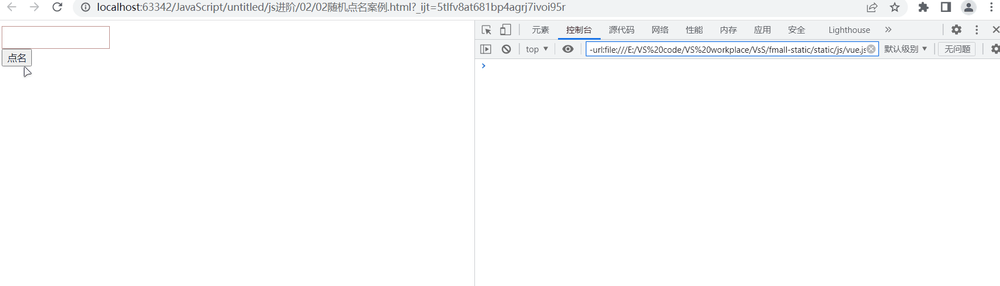

## 10.2 小米输入框案例（focus&blur事件）

 [小米输入框案例.css](JavaScript.assets\css\小米输入框案例.css) 

```html
<body>
<div class="mi">
    <input type="search" placeholder="小米笔记本">
    <ul class="result-list" hidden>
        <li><a href="#">全部商品</a></li>
        <li><a href="#">小米11</a></li>
        <li><a href="#">小米10s</a></li>
        <li><a href="#">小米平板5</a></li>
        <li><a href="#">黑鲨101</a></li>
    </ul>
</div>
</body>
<script>
    //获取元素
    let input = document.querySelector('input');
    let ul = document.querySelector('ul');

    //得到焦点
    input.addEventListener('focus', function () {
        input.classList.add('search');
        ul.hidden = false;
    });

    //失去焦点
    input.addEventListener('blur', function () {
        input.classList.remove('search');
        ul.hidden = true;
    })
</script>
```

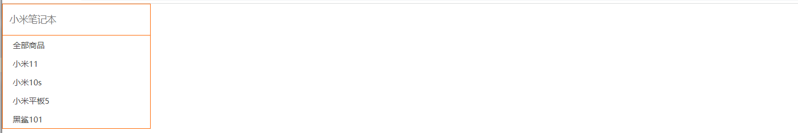

## 10.3 微博输入案例（input事件）

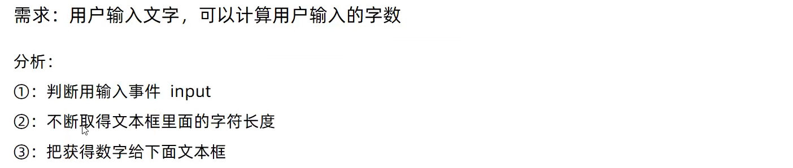

 [weibo.css](JavaScript.assets\微博发布案例\weibo.css) 

```js
<body>
<div class="w">
    <div class="controls">
        <br>
        <textarea placeholder="说点什么吧..." id="area" cols="30" rows="10" maxlength="200"></textarea>
        <div>
            <span class="useCount">0</span>
            <span>/</span>
            <span>200</span>
            <button id="send">发布</button>
        </div>

    </div>
    <div class="contentList">
        <ul>
        </ul>
    </div>
</div>
<script>
    //1.获取元素  文本域 usecount
    let area = document.querySelector('#area');
    let useCount = document.querySelector('.useCount');
    //2.绑定事件 用户输入事件 input
    area.addEventListener('input', function () {
        // console.log(area.value)
        //不断得到文本域中的长度
        useCount.innerHTML=area.value.length;
    });
</script>
</body>
```

## 10.4 全选文本框案例

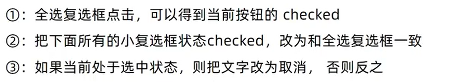

 [全选文本框案例.css](JavaScript.assets\css\全选文本框案例.css) 

```js
<body>
<table>
    <tr>
        <th class="allCheck">
            <input type="checkbox" name="" id="checkAll"><span class="all">全选</span>
        </th>
        <th>商品</th>
        <th>商家</th>
        <th>价格</th>
    </tr>
    <tr>
        <td>
            <input type="checkbox" name="check" class="ck">
        </td>
        <td>小米手机</td>
        <td>小米</td>
        <td>￥1999</td>
    </tr>
    <tr>
        <td>
            <input type="checkbox" name="check" class="ck">
        </td>
        <td>小米手机</td>
        <td>小米</td>
        <td>￥1999</td>
    </tr>
    <tr>
        <td>
            <input type="checkbox" name="check" class="ck">
        </td>
        <td>小米手机</td>
        <td>小米</td>
        <td>￥1999</td>
    </tr>
</table>
</body>
<script>
    //1.获取元素 获取checkAll和ck
    let checkAll = document.querySelector('#checkAll');
    let ck = document.querySelectorAll('.ck');
    let span = document.querySelector('.all');
    //2.事件监听 全选
    checkAll.addEventListener('click', function () {
        for (const check of ck) {
            check.checked = true;
        }
        //全选按钮处于选中状态则改为取消
        if (checkAll.checked) {
            span.innerHTML = '取消';
        } else {
            span.innerHTML = '全选';
        }
    })
    //3.小按钮（同时给多个按钮绑定事件
    // for (let i = 0; i <ck.length ; i++) {
    //     ck[i].addEventListener()
    //
    // }
    for (const check of ck) {
        //绑定事件
        check.addEventListener('click', function () {

            //只要点击任何一个小按钮，都要遍历所有的按钮
            for (const checkE of ck) {
                if (checkE.checked === false) {
                    //如果有false结束函数
                    checkAll.checked = false;
                    span.innerHTML = '全选';
                    return;
                }
            }
            //循环结束说明，没有小按钮为false
            checkAll.checked = true;
            span.innerHTML = '取消';
        })
    }
</script>
```

## 10.4 购物车增加案例

 [购物车增加案例.css](JavaScript.assets\css\购物车增加案例.css) 

```js
<body>
<div>
    <input type="text" id="total" value="1" readonly>
    <input type="button" value="+" id="add">
    <input type="button" value="-" id="subtract" disabled>
</div>
<script>
    //1.获取元素
    let total = document.querySelector('#total');
    let add = document.querySelector('#add');
    let subtract = document.querySelector('#subtract');
    //2.点击加号 事件监听
    add.addEventListener('click', function () {
        //console.log(total.value)
        total.value++;
        subtract.disabled = false;
    })

    //点击减号 事件监听
    subtract.addEventListener('click', function () {
        //console.log(total.value)
        total.value--;
        if (total.value === '1') {
            subtract.disabled = true;
        }
    })
</script>
</body>
```

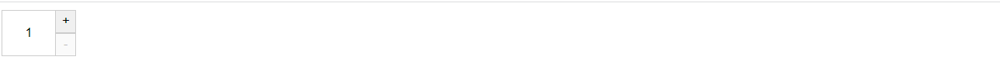

# 11、高阶函数

1. 函数表达式

   1. 函数即数据

   2. 把函数赋值给变量

      > ~~~ js
      > let count=function(x,y){
      >     return x+y;
      > };
      > ~~~

2. 回调函数

   1. 把函数当作另外一个函数的参数传递，这个函数就叫做<u>回调函数</u>

   2. 回调函数本质还是函数，只不过把它当作参数使用

   3. 使用匿名函数做回调函数比较常见

      > ~~~js
      > function fn(){
      >   console.log('我是回调函数')
      > };
      > //fn传递给setInterval,fn就是回调函数
      > setInterval(fn,1000);
      > ~~~

# 12、排他思想

当前元素为a状态，其他元素为b状态

**使用：**

1. 干掉所有人（使用for循环）
2. 复活它自己（通过this或下标找到自己或对应的元素

```js
    <style>
        .p {
            background: #42e5d8;
        }
    </style>
</head>
<body>
<button class="p">第1个</button>
<button>第2个</button>
<button>第3个
</button>
<button>第4个</button>
<button>第5个</button>
</body>
<script>
    let btns = document.querySelectorAll('button')
    for (let i = 0; i < btns.length; i++) {
        btns[i].addEventListener('click', function () {
            // this.classList.add('p')
            /*  // 干掉所有人
                        for (let j = 0; j < btns.length; j++) {
                            btns[j].classList.remove('p')
                        }*/
            //只需要找出那个唯一得到，删除
            document.querySelector('.p').classList.remove('p')
            // 复活自己
            this.classList.add('p')
        })
    }
</script>
```

# 13、*节点操作*

## 13.1 dom节点的类型

- dom节点

  - dom树中每一个内容都称之为节点

- 节点类型

  1. **元素节点(key)**

     - 所有的标签 比如body、div
     - html是根节点

  2. 属性节点

     - 所有的属性 比如和 href

  3. 文本节点

     - 所有的文本

  4. 其他

     

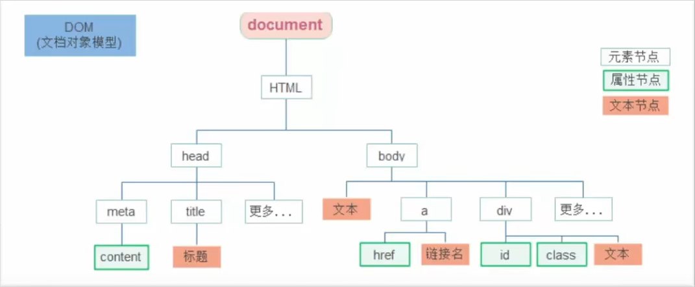

## 13.2 查找节点

### 13.21.父节点查找

- ### 父节点查找：

  - parentNode<u>属性</u>

  - 返回最<u>近一级</u>的父节点 找不到 返回null

    > 子元素.parentNode

<!--关闭二维码-->

 [关闭二维码.css](JavaScript.assets\css\关闭二维码.css) 

```html
<body>
<div class="erweima">
    <span class="close"></span>
</div>
<div class="erweima">
    <span class="close"></span>
</div>
<div class="erweima">
    <span class="close"></span>
</div>
<div class="erweima">
    <span class="close"></span>
</div>
<div class="erweima">
    <span class="close"></span>
</div>
<script>
    //1.获取元素
    let close = document.querySelectorAll('.close');

    //2.遍历 为每一个close添加监听事件
    for (let i = 0; i < close.length; i++) {
        close[i].addEventListener('click', function () {
            //关闭当前那个二维码，点击谁就关闭谁的爸爸
            this.parentNode.style.visibility = 'hidden';
        })
    }
</script>
</body>
```

### 13.22.子节点查找

- ### 子节点查找

  - childNodes

    - 获取所有子节点、包括文本节点（空格、换行）、注释节点等

  - **children(key)**

    - 仅获得所有元素节点

    - 返回一个伪数组

      > 父元素.children

```html
<body>
<button>点击</button>
<ul>
    <li>我是孩纸</li>
    <li>我是孩纸</li>
    <li>我是孩纸</li>
    <li>我是孩纸</li>
    <li>我是孩纸</li>
    <li>我是孩纸</li>
</ul>
</body>
<script>
    let btn=document.querySelector('button');
    let ul=document.querySelector('ul');
    btn.addEventListener('click',function () {
        for (let i = 0; i <ul.children.length ; i++) {
            ul.children[i].style.color='red';
        }
    })
</script>
```

### 13.2.3.兄弟节点查找

- 兄弟节点查找
  1. 下一个兄弟节点
     - nextElementSibling 属性
  2. 上一个兄弟节点
     - previousElementSibling 属性

```js
<body>
<button>点击</button>
<ul>
    <li>第1个</li>
    <li class="two">第2个</li>
    <li>第3个</li>
    <li>第4个</li>
</ul>
</body>
<script>
    let btn = document.querySelector('button');
    let two = document.querySelector('.two');
    btn.addEventListener('click', function () {
        two.nextElementSibling.style.color = 'red';
        two.previousElementSibling.style.color = 'blue';
    })
</script>
```

## 13.3 追加节点

1. 创建节点

   - 即创造出一个新的网页元素，再添加到网页内一般先创建节点，然后插入节点

   - 创建元素节点的方法

     > ~~~js
     > //创建一个新的元素节点 
     > document.createElement('标签名')
     > ~~~

2. 追加节点

   - 插入到父元素的最后一个子元素

   - > ~~~
     > 父元素.appendChild（子元素）
     > ~~~

     ```html
     <body>
     <ul>
         <li>
         111
         </li>
     </ul>
     </body>
     <script>
         let ul = document.querySelector('ul');
         let li = document.createElement('li');
         li.innerHTML = '123';
         //追加节点，父元素.appendChild（子元素），追加在父元素的子元素的后面
         ul.appendChild(li);
     </script>
     ```

   - 插入到父类中某个子元素的前面

     > ~~~html
     > 父元素.insertBefore（要插入的元素，在哪个元素前面）
     > ~~~

   - 

   - ```html
     <body>
     <ul>
         <li>111</li>
         <li>333</li>
     </ul>
     </body>
     <script>
         let ul = document.querySelector('ul');
         let li = document.createElement('li');
         li.innerHTML = '我是张三';
         //父元素.insertBefore（要插入的元素，在哪个元素前面）
         ul.insertBefore(li,ul.children[1])
     </script>
     ```

### 1.<!--学成案例重构-->

 [style.css](JavaScript.assets\学成案例重构\style.css) 

 [综合案例数据代码.js](JavaScript.assets\学成案例重构\综合案例数据代码.js) 

[学成案例重构资料](JavaScript.assets\学成案例重构)

```html
<link rel="stylesheet" href="../css/style.css">
<body>
<!-- 4. box核心内容区域开始 -->
<div class="box w">
    <div class="box-hd">
        <h3>精品推荐</h3>
        <a href="#">查看全部</a>
    </div>
    <div class="box-bd">
        <ul class="clearfix">
        </ul>
    </div>
</div>
<script src="../js/综合案例数据代码.js"></script>
<script>
    let ul = document.querySelector('ul');
    //1.根据数据的个数，决定这个li的个数
    for (let i = 0; i < data.length; i++) {
        //2.创建li
        let li = document.createElement('li');
        li.innerHTML = `
        
        <h4>
           ${data[i].title}
        </h4>
        <div class="info">
            <span>高级</span> • <span> ${data[i].num}</span>人在学习
        </div>
        `
        //3.追加给父元素
        ul.appendChild(li);
    }
</script>
</body>
```

## 13.4 克隆节点

- 特殊情况下需要新增节点 按照如下操作：

  - 复制一个原有的节点

  - 把复制的节点放入到指定的元素内部

- **克隆节点**

  > ~~~
  > //克隆一个已有的节点
  > 元素.cloneNode(布尔值)
  > ~~~

cloneNode会克隆出一个与原标签一样的元素，括号里传入布尔值

- 若为true，则代表克隆时包含后代节点一期克隆
- 若为false，则只克隆本身
- 默认为false

```html
<body>
<ul>
    <li>
        我是li
    </li>
</ul>
</body>
<script>
    let ul = document.querySelector('ul');
    //克隆自身包括后代
    let newUl = ul.cloneNode(true);
    document.body.appendChild(newUl);
</script>
```

## 13.5 删除节点

- 若一个节点在页面中不需要了，可以删除它

- 在js原生dom操作中，要删除元素必须通过<u>父元素删除</u>

- **语法：**

  > ```
  > 父元素.removeChild(要删除的元素);//删除子节点元素
  > 父元素.remove();//删除该节点
  > ```

==tips:==

- 如不存在父子关系则删除不成功

- 删除节点和隐藏节点（display：none）有区别：

  隐藏节点节点还是存在的但是删除，则是从html中删除节点

```html
<body>
<button>click</button>
<ul>
    <li>我是li 111</li>
    <li>我是li 222</li>
</ul>
</body>
<script>
    //点击按钮 删除小li
    let btn=document.querySelector('button');
    let ul=document.querySelector('ul');
    //通过父节点删除
    btn.addEventListener('click',function () {
     ul.removeChild(ul.children[0]);
    })
</script>
```

# 14、时间对象及案例

在代码中发现new关键字时，一般将这个操作称为<u>实例化</u>

**获取当前时间**

> ```
> let date = new Date();
> ```

**获得指定时间**

> ```
> let date = new Date('2022-8-10  18:30:00');
> ```

## 14.1.时间对象方法

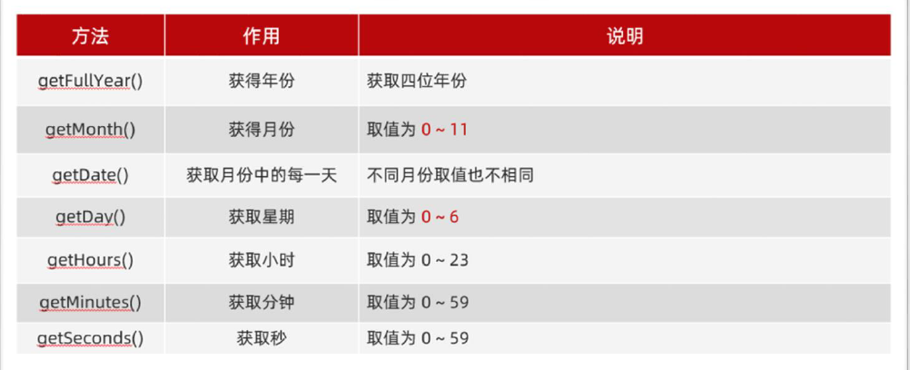

### 1<!--显示时间-->

```css
<style>
    div {
        width: 400px;
        height: 50px;
        background-color: #d4c3c3;
        text-align: center;
        line-height: 50px;
    }
</style>
```

```html
<body>
<div></div>
</body>
<script>
    let arr = ['星期日', '星期一', '星期二', '星期三', '星期四', '星期五', '星期六'];
    //先调用一次去除空白
    getTime();
    setInterval(getTime, 1000);

    function getTime() {
        //实例化时间对象
        let date = new Date();
        let year = date.getFullYear();
        let month = date.getMonth() + 1;
        let date1 = date.getDate();
        let hour = date.getHours();
        let minutes = date.getMinutes();
        let sec = date.getSeconds();
        let day = date.getDay();
        //获取div
        let div = document.querySelector('div');
        div.innerHTML = `今天是：${year}年${month}月${date1}日 ${hour}时${minutes}分${sec}秒 ${arr[day]}`
    }
</script>
```

## 14.2 时间戳

什么是时间戳：指1970年01月01日00时00分00秒起至现在的毫秒数，它时一种特殊的计量时间的方式

**三种获取时间戳的方法：**

1. 使用getTime()方法

   > ~~~
   > let date = new Date();
   > console.log(date.getTime());
   > ~~~

2. 简写 +new Date()

   > ~~~
   > console.log(+new Date());
   > ~~~

3. Date.now()

   > ~~~
   > console.log(Date.now());
   > ~~~

   - 无需实例化
   - 但是只能得到当前时间的时间戳，而前面两种可以返回指定时间的时间戳


### 1<!--下班倒计时-->

 [下班倒计时.css](JavaScript.assets\css\下班倒计时.css) 

```html
<body>
<div class="countdown">
    <p class="next">今天是2022年8月10日</p>
    <p class="title">下班倒计时</p>
    <p class="clock">
        <span id="hour"></span>
        <i>:</i>
        <span id="minutes"></span>
        <i>:</i>
        <span id="second"></span>
    </p>
    <p class="tips">
        <script>
            setInterval(function () {
                let date = new Date();
                let h = date.getHours();
                h < 10 ? h = '0' + h : h;
                let m = date.getMinutes();
                m < 10 ? m = '0' + m : m;
                let sec = date.getSeconds();
                sec < 10 ? sec = '0' + sec : sec;
                let p = document.querySelector('.tips')
                p.innerHTML = `现在是：${h}:${m}:${sec}`
            }, 1000)

        </script>
    </p>
</div>
<script>
    let aa = document.querySelector('.clock');
    f1();
    setInterval(f1, 1000)
    
    function f1() {
        //1.得到现在的时间戳
        let now = +new Date();
        //2.得到指定的时间戳
        let last = +new Date('2022-8-17 01:00:00');

        //3.计算剩余毫秒数/1000=剩余秒数
        let time = (last - now) / 1000;
        console.log(time)
        
        //4.转换时分秒
        let hour = parseInt(time / 60 / 60 % 24)
        hour < 10 ? hour = '0' + hour : hour;
        let minute = parseInt(time / 60 % 60);
        minute < 10 ? minute = '0' + minute : minute;
        let second = parseInt(time % 60)
        second < 10 ? second = '0' + second : second;

        //5.写入页面
        aa.children[0].innerHTML = hour;
        aa.children[2].innerHTML = minute;
        aa.children[4].innerHTML = second;
    }
</script>
</body>
```

## <span id='jump'><!--微博发布案例改--></span>

 [weibo.css](JavaScript.assets\css\weibo.css) 

 [案例数据.js](JavaScript.assets\微博发布案例\微博发布案例.js) 

~~~html
<body>
<div class="w">
    <!-- 操作的界面 -->
    <div class="controls">
        <br/>
        <!-- maxlength 可以用来限制表单输入的内容长度 -->
        <textarea placeholder="说点什么吧..." id="area" cols="30" rows="10" maxlength="200"></textarea>
        <div>
            <span class="useCount" id="useCount">0</span>
            <span>/</span>
            <span>200</span>
            <button id="send">发布</button>
        </div>
    </div>
    <!-- 微博内容列表 -->
    <div class="contentList">
        <ul id="list">
            <li hidden>
            </li>
        </ul>
    </div>
</div>
</body>
~~~

 [微博发布案例js.md](JavaScript.assets\微博发布案例\微博发布案例js.md) 

总文件：

 [微博发布案例](JavaScript.assets\微博发布案例) 

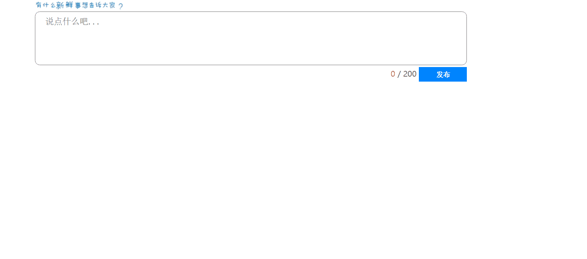

# 15、事件对象

## 15.1获取事件对象：

事件对象：包含事件触发时的相关信息

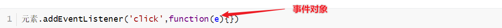

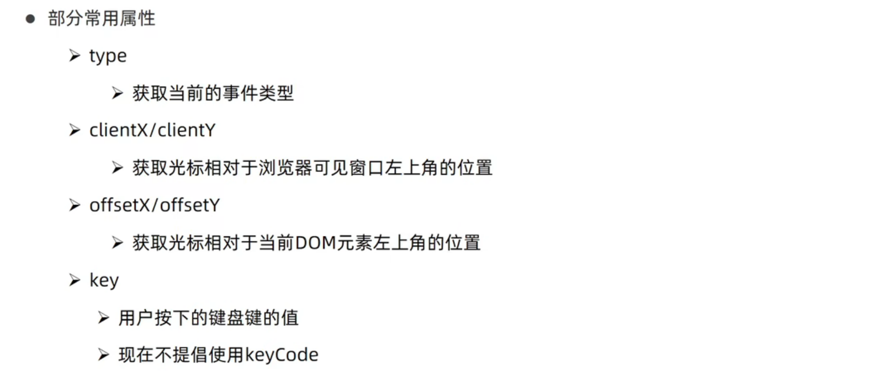

~~~js
document.addEventListener('click',function (e) {
    console.log('clientX:'+e.clientX,'clientY:'+e.clientY);
    console.log('pageX:'+e.pageX,'pageY:'+e.pageY);
    console.log('offsetX:'+e.offsetX,'offsetY:'+e.offsetY);
})
~~~

## <!--鼠标跟随-->

```css
<style>
    img{
        position: absolute;
        top: 0;
        left: 0;
    }
</style>
```

```html
<body>

</body>
<script>
    let img=document.querySelector('img');
    document.addEventListener('mousemove',function (e) {
        //不断得到鼠标坐标
        //并将坐标赋给图片
        img.style.top=`${e.pageY}px`;
        img.style.left=`${e.pageX}px`;
    })
</script>
```

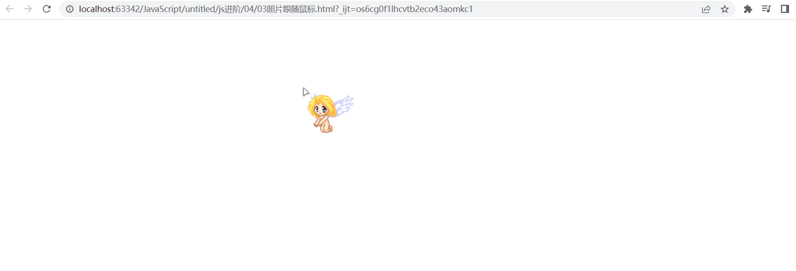

## <!--回车发布微博-->

[数据参考](#jump)

```js
area.addEventListener('keyup',function (e) {
    //e.key获取键盘按键
    if(e.key=='Enter'){
        send.click();
    }
    console.log(e.key)
})
```

## 15.2 阻止事件冒泡和默认行为

事件冒泡和事件捕获：

**事件冒泡概念**:

> 当一个元素的事件被触发时，同样的事件将会在该元素的所有祖先元素中依次被触发。这一过程被称为事件冒泡

l简单来说：捕获阶段是 从父到子 冒泡阶段是从子到父

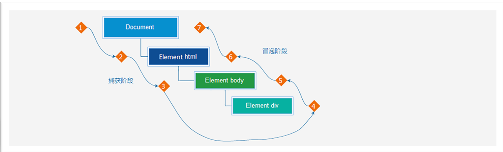

事件冒泡(<u>默认</u>）：

```css
<style>
    .father{
        margin: 100px auto;
        width: 500px;
        height: 500px;
        background-color: #37c94f;
    }
    .son{
        width: 200px;
        height: 200px;
        background-color: #09765c;
    }
</style>
```

```html
<body>
<div class="father">
    <div class="son"></div>
</div>
</body>
<script>
    let fa=document.querySelector('.father');
    let son=document.querySelector('.son');
    fa.addEventListener('click',function () {
        alert('我是爸爸');
    })
    son.addEventListener('click',function () {
        alert('我是儿子');
    })
    document.addEventListener('click',function () {
        alert('我是爷爷');
    })
</script>
```

阻止事件流动：

- 因为默认就有冒泡模式的存在，所以容易导致事件影响到父级元素

- 若想把事件就限制在当前元素内，就需要阻止事件流动

- 阻止事件流动需要拿到事件对象

- 语法：

  > <u>事件对象.stopPropagation();</u>

- 此方法可以阻断事件流动传播，不光在冒泡阶段有效，捕获阶段也有效

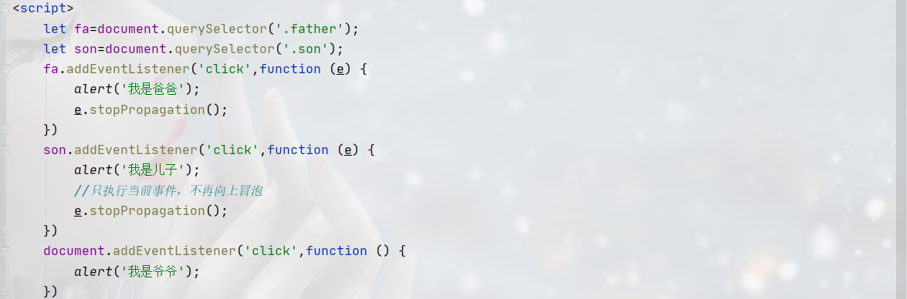

阻止默认行为：

语法：

> ~~~
> 事件对象.preventDefault();
> ~~~

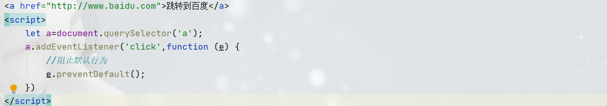

## 15.3 *事件委托*

```html
<body>
<ul>
    <li>我是第1个li</li>
    <li>我是第2个li</li>
    <li>我是第3个li</li>
    <li>我是第4个li</li>
    <li>我是第5个li</li>
</ul>
</body>
<script>
    //不要每个li都注册事件了 而是把事件委托给他的爸爸
    // 事件委托是给父级添加事件 而不是给还在添加事件
    let ul=document.querySelector('ul');
    ul.addEventListener('click',function (e) {
        //得到当前元素:  e.target
        console.log(e.target);
        e.target.style.color='red';
    })
</script>
```

# 16、滚动事件和加载事件

## 16.1 滚动事件

- 当页面进行滚动时触发事件

- 事件名：scroll

- 监听整个页面滚动

  > ~~~ 
  > //页面滚动事件
  > window.addEventListener('scroll',function(){
  > //执行操作
  > })
  > ~~~

  - 给widow或document添加scroll事件

## 16.2 加载事件

- 加载外部资源（如图片、外联 CSS 和 JavaScript 等）加载完毕时触发的事件

- 为什么要学？

  - 有些时候需要等页面资源全部处理完了做一些事情

  - 老代码喜欢把 script 写在 head 中，这时候直接找 dom 元素找不到

- 事件名： load

- 监听页面所有资源加载完毕：

  - 给 window 添加 load 事件

  > ~~~ 
  > //页面加载
  > window.addEventListener('load',function(){
  > //执行操作
  > })
  > ~~~

- 当 初始的 HTML 文档被完全加载和解析完成之后， DOMContentLoaded 事件被触发，而无需等待样式表、 图像 等 完全加载

- 事件名： DOMContentLoaded

- 监听页面 DOM 加载完毕：

  - 给 document 添加 DOMContentLoaded 事件

  > ~~~js
  > window.addEventListener('DOMContentLoaded ',function(){
  > //执行操作
  > })
  > ~~~

## 16.3 scroll家族



- 获取宽高：
  - 获取元素 的 内容 总宽高（不包含滚动条） 返回值不带单位
  - scrollWidth 和 scrollHeight
- 获取位置 :
  - 获取 元素内容往左、往上滚出去 看不到 的距离
  - scrollLeft 和 scrollTop
  - 这两个属性是可以 修改 的

> ~~~js
> div.addEventListener('scroll',function (){
>    console.log(this.scrollTop) 
> })
> 
> ~~~

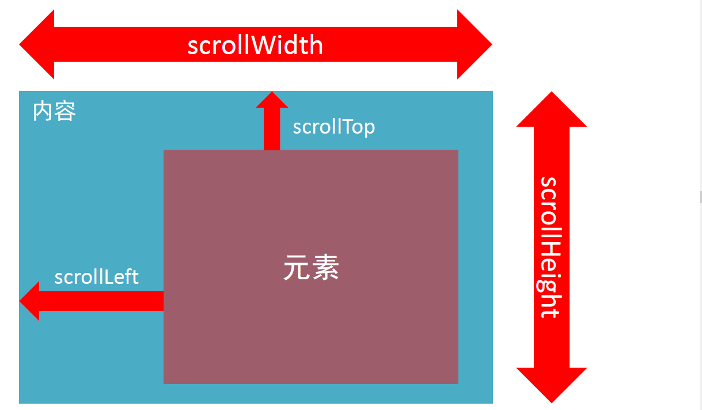

```js
<style>
    body {
        height: 3000px;
    }
</style>
<script>
    //返回html元素
    console.log(document.documentElement)

    window.addEventListener('scroll', function () {
        //得到页面滚动的距离 scrollTop
        console.log(document.documentElement.scrollTop);
        //可以设置修改属性 但是不要带单位
        // document.documentElement.scrollTop = 500
    })
</script>
```

### 16.3.1<!--案例-->

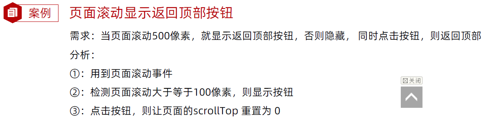

 [页面滚动返回顶部](JavaScript.assets\案例夹\页面滚动返回顶部) 

```html
<link rel="stylesheet" href="../css/页面滚动返回顶部.css">
<body>
<div class="content"></div>
<div class="backtop">
    
    <a href="javascript:;"></a>
</div>
<script>
    let backtop = document.querySelector('.backtop');
    let a = document.querySelector('a');
    //1.页面滚动事件
    window.addEventListener('scroll', function () {
        //2.检测页面滚动距离
        let position = document.documentElement.scrollTop;
        //3.判断显示和隐藏
        if (position >= 500) {
            backtop.style.display = 'block';
        } else {
            backtop.style.display = 'none';
        }
    })
    //点击返回顶部
    backtop.children[1].addEventListener('click', function () {
        document.documentElement.scrollTop = 0;
    });
    backtop.children[0].addEventListener('click', function () {
        console.log(this.parentNode)
        backtop.innerHTML = '';

    })
</script>
</body>
```

## 16.4offset家族

- 获取宽高：
  -  获取元素自身的宽高、包含元素自身设置的宽高、padding、border
  - offsetWidth和offsetHeight(*返回值为：*<u>获取盒子元素的大小=盒子本身的高度+padding+border</u>)
- 获取位置：
  - 获取元素距离自己<u>定位父级</u>的左、上距离
  - **offsetLeft和offsetTop是只读属性**


### <!--固定导航栏-->

 [固定导航栏.css](JavaScript.assets\css\固定导航栏.css) 

```html
<body>
<div class="header">我是顶部导航栏</div>
<div class="content">
    <div class="sk">秒杀模块</div>
</div>
<div class="backtop">
    
    <a href="javascript:;"></a>
</div>
<script>
    document.documentElement.scrollTop=0;
    let sk = document.querySelector('.sk');
    let header = document.querySelector('.header');
    //1.页面滚动事件
    window.addEventListener('scroll', function () {
        // 2.检测页滚动距离
        let position = document.documentElement.scrollTop
        //console.log(document.documentElement.scrollTop)
        //检测滚动的距离>=秒杀模块的offsetTop则滑入
        if (position >= sk.offsetTop) {
            header.style.top = '0px';
        } else {
            header.style.top = '-80px';
        }
    })
</script>
</body>
```

### <!--电梯导航-->

 [电梯导航.css](JavaScript.assets\css\电梯导航.css) 

```html
<body>
<div class="aside">
    <div class="item active">男装/女装</div>
    <div class="item">儿童服装/游乐园</div>
    <div class="item">电子产品</div>
    <div class="item">电影/美食</div>
</div>

<div class="content">
    <div class="neirong content1">男装/女装</div>
    <div class="neirong content2">儿童服装/游乐园</div>
    <div class="neirong content3">电子产品</div>
    <div class="neirong content4">电影/美食</div>
</div>

<script>
    //获取元素
    let contents = document.querySelectorAll('.neirong')
    let items = document.querySelectorAll('.item');
    //添加监听事件
    for (let i = 0; i < items.length; i++) {
        items[i].addEventListener('click', function () {
            //移除active
            document.querySelector('.active').classList.remove('active')
            //复活自己
            items[i].classList.add('active');

            //右侧内容跟随点击
            document.documentElement.scrollTop = contents[i].offsetTop;
        })
    }
</script>
</body>
```

## 16.4client家族

# 125XXXXX

 [小米输入框案例.css](JavaScript.assets) 


# ==综合案例==

## <!--购物车案例-->

 [购物车样式文件](JavaScript.assets\购物车) 

```html
<link rel="stylesheet" href="../css/购物车初始化.css">
<link rel="stylesheet" href="../cs s/购物车.css">
<body>
<div class="car">
    <table>
        <thead>
        <tr>
            <th><input type="checkbox" id="all"/>全选</th>
            <th>商品</th>
            <th>单价</th>
            <th>商品数量</th>
            <th>小计</th>
            <th>操作</th>
        </tr>
        </thead>
        <tbody id="carBody">
        <tr>

            <td>
                <input class="s_ck" type="checkbox" readonly/>
            </td>
            <td>
                
                <p>牛奶</p>
            </td>
            <td class="price">5￥</td>
            <td>
                <div class="count-c clearfix">
                    <button class="reduce" disabled>-</button>
                    <input type="text" class="counter" value="1"/>
                    <button class="add">+</button>
                </div>
            </td>
            <td class="total">5￥</td>
            <td>
                <a href="javascript:" class="del">删除</a>
            </td>
        </tr>
        <tr>
            <td>
                <input class="s_ck" type="checkbox"/>
            </td>
            <td>
                
                <p>牛奶</p>
            </td>
            <td class="price">10￥</td>
            <td>
                <div class="count-c clearfix">
                    <button class="reduce" disabled>-</button>
                    <input type="text" class="counter" value="1"/>
                    <button class="add">+</button>
                </div>
            </td>
            <td class="total">10￥</td>
            <td>
                <a href="javascript:" class="del">删除</a>
            </td>
        </tr>
        <tr>
            <td>
                <input class="s_ck" type="checkbox"/>
            </td>
            <td>
                
                <p>牛奶</p>
            </td>
            <td class="price">20￥</td>
            <td>
                <div class="count-c clearfix">
                    <button class="reduce" disabled>-</button>
                    <input type="text" class="counter" value="1"/>
                    <button class="add">+</button>
                </div>
            </td>
            <td class="total">20￥</td>
            <td>
                <a href="javascript:" class="del">删除</a>
            </td>
        </tr>
        <tr>
            <td>
                <input class="s_ck" type="checkbox"/>
            </td>
            <td>
                
                <p>牛奶</p>
            </td>
            <td class="price">35￥</td>
            <td>
                <div class="count-c clearfix">
                    <button class="reduce" disabled>-</button>
                    <input type="text" class="counter" value="1"/>
                    <button class="add">+</button>
                </div>
            </td>
            <td class="total">35￥</td>
            <td>
                <a href="javascript:" class="del">删除</a>
            </td>
        </tr>
        </tbody>
    </table>
    <div class="controls clearfix">
        <a href="javascript:" class="del-all">删除所选商品</a>
        <a href="javascript:" class="clear">清理购物车</a>
        <a href="javascript:" class="pay">去结算</a>
        <p>
            已经选中<span id="totalCount">0</span>件商品;总价：<span id="totalPrice" class="total-price">0￥</span>
        </p>
    </div>
</div>
</body>
```

## <!--学生信息表-->

 [user.css](JavaScript.assets\css\user.css) 

```html
<link rel="stylesheet" href="../css/user.css">
<body>
<h1>新增学员</h1>
<div class="info">
    姓名：<input type="text" class="uname">
    年龄：<input type="text" class="age">
    性别: <select name="gender" id="gender" class="gender">
    <option value="男">男</option>
    <option value="女">女</option>
</select>
    薪资：<input type="text" class="salary">
    就业城市：<select name="city" id="city" class="city">
    <option value="北京">北京</option>
    <option value="上海">上海</option>
    <option value="广州">广州</option>
    <option value="深圳">深圳</option>
    <option value="曹县">曹县</option>

</select>
    <button class="add">录入</button>
</div>

<h1>就业榜</h1>
<table>
    <thead>
    <tr>
        <th>学号</th>
        <th>姓名</th>
        <th>年龄</th>
        <th>性别</th>
        <th>薪资</th>
        <th>就业城市</th>
        <th>操作</th>
    </tr>
    </thead>
    <tbody>
    <tr></tr>
    </tbody>
</table>
</body>
```

```js
<script>
    //  1. 准备好数据后端的数据
    let arr = [
        {stuId: 1001, uname: '欧阳霸天', age: 19, gender: '男', salary: '20000', city: '上海'},
        {stuId: 1002, uname: '令狐霸天', age: 29, gender: '男', salary: '30000', city: '北京'},
        {stuId: 1003, uname: '诸葛霸天', age: 39, gender: '男', salary: '2000', city: '北京'},
    ];
    //获取父元素 tbody
    let tbody = document.querySelector('tbody');
    //表单元素
    let info = document.querySelector('.info');
    let uname = info.children[0];
    let age = info.children[1];
    let gender = info.children[2];
    let salary = info.children[3];
    let city = info.children[4];

    //渲染函数
    function render() {
        //删除旧数据
        tbody.innerHTML = "";

        //根据数据条数渲染增加tr
        for (let i = 0; i < arr.length; i++) {
            //1.创建tr
            let tr = document.createElement('tr');
            //2.向tr添加数据
            tr.innerHTML = `
               <td>${arr[i].stuId}</td>
               <td>${arr[i].uname}</td>
               <td>${arr[i].age}</td>
               <td>${arr[i].gender}</td>

               <td>${arr[i].salary}</td>
               <td>${arr[i].city}</td>
               <td>
               <!--给a标签添加索引号-->
                   <a href="javascript:" id="${i}">删除</a>
               </td>`
            //3.将tr追加到tbody
            tbody.appendChild(tr);

            //复原表单数据
            uname.value = age.value = salary.value = '';
            gender.value = '男';
            city.value = '北京';
        }
    }

    render();

    // 添加数据
    let add = document.querySelector('.add');
    add.addEventListener('click', function () {
        snum = arr[arr.length - 1].stuId;
        console.log(snum);
        arr.push({
            stuId: ++snum,
            uname: uname.value,
            age: age.value,
            gender: gender.value,
            salary: salary.value,
            city: city.value,
        });
        render();
    })

    //删除操作,事件委托代替for循环
    tbody.addEventListener('click', function (e) {
        //只有点击链接才删除
        console.log(e.target)
        // if(e.target.innerHTML=="删除"){
        //     alert('111')
        // }
        if (e.target.tagName == "A") {
            arr.splice(e.target.id, 1);
        }
        render();


    })
</script>
```

## <!--手风琴-->

 [手风琴](JavaScript.assets\案例夹\手风琴) 

```html
    <style>
        ul {
            list-style: none;
        }

        * {
            margin: 0;
            padding: 0;
        }

        div {
            width: 1200px;
            height: 400px;
            margin: 50px auto;
            border: 1px solid red;
            overflow: hidden;
        }

        div li {
            width: 240px;
            height: 400px;
            float: left;
            transition: all 500ms;
        }

        div ul {
            width: 1200px;
        }
    </style>
</head>

<body>
<div id="box">
    <ul>
        <li>
            <a href="#">
                
            </a>
        </li>
        <li>
            <a href="#">
                
            </a>
        </li>
        <li>
            <a href="#">
                
            </a>
        </li>
        <li>
            <a href="#">
                
            </a>
        </li>
        <li>
            <a href="#">
                
            </a>
        </li>
    </ul>
</div>
</body>
```

```js
<script>
    //1.li默认有个宽度 240px
    //2.当鼠标经过时，当前小li 宽度变为 800px 其余li变为 100px
    //3.鼠标离开事件，所有li 都要复原为 240px

    //获取所有li
    let lis = document.querySelectorAll('li');
    //绑定鼠标经过和鼠标离开事件
    for (let i = 0; i < lis.length; i++) {
        //鼠标经过事件
        lis[i].addEventListener('mouseenter', function () {
            // 当鼠标经过时，当前小li 宽度变为 800px 其余li变为 100px
            //先干掉所有，将li全部变为100px
            for (let j = 0; j < lis.length; j++) {
                lis[j].style.width = '100px';
            }
            //复活自己
            this.style.width = '800px';
        })

        //鼠标离开事件
        lis[i].addEventListener('mouseleave', function () {
            // 鼠标离开事件，所有li 都要复原为 240px
            for (let j = 0; j < lis.length; j++) {
                lis[j].style.width = '240px';
            }
        })


    }
</script>
```


## 8.1Document 对象中的方法介绍

**document.getElementById(elementId)**
通过标签的id 属性查找标签dom 对象，elementId 是标签的id 属性值
**document.getElementsByName(elementName)**
通过标签的name 属性查找标签dom 对象，elementName 标签的name 属性值
**document.getElementsByTagName(tagname)**
通过标签名查找标签dom 对象。tagname 是标签名
**document.createElement( tagName)**
方法，通过给定的标签名，创建一个标签对象。tagName 是要创建的标签名

***注：***
document 对象的三个查询方法，如果有id 属性，优先使用getElementById 方法来进行查询
如果没有id 属性，则优先使用getElementsByName 方法来进行查询
如果id 属性和name 属性都没有最后再按标签名查getElementsByTagName
以上三个方法，一定要在页面加载完成之后执行，才能查询到标签对象。

### 8.1.1 getElementById

```javascript
<head>
    <meta charset="UTF-8">
    <title>Title</title>
    <script>
        /*需求：当用户点击了较验按钮，要获取输出框中的内容。然后验证其是否合法。<br/>
        * 验证的规则是：必须由字母，数字。下划线组成。并且长度是5 到12 位。*/
        function onclickf() {
            //1 获取标签对象
            let elementById = document.getElementById("username");
            //2.获取输入框的内容
            let username = elementById.value;
            console.log(username);
            let patt = /^\w{5,12}$/;
            /*
            * test()方法用于测试某个字符串，是不是匹配我的规则，
            * 匹配就返回true。不匹配就返回false.
            * */
            if(patt.test(username)){
                alert("用户名合法!")
            }else {
                alert("用户名不合法!")
            }
        }

    </script>
</head>
<body>
用户名:<input id="username" type="text"/>
<button onclick="onclickf()">校验</button>
</body>
```

### 8.1.2  JavaScript验证

#### 8.1.2.1 onclick验证

```javascript
<head>
    <meta charset="UTF-8">
    <title>Title</title>
    <script>
        /*需求：当用户点击了较验按钮，要获取输出框中的内容。然后验证其是否合法。<br/>
        * 验证的规则是：必须由字母，数字。下划线组成。并且长度是5 到12 位。*/
        let patt = /^\w{5,12}$/;
        function onclickf1() {
            //1 获取标签对象
            let elementById1 = document.getElementById("username");
            //2.获取输入框的内容
            let username = elementById1.value;
            console.log(username);
            let tips = document.getElementById("tips");

            if (patt.test(username)) {
                tips.innerHTML = "!"
            } else {
                tips.innerHTML = "用户名不合法!"
            }
        }

        function onclickf2() {
            let elementById2 = document.getElementById("password");
            let password = elementById2.value;
            let tips = document.getElementById("tips");
            if (patt.test(password)) {
                tips.innerHTML = ""
            } else {
                tips.innerHTML = "密码不合法!"
            }
        }
    </script>
</head>
<body>
用户名:<input id="username" type="text" onclick="onclickf1()"/>
<span id="tips" style="color: red"></span>
<input id="password" type="text" onclick="onclickf2()"/>
</body>
```

#### 8.1.2.1 onchange验证
#### 8.1.2.1 onblur验证

### 8.1.3 getElementsByName

```html
<!DOCTYPE html>
<html lang="en">
<head>
    <meta charset="UTF-8">
    <title>Title</title>
    <script>
        //全选
        function checkAll() {
            /*            让所有复选框都选中
                        document.getElementsByName();是根据指定的name 属性查询返回多个标签对象集合
                        这个集合的操作跟数组一样
                        集合中每个元素都是dom 对象
                        这个集合中的元素顺序是他们在html 页面中从上到下的顺序*/
            let elementsByName = document.getElementsByName("hobby");
            // checked 表示复选框的选中状态。如果选中是true，不选中是false
            // checked 这个属性可读，可写
            for (const elementsByNameElement of elementsByName) {
                elementsByNameElement.checked = true;
            }
        }

        //全不选
        function checkNull() {
            let elementsByName = document.getElementsByName("hobby");
            for (const elementsByNameElement of elementsByName) {
                elementsByNameElement.checked = false;
            }
        }

        //反选
        function checkAnti() {
            let elementsByName = document.getElementsByName("hobby");
            for (const elementsByNameElement of elementsByName) {
                elementsByNameElement.checked = !elementsByNameElement.checked;
                // if (elementsByNameElement.checked === true) {
                //     elementsByNameElement.checked = false;
                // } else {
                //     elementsByNameElement.checked = true;
                // }
            }
        }
    </script>
</head>
<body>
<input type="checkbox" name="hobby" id="cpp" value="cpp">C++
<input type="checkbox" name="hobby" value="java">Java
<input type="checkbox" name="hobby" value="js">JavaScript
<br>
<button onclick="checkAll()">全选</button>
<button onclick="checkNull()">全不选</button>
<button onclick="checkAnti()">反选</button>
</body>
</html>
```

### 8.1.4 getElementsByTagName

<!DOCTYPE html>
<html lang="en">
<head>
<meta charset="UTF-8">
<title>Title</title>
<script type="text/javascript">
// 全选
function checkAll() {
// document.getElementsByTagName("input");
// 是按照指定标签名来进行查询并返回集合
// 这个集合的操作跟数组一样
// 集合中都是dom 对象
// 集合中元素顺序是他们在html 页面中从上到下的顺序。
var inputs = document.getElementsByTagName("input");
for (var i = 0; i < inputs.length; i++){
inputs[i].checked = true;
}
}
</script>
</head>
<body>
兴趣爱好：
<input type="checkbox" value="cpp" checked="checked">C++
<input type="checkbox" value="java">Java
<input type="checkbox" value="js">JavaScript
<br/>
<button onclick="checkAll()">全选</button>
</body>
</html>

### 8.1.4 createElement

## 8.2节点的常用属性和方法

节点就是标签对

### 方法：

通过具体的元素节点调用
*getElementsByTagName()*方法，

获取当前节点的指定标签名孩子节点

*appendChild( oChildNode )*方法，

可以添加一个子节点，oChildNode 是要添加的孩子节点

### 属性：
***childNodes***属性，

获取当前节点的所有子节点

***firstChild***属性，

获取当前节点的第一个子节点

***lastChild***属性，

获取当前节点的最后一个子节点

***parentNode***属性，

获取当前节点的父节点

***nextSibling***属性，

获取当前节点的下一个节点

***previousSibling***属性，

获取当前节点的上一个节点

***className***

用于获取或设置标签的class 属性值
***innerHTML***属性，

表示获取/设置起始标签和结束标签中的内容

***innerText***属性，

表示获取/设置起始标签和结束标签中的文本


  
