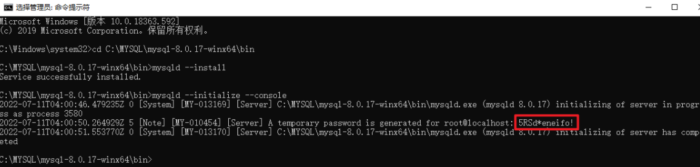
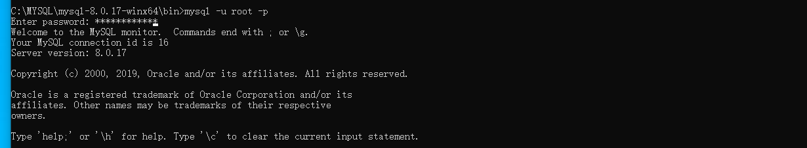

# 6、Servlet

## 6.1、Servlet简介

- sun公司开发动态web的一门技术
- sun公司在这些API中提供一个接口叫做：servlet，开发一个servletv程序的步骤
  - 编写一个类实现servlet接口
  - 把开发好的java类部署到web服务器。

**实现了Servlet接口的Java程序叫做，Servlet程序**

## 6.2、HelloServlet

1. 构建一个普通的Maven项目删掉里面的src目录，以后我们学习就在这个项目下建立Module；这个空的工程就是Maven主工程；
2. 关于父子工程的理解：

父项目中会有

```xml
<modules>
    <module>servlet01</module>
</modules>
```

子项目会有：

```xml
<parent>
    <artifactId>maven-01-servlet</artifactId>
    <groupId>com.Parallel</groupId>
    <version>1.0-SNAPSHOT</version>
</parent>
```

父项目的jar包子项目可以直接使用

```java
son extends father
```

3. Maven环境优化

   1. 修改web.xml为新版
   2. 将maven结构搭建完整

4. 编写一个servlet程序

   1. 编写一个普通类
   2. 实现Servle接口，这里我门直接继承HttpServlet

   ```java
   package com.Parallelselvet1;
   
   import javax.servlet.ServletException;
   import javax.servlet.annotation.WebServlet;
   import javax.servlet.http.HttpServlet;
   import javax.servlet.http.HttpServletRequest;
   import javax.servlet.http.HttpServletResponse;
   import java.io.IOException;
   import java.io.PrintWriter;
   
   @WebServlet
   public class HelloServlet extends HttpServlet {
       //由于get和post只是请求实现的不同的方式，可以相互调用，业务逻辑一样
       @Override
       protected void doGet(HttpServletRequest request, HttpServletResponse response) throws ServletException, IOException {
           PrintWriter out=response.getWriter();//响应流
           out.println("Hello,Servlet");
       }
   
       @Override
       protected void doPost(HttpServletRequest request, HttpServletResponse response) throws ServletException, IOException {
           this.doGet(request,response);
       }
   }
   
   ```

5. 编写Servlet的映射

   为什么需要映射：我们写的是JAVA程序但是要通过浏览器访问，而浏览器需要连接web服务器，所以需要再web服务中注册所写的Servlet，还需要给它一个浏览器能够访问的路径；

6. 配置Tomcat（工程的部署）

## 6.3、Servlet原理

## 6.4、Mapping

1. 一个Servlet可以指定一个映射路径

```xml
<servlet-mapping>
    <servlet-name>HelloServlet</servlet-name>
    <url-pattern>/hello</url-pattern>
</servlet-mapping>
```

1. 一个Servlet可以指定多个映射路径

```xml
 <servlet-mapping>
        <servlet-name>HelloServlet</servlet-name>
        <url-pattern>/hello</url-pattern>
    </servlet-mapping>
 <servlet-mapping>
        <servlet-name>HelloServlet</servlet-name>
        <url-pattern>/hello2</url-pattern>
    </servlet-mapping>
```

1. 一个Servlet可以指定通用映射路径
2. 

## 6.***5、ServletContext***

> servletContext存储数据特点：

> 全局共享，里面的所有动态资源都可以写入和获取

> ​    服务器启动时创建，服务器关闭时销毁。

### 6.5.1.共享数据

在一个Servlet中的保存的数据可以在另一个，可以在另一个Servlet中拿到（this.getServletContext()）

```java
protected void doGet(HttpServletRequest request, HttpServletResponse response) throws ServletException, IOException {
    response.setContentType("text/html;charset=utf-8");
    //        response.getWriter().println("<h1>hellohello</h1>");
    PrintWriter out = response.getWriter();
    out.println("<h1>hellohello</h1>");
    
    String username = "百度";
    ServletContext a = this.getServletContext();
    a.setAttribute("username", username);         //将一个数据保存在ServletContext中，名字为：username，值为username
    response.getWriter().println(username);

}
```

```java
   protected void doGet(HttpServletRequest request, HttpServletResponse response) throws ServletException, IOException {
        response.setContentType("text/html;charset=utf-8");
        ServletContext a=this.getServletContext();
        String username =(String)a.getAttribute("username"); //读取数据
        response.getWriter().println("名字："+username);
    }
```

### 6.5.2.获取初始化参数

```xml
<!--配置web的初始化参数-->
<context-param> <!--使用的是ServletContext上下文定义，所以全局servlet可以调用-->
    <param-name>url</param-name>
    <param-value>jdbc:mysql://localhost:3306/mybatis</param-value>
</context-param>
```

```java
protected void doGet(HttpServletRequest request, HttpServletResponse response) throws ServletException, IOException {
    ServletContext context=this.getServletContext();
    String url=context.getInitParameter("url"); //获取Servlet的配置文件的初始化参数的信息
    response.getWriter().println(url);
}
```

### *6.5.3.请求转发*

```java
    protected void doGet(HttpServletRequest request, HttpServletResponse response) throws ServletException, IOException {
        ServletContext context=this.getServletContext();
/*        context.getRequestDispatcher("/demo03").forward(request,response);*/
        request.getRequestDispatcher("/hello").forward(request,response);
    }
```


### 6.5.4.读取资源文件

Properties

- 在java目录下新建properties
- 在resources目录下新建properties

发现：都被打包到了同一路径：classes，我们俗称这个路径为classpath

> 需要一个文件流

```java
protected void doGet(HttpServletRequest request, HttpServletResponse response) throws ServletException, IOException {
    InputStream ss = this.getServletContext().getResourceAsStream("/WEB-INF/classes/db.properties");
    Properties prop=new Properties();
    prop.load(ss);
    String user=prop.getProperty("username");
    String pwd=prop.getProperty("password");
    response.getWriter().println(user+":"+pwd);
}
```

## 6.6、HttpServletResponse

web服务器接收到客户端的http请求，针对这个请求，分别创建一个代表请求的HttpServletRequest对象，一个代表响应的HttpServletResponse对象；

- 如果要获取客户端请求的参数：找HttpServletRequest
- 如果要给客户端响应一些信息：找HttpServletResponse

### 1.简单分类

负责向浏览器发送数据的方法

```java
ServletOutputStream getOutputStream() throws IOException;

PrintWriter getWriter() throws IOException;
```

负责向浏览器发送响应头的方法

```java
void setCharacterEncoding(String var1);

void setContentLength(int var1);

void setContentLengthLong(long var1);

void setContentType(String var1);

void setDateHeader(String var1, long var2);

void addDateHeader(String var1, long var2);

void setHeader(String var1, String var2);

void addHeader(String var1, String var2);

void setIntHeader(String var1, int var2);

void addIntHeader(String var1, int var2);
```

响应的状态码

```java
int SC_OK = 200;
int SC_NOT_FOUND = 404;
int SC_INTERNAL_SERVER_ERROR = 500;
```

### 2、常见应用

- 向浏览器输出消息
- 下载文件
  1. 获取下载文件的路径
  2. 下载额文件名
  3. 设置让浏览器能够支持下载我们需要的东西
  4. 获取下载文件的输入流
  5. 创建缓冲区
  6. 获取OutputStream对象
  7. 将FileOutStream流写入到buffer缓冲区
  8. 使用OutputStream将缓冲区中的数据输出到客户端 

### 3、验证码功能

1. 前端实现
2. 后端实现，需要用到Java的图片类

### 4、实现重定向


一个web资源b收到客户端a的请求，b通知a去访问另一个web资源c，这个过程叫重定向

测试：

```java
  protected void doGet(HttpServletRequest request, HttpServletResponse response) throws ServletException, IOException {
     
        /*response.setHeader("Location","/ServletResponse_war_exploded/imageservlet");
        response.setStatus(302);*/
        response.sendRedirect("/ServletResponse_war_exploded/imageservlet");
    }
```

=========================================================================================================

```html
<%--这里提交的路径，需要找到项目的路径--%>
<%request.setCharacterEncoding("utf-8");%>
<form action="${pageContext.request.contextPath}/RequestServlet" method="post">
    <p><input type="text" name="username" placeholder="请输入用户名"></p>
    <p><input type="password" name="psd"placeholder="请输入密码"></p>
    <input type="submit">
</form>
```

```java
@WebServlet("/RequestServlet")
public class RequestServlet extends HttpServlet {
    protected void doPost(HttpServletRequest request, HttpServletResponse response) throws ServletException, IOException {
        response.setContentType("text/html;charset=utf-8");
        String username = request.getParameter("username");
        String psd=request.getParameter("psd");
        response.getWriter().println("用户名："+username+"</br>");
        response.getWriter().println("密码："+psd+"</br>");
    }
```

***${pageContext.request.contextPath}***   ：绝对路径

***重定向和转发的区别：***

不同点

1. 请求转发时，url不会发生变化   307
2. 重定向，url会发生变化               302

 

## 6.7、HttpServletRequest

HttpServletRequest代表客户端的请求，用户通过http协议访问服务器，http请求中的所以信息会被封装到HttpServletRequest，通过这个HttpServletRequest方法，获取客户端的所有信息


**获取前端传递的参数，请求转发**


```jsp
<div>
    <form action="${pageContext.request.contextPath}/Login" method="post">
        <p>用户名：<input type="text" name="username"></p>
        <p>密码：<input type="password" name="password"></p>
        <p>爱好：
            <input type="checkbox" name="hobby" value="音乐">音乐
            <input type="checkbox" name="hobby" value="电影">电影
            <input type="checkbox" name="hobby" value="购物">购物
            <input type="checkbox" name="hobby" value="篮球">篮球
        </p>
        <input type="submit">

    </form>
</div>
```

```java
protected void doPost(HttpServletRequest request, HttpServletResponse response) throws ServletException, IOException {
    request.setCharacterEncoding("UTF-8");
    response.setContentType("text/html;charset=utf-8");
    String username = request.getParameter("username");
    String password = request.getParameter("passeord");
    String[] hobby = request.getParameterValues("hobby");
    System.out.println("==================================");
    System.out.println(username);
    System.out.println(password);
    System.out.println(Arrays.toString(hobby));
    System.out.println("==================================");
    request.getRequestDispatcher("/success.jsp").forward(request,response);

}
```

# 7、Cookie、Session

## 7.1、会话技术

1.  **会话**：一次会话中包含多次请求和响应

- 一次会话：浏览器第一次给服务器资源发送请求，直到有一方断开为止

2. **功能：**在一次对话范围内的多次请求间，共享数据

## 7.2、保存会话的两种技术

cookie

- 客户端技术（响应，请求）

session

- 服务器技术：利用这个技术，可以保存用户的会话信息，我们可以把信息或数据放下session中！

## 7.3、Cookie

###  **使用步骤**

1. 创建cookie对象，绑定数据
2. 发送cookie对象
3. 获取cookie，拿到数据

```java
Cookie cookie2 = new Cookie("parallel","123");//新建一个cookie
cookie2.setMaxAge(24*60*60);//设置cookie有效期1天
response.addCookie(cookie1);//响应给客户端一个cookie  

Cookie[] cookies = request.getCookies();//获得Cookie
cookie.getName();//获取cookie的key
cookie.getValue();//获取cookie的value
```

### **cookie的存活时间**

设置方法：setMaxage（）；

- 正数：将cookie数据写入硬盘的文件中。持久化存储
- 负数：默认值
- 0：清空cookie

**删除cookie：**

- 不设置有效期，关闭浏览器自动失效；
- 设置有效期为0；

``` java
//新创建的cookie，名字要和要删除的一致
Cookie cookie2 = new Cookie("parallel","123");
cookie2.setMaxAge(0);//使得cookie2过期
```


中文乱码：

  编码与解码：

```
Cookie cookie =new Cookie("name"URLEncoder.encode("玖","utf-8"));
```

```
out.println(URLDecoder.decode(cookie1.getValue(),"utf-8"));
```

### COOKIE EG1:

```java
PrintWriter out = response.getWriter();
String username = request.getParameter("username");//获取表单提交的
String password = request.getParameter("password");//
ArrayList<User> data = new ArrayList<User>();//创建ArrayList集合：data
User s1 = new User("Tom", "123");
User s2 = new User("Swift", "123");
User s3 = new User("Charles", "123");
data.add(s1);//向data添加数据
data.add(s2);
data.add(s3);

for (User datum : data) {//for—e
    if (username.equals(datum.getUsername()) && password.equals(datum.getPassword())) {
        Cookie user = new Cookie("user", datum.getUsername());
        response.addCookie(user);
        response.sendRedirect(request.getContextPath() + "/7-1/test.jsp");
    }
```


# 8、Filter


```java
@WebFilter("/servlet/*")//只要是/servlet的任何请求,都会经过这个过滤器
public class CharacterEncodingFilter implements Filter {
    //销毁:web服务器关闭时销毁
    public void destroy() {
    }
    //chain:链
    public void doFilter(ServletRequest req, ServletResponse resp, FilterChain chain) throws ServletException, IOException {
        req.setCharacterEncoding("utf-8");
        resp.setContentType("text/html;charset=utf-8");
        System.out.println("CharacterEncoding执行前...");
        chain.doFilter(req, resp);//让请求继续执行
        System.out.println("CharacterEncoding执行后...");
    }
    //初始化
    public void init(FilterConfig config) throws ServletException {

    }

}
```

# 9、MySQL

安装mysql（免安装）

1.管理员打开cmd

2.进入mysql安装bin目录


3.安装mysql服务：mysqld --install


4.mysqld --initialize --console初始化mysql,会产生一个随机密码



5.启动服务:net start mysql


6.登录



## 9.1.配置my.ini:

```mysql
[mysqld]
#设置3306端口
port=3306
#设置mysql的安装目录
basedir=D:\MySQL\mysql-8.0.17-winx64
#设置mysql数据库的数据的存放目录
datadir=D:\MySQL\mysql-8.0.17-winx64\data
#允许最大连接数
max_connections=200
#允许连接失败的次数。这是为了防止有人从该主机试图攻击数据库系统
max_connect_errors=10
#服务端使用的字符集默认为UTF8
character-set-server=utf8
#创建新表时将使用的默认存储引擎
default-storage-engine=INNODB
#默认使用“mysql_native_password”插件认证
default_authentication_plugin=mysql_native_password

[mysql]
#设置mysql客户端默认字符集
default-character-set=utf8
[client]
#设置mysql客户端连接服务端时默认使用的端口
port=3306
default-character-set=utf8
```


## 9.2.MySQL  cmd操作：

``` mysql
sc delete mysql #删除mysql服务

mysqld -install #安装服务

net start mysql #启用SQL服务   (c
mysql -u root -p  #进入mySQL  (c
alter user user() identified  by "admin"; #将密码设置成admin  (mysql)
show databases; #显示所有数据库  (my
\#看数据库 的语法格式为： SHOW DATABASES 【LIKE  数据库 名】;  #(my
create database teaching; #创建teaching数据库  (my
drop database teaching;  #删除teaching数据库  (my
quit #退出  (my
net stop mysql  #停止数据库服务  (c
```

## 9.3.JDBC

### 9.3.1概念：

- JDBC:Java DataBase Connectivity;  Java 数据库连接Java语言操作数据库

- JDBC本质：官方（sun公司）定义得到一套操作所有关系型数据库的规则即接口。各个数据库厂商去实现这套接口，提供数据库驱动jar包。我们可以使用这套（JDBC）编程，真正执行的代码是驱动jar包中的实现类

### 9.3.2My first JDBC

```java
package com;

import java.sql.*;

public class JDBCfirst {
    public static void main(String[] args) throws ClassNotFoundException, SQLException {
        //1.加载驱动
            Class.forName("com.mysql.cj.jdbc.Driver");

        //2.用户信息和url
        String url="jdbc:mysql://localhost:3306/jdbcStudy?useUnicode=true&characterEncoding=utf8&useSSL=true&serverTimezone=UTC";
        String username="root";
        String password="admin";
        //3.连接数据库对象
        Connection connection = DriverManager.getConnection(url, username, password);
        //4.执行Statement对象
        Statement statement = connection.createStatement();
        //5.执行SQL的对象，执行SQL,可能存在结果，查看返回结果
        String sql="SELECT * FROM users";

        ResultSet resultSet = statement.executeQuery(sql);//返回的结果集

        while(resultSet.next()){
            System.out.println("id="+resultSet.getString("id"));
            System.out.println("name="+resultSet.getString("NAME"));
            System.out.println("password="+resultSet.getString("PASSWORD"));
            System.out.println("email="+resultSet.getString("email"));
            System.out.println("birthday="+resultSet.getString("birthday"));
        }
        //6.释放连接
        resultSet.close();
        statement.close();
        connection.close();
    }

}

```

步骤总结：

1. 加载驱动
2. 连接数据库 DriverManager
3. 获取执行sql的对象 Statement
4. 获取返回的结果集
5. 释放连接

>DriverManager

```java
Class.forName("com.mysql.cj.jdbc.Driver");//固定写法，加载驱动
Connection connection = DriverManager.getConnection(url, username, password);

//数据库设置自动提交  connection.setAutoCommit();
//事务提交  connection.commit();
//事务回滚  connection.rollback();
```

>URL

```java
String url="jdbc:mysql://localhost:3306/jdbcStudy?useUnicode=true&characterEncoding=utf8&useSSL=true&serverTimezone=Asia/Shanghai";

//mysql默认端口号--3306
//jdbc:mysql://主机地址：端口号、数据库名？参数1&参数2&参数3
```

> Statement执行SQL对象

```java
String sql="SELECT * FROM users";


statement.executeQuery();  //查询操作返回ResultSet
statement.execute();        //执行任何sql
statement.executeUpdate(); //更新、插入、删除。返回一个受影响的行数
```

> ```
> ResultSet查询结果集：封装了所有得到查询结果
> ```

获取指定的数据类型

```java 
ResultSet resultSet = statement.executeQuery(sql);//返回的结果集

resultSet.getObject();//在不知道类型下使用
resultSet.getString();
resultSet.getInt();
resultSet.getFloat();
resultSet.getDate();
......
```

>释放连接 

```java
resultSet.close();
statement.close();
connection.close();
```

### 9.3.3Statement对象

jdbc中的statement对象用于向数据库发送SQL语句，想完成对数据库的增删改查，只需要通过这个对象对数据库发送增删改查的语句即可

statement对象的executeUpdate方法用于向数据库发送增删改查的sql语句，executeUpdate执行完后会返回一个整数（即增删改查语句导致数据库 几行数据发生了变化）

Statement.executeQuery方法用于向数据库发送查询语句，executeQuery返回代表查询结果的ResultSet对象。

>提取工具类

```java
public class JDBCUtils {
    private static String driver = "com.mysql.cj.jdbc.Driver";
    private static String url = "jdbc:mysql://localhost:3306/jdbcStudy?useUnicode=true&characterEncoding=utf8&useSSL=true&serverTimezone=Asia/Shanghai";
    private static String username = "root";
    private static String password = "admin";
    //获取连接
    public static Connection getConnection() throws SQLException {
        return DriverManager.getConnection(url, username, password);
    }
    //释放连接资源
    public static void release(Connection conn, Statement st, ResultSet rs) throws SQLException {
        if(rs!=null)
            rs.close();
        if(st!=null)
            st.close();
        if(conn!=null)
            conn.close();
    }
}
```

> 增删改功能实现 （只用更改sql后面的代码）

```java
import java.sql.Connection;
import java.sql.SQLException;
import java.sql.Statement;

public class testInsert {
    public static void main(String[] args) throws SQLException, ClassNotFoundException {
        Class.forName("com.mysql.cj.jdbc.Driver");//加载驱动
        Connection conn = JDBCUtils.getConnection();//获取数据库连接
        Statement st = conn.createStatement();//获得sql的执行对象
        String sql = "INSERT INTO jdbcStudy.users\n" +
                "VALUES(5,'shi','123','shi@sina.com','1988-11-11')";
        int i = st.executeUpdate(sql);
        if(i>0){
            System.out.println("插入成功！");
        }
        JDBCUtils.release(conn,st,null);
    }
}
```

> 查询

```java
import java.sql.Connection;
import java.sql.ResultSet;
import java.sql.SQLException;
import java.sql.Statement;

public class testselect {
    public static void main(String[] args) throws SQLException, ClassNotFoundException {
        Class.forName("com.mysql.cj.jdbc.Driver");
        Connection conn = JDBCUtils.getConnection();
        Statement st = conn.createStatement();
        String sql = "Select * from users where id=1";
        ResultSet rs = st.executeQuery(sql);
        if (rs.next()) {
            System.out.println(rs.getString("NAME"));
        }
        JDBCUtils.release(conn, st, null);
    }
}
```

> SQL注入问题

```java
所谓SQL注入，就是通过把SQL命令插入到Web表单提交或输入域名或页面请求的查询字符串，最终达到欺骗服务器执行恶意的SQL命令。
```

### 9.3.4PrepareStatement


### 9.3.*##tips

> 关于时区（高版本MySQL不配置报错问题）
>
> com.mysql.jdbc.Driver 是 mysql-connector-java 5中的
>
> com.mysql.cj.jdbc.Driver 是 mysql-connector-java 6以上的版本中的
>
> 使用com.mysql.cj.jdbc.Driver驱动不配置时区会报错的。
>
> 解决相差8小时问题关于jdbc时区的配置：
>
> serverTimezone=Asia/Shanghai
>
> 或
>
> serverTimezone=GMT%2B8

# 10、JSTL

## 10.1 、JSTL使用和分类

JSTL(JavaServer Pages Standard Tag Library,Jsp标准标签库)是一个Jsp标签集合，封装了Jsp应用的通用核心功能

JSTL支持通用的，结构化的任务（迭代，条件判断，xml文档操作，国际化标签，sql标签，自定义标签）

***

## 10.2、JSTL分类

导入JSTL的jar包（包含jstl-api和standard标签库），然后使用@taglib标签进行引用(不同类标签引用方法不一样),

!!使用任何库，必须在每个 JSP 文件中的头部包含 **<taglib>** 标签。

>```java
><%@ taglib prefix="c" uri="http://java.sun.com/jsp/jstl/core" %>

JSTL主要分为四大类

### 1. 核心标签库

核心标签是最常用的 JSTL标签

```java
<%@ taglib prefix="c" uri="http://java.sun.com/jsp/jstl/core" %>
```


### 2. 格式化标签库

JSTL格式化标签用来格式化并输出文本、日期、时间、数字。引用格式化标签库的语法如下：

```java
<%@ taglib prefix="fmt" uri="http://java.sun.com/jsp/jstl/fmt" %>
```


### 3. sql标签库

JSTL SQL标签库提供了与关系型数据库（Oracle，MySQL，SQL Server等等）进行交互的标签。

```java
<%@ taglib prefix="sql" uri="http://java.sun.com/jsp/jstl/sql" %>
```


### 4. xml标签库

JSTL XML标签库提供了创建和操作XML文档的标签。


### 5. JSTL函数

JSTL包含一系列标准函数，大部分是通用的字符串处理函数

```
<%@ taglib prefix="fn" uri="http://java.sun.com/jsp/jstl/functions" %>
```


## 10.3、JSTL标签的使用

### 1、out标签

用于在jsp页面显示数据，相当于 <%=   %>


```java
<%session.setAttribute("name","Tom");%>
<c:out value="${name}"></c:out>
```

### 2、set标签

用于保存数据


```java
<%--通过set标签保存值到scope（作用域）中
var为变量名，value为变量值--%>
<%--相当于session.setAttribute("person","Swift")--%>
<c:set var="person1" value="Swift" scope="session"></c:set>
<c:out value="${person1}"></c:out>

<%--value值可以放在两个标签之间--%>
<c:set var="person2"  scope="page">Tom</c:set>
<c:out value="${person2}"></c:out>
```

### 3、remove标签

**<c:remove>**标签用于移除一个变量，可以指定这个变量的作用域，若未指定，则默认为变量第一次出现的作用域。

这个标签不是特别有用，不过可以用来确保JSP完成清理工作。


```java
<c:set var="salary" scope="session" value="${2000*2}"/>
<p>salary 变量值: <c:out value="${salary}"/></p>
<c:remove var="salary"/>
<p>删除 salary 变量后的值: <c:out value="${salary}"/></p> <br>
```

### 4、catch标签

<c:catch> 标签主要用来处理产生错误的异常状况，并且将错误信息储存起来。


``` java
<c:catch var="error">
    <c:set target="${user}" property="assi"></c:set>
</c:catch>
<c:out value="${error}"></c:out> <br>

<c:catch var ="catchException">
    <% int x = 5/0;%>
</c:catch>
<c:out value="${catchException}"></c:out> <br>
```


### 5、if标签


```java
<c:set var="num" value="${4/2}" scope="session"></c:set>
<c:if test="${num>1}">
    <c:out value="true"></c:out>
</c:if> 
```

### 6、choose, when, otherwise标签

- <c:choose>标签没有属性。
- <c:when>标签只有一个属性，在下表中有给出。
- <c:otherwise>标签没有属性


```java
<c:set var="score" value="${9}" scope="session"></c:set>
<c:choose>
    <c:when test="${score>=90}">
        <c:out value="excellent"></c:out>
    </c:when>
    <c:when test="${score>=80}">
        <c:out value="good"></c:out>
    </c:when>
    <c:when test="${score>=60&&score<70}">
        <c:out value="It is okay"></c:out>
    </c:when>
    <c:otherwise>
        <c:out value="awful"></c:out>
    </c:otherwise>
</c:choose>
```

### 7、forEach标签


```java
<%ArrayList<String> list=new ArrayList<>();
list.add("Tom");
list.add("Alice");
list.add("Swift");
list.add("Token");
%>
<c:forEach var="name" items="${list}">
    <c:out value="${name}"></c:out> <br>
</c:forEach>
<hr>
<%--获取部分值--%>
<c:forEach var="name" items="${sessionScope.list}" begin="0" end="2">
    <c:out value="${name}"></c:out> <br>
</c:forEach>
```

### 8、forTokens标签

<c:forTokens>标签通过指定分隔符将字符串分隔为一个数组然后迭代它们。


```java
<%--<c:forTokens>标签通过指定分隔符将字符串分隔为一个数组然后迭代它们。--%>
<c:forTokens items="My JSTL project" delims=" " var="n">
    <c:out value="${n}"></c:out> <br>
</c:forTokens>
```


​            

