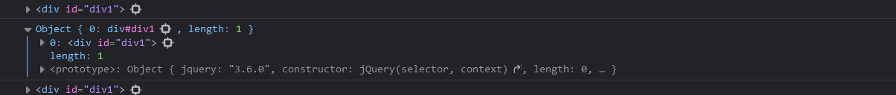

# JQUERY

##  1、Dom对象和jquery包集

原始的dom对象只有DOM接口提供的方法和属性,通过js代码获取的对象都是dom对象;通过jquery获取的对象时jquery包装集类,简称jquery对象,只有jquery对象才能使用jquery提供的方法。

### 1.1Dom对象:

 js中获取的Dom对象,Dom对象只有有限的属性和方法:

```javascript
let div =  document.getElementById("ll");
let d= document.getElementByTagName("div");
```

### 1.2 Jquery包装集对象

 可以说是Dom对象的扩充,在jquery中将所有的对象,无论是一个还是一组,都封装成一个jquery包装集,比如获取包含你一个元素的jquery包装集:

```js
let jq = $("#test")
```

### 1.3 jquery对象和dom对象的转化

> dom => jquery  使用`$()`进行包装即可

```javascript
let domDiv = document.getElementById("mydiv");
mydiv= $(domDiv);
```

> jquery =>dom  使用获取`$("")[0]`进行包装即可

```js
let div2=$("#div1");
let jqueryTOdom=div2[0];
console.log(div2);
console.log(jqueryTOdom);
```



## **2 、选择器**

### 2.1基本选择器

| 选择器     | 示例                             | 描述                                                  |
| ---------- | :------------------------------- | ----------------------------------------------------- |
| id选择器   | $("#div1")                       | 相当于原生的document.getElementById('div1')           |
| 元素选择器 | $("div")                         | 相当于原生的document.getElementsByTagName('div')      |
| 类选择器   | $(".class1")                     | 相当于原生的document.getElementsByClassName('class1') |
| 组合选择器 | $("#div1, #span1, .class1, li"); |                                                       |

###  2.2层次选择器

| 选择器     | 示例                  | 解释                                                         |
| ---------- | --------------------- | ------------------------------------------------------------ |
| 后代选择器 | $("父元素  指定元素") | 选择父元素中的所有的后代元素(包含第一代,第二代...)           |
| 子代选择器 | $("父元素>指定元素")  | 选择父元素中的所有的子代元素(第一代)                         |
| 相邻选择器 | $("元素+指定元素")    | 选择元素的下一个指定元素(只会查找*下一个*元素,不存在则获取不到) |
| 同辈选择器 | $("元素~指定元素")    | 选择元素下面的*所有*指定元素                                 |

<body>

    <div id="parent">层次选择器
        <div id="child" class="testColor" style="background-color:gray ;">父选择器
            <div class="gray">子选择</div>
            
            
        </div>
        <div style="background-color: lightcyan;">
            选择器2 <div>选择器2中的div</div>
        </div>
    </div>
</body>

```js
<script src="js/jquery-3.6.0.js"></script>
<script>
    //后代选择器
    var demo1 = $("#parent div")
console.log(demo1);

//子代选择器
var child = $("#parent>div")
console.log(child);

//相邻选择器
var next = $("#child+div")
console.log(next);

//同辈选择器
var imgs = $(".gray~img")
console.log(imgs);
</script>
```

### 2.3 表单选择器

| Forms            | 名称      | 示例/描述                                                    |
| ---------------- | --------- | ------------------------------------------------------------ |
| 表单选择器       | :input    | 查找所有input元素:$(":input") <br>(包含所有的inpu,textarea,select和button元素) |
| 文本框选择器     | :text     | 查找所有的文本框:$(":text")                                  |
| 密码框选择器     | :password | 查找所有密码框:$(":password")                                |
| **单选框选择器** | :radio    | 查找所有密码框:$(":radio")                                   |
| **复选框选择器** | :checkbox | 查找所有密码框:$(":checkbox")                                |
| 提交按钮选择器   | :submit   | 查找所有密码框:$(":submit")                                  |
| 重置按钮选择器   | :reset    | 查找所有密码框:$(":reset")                                   |
| 按钮选择器       | :button   | 查找所有密码框:$(":button")                                  |
| 文件域选择器     | :file     | 查找所有密码框:$(":file")                                    |

### 2.4常用基本选择器

> 通常带`:`号的选择器一般会与其他选择器组合使用

| 基本选择器                             | 示例/描述                                                    |
| -------------------------------------- | ------------------------------------------------------------ |
| `:first`/`:last`                       | $("li:first")\|$("li:last")：得到所有的li中的第一个\|最后一个。 |
| `:eq(index)`|`:gt(index)`|`:lt(index)` | $("tr:gt(0)"):匹配*一个*\|*所有大于*\|*所有小于*给定索引值的元素 |
| `:not(selector)`                       | 去除所有与给定选择器匹配的元素(取反)                         |
| `:even`|`:odd`                         | 匹配所有索引值为*偶数*\|*奇数*的元素，从 0 开始计数          |

> 例如：$("tr:odd")得到所有的奇数行。
>
> ==此处的偶数和基数是相对于元素下标而言,js中行从0开始。即获得奇数(1,3,5)行,看起来像偶数行==

```html
<body>
    <ul>
        <li>111</li>
        <li>222</li>
        <li>333</li>
        <li>444</li>
        <li>555</li>
        <li>666</li>
    </ul>
    <script src="http://lib.sinaapp.com/js/jquery/1.7.2/jquery.min.js"></script>
    <script>
        $("li:even").css("color", "gray");
        $("li:odd").css("color", "orange");
    </script>
</body>
```

### 2.5 内容/可见性选择器

| 内容/可见性选择器 | 示例/描述                                  |
| ----------------- | ------------------------------------------ |
| :contains(text)   | 匹配包含给定文本的元素                     |
| :empty            | 匹配所有不包含子元素或者文本的空元素       |
| :parent           | 匹配含有子元素或者文本的元素               |
| :hidden           | 匹配所有不可见元素，或者type为hidden的元素 |
| :visible          | 匹配所有的可见元素                         |

### 2.6 属性选择器

## 3 、Jquery Dom操作

### 3.1操作元素的属性

> `attr(name|properties|key,value|fn)`:设置或返回被选元素的属性值(返回属性的值)
>
> ```js
> //返回文档中所有图像的src属性值。
> $("img").attr("src");//name
> ```
>
> ```js
> //为所有图像设置src和alt属性。
> $("img").attr({ src: "test.jpg", alt: "Test Image" });//properties
> ```
>
> ```js
> //为所有图像设置src属性。
> $("img").attr("src","test.jpg");//key,value
> ```
>
> ```js
> //把src属性的值设置为title属性的值。
> $("img").attr("title", function() { return this.src });//fn
> ```

> `prop(name|properties|key,value|fn)`
>
> ```js
> //选中复选框为true，没选中为false
> $("input[type='checkbox']").prop("checked");
> ```
>
> ```js
> //禁用页面上的所有复选框。
> $("input[type='checkbox']").prop({
>   disabled: true
> });
> ```
>
> ```js
> //禁用和选中所有页面上的复选框。
> $("input[type='checkbox']").prop("disabled", false);
> $("input[type='checkbox']").prop("checked", true);
> ```
>
> ```js
> //通过函数来设置所有页面上的复选框被选中。
> $("input[type='checkbox']").prop("checked", function( i, val ) {
>   return !val;
> });
> ```

==**key,function(index, attr|prop)**== 

> 1:属性名称。
>
> 2:返回属性值的函数,第一个参数为当前元素的索引值，第二个参数为原先的属性值。

```html
<body>
    <input type="checkbox" name="ch" checked id="aa" abc="aabbcc">
    <input type="checkbox" name="ch" id="bb">
</body>
<script src="../js/jquery-3.6.0.js"></script>
<script>
    //获取属性
    //固有属性
    var name1 = $("#aa").attr("name");
    var name2 = $("#aa").prop("name");
    console.log(name1);
    console.log(name2);

    //返回值是boolean的属性(元素设置了属性)
    var ck1 = $("#aa").attr("checked");
    var ck2 = $("#aa").prop("checked");
    console.log(ck1);   //checked
    console.log(ck2);   //true

    //返回值是boolean属性(元素没有设置值)
    var ck3 = $("#bb").attr("checked");
    var ck4 = $("#bb").prop("checked");
    console.log(ck3);  //undefined
    console.log(ck4);   //false

    //自定义属性
    var abc1 = $("#aa").attr("abc");
    var abc2 = $("#aa").prop("abc");
    console.log(abc1);  //aabbcc
    console.log(abc2);   //undefined

</script>
```

==attr和prop的区别:==

> 1. 固有属性,attr和prop方法都可以操作
> 2. 自定义属性attr可以操作
> 3. 返回值为boolean类型的属性:
>    1. 若设置了属性,attr返回具体的值,prop返回true
>    2. 若没设置值,attr返回undefined,prop返回false 

### 3.2 CSS操作

> class操作：
>
> addClass("className")：添加class样式
>
> removeClass("className")：移除class样式

> 直接操作css：
>
> 两种方式：
>
> 1、一个属性的操作，使用两个参数：例如：$("div").css("color", "red");
>
> 2、一次操作多个属性,使用一个对象参数。例如：$("div").css({"color":"red", "border":"1px solid red"});

> 一些特殊的样式，有单独操作方式：
>
> 例如高度、宽度设置：$("div").height(200);

### 3.3 操作元素的内容

| 方法              | 说明                                  |
| ----------------- | ------------------------------------- |
| html()            | 获取元素的html内容                    |
| html("html,内容") | 设置元素的html内容                    |
| text()            | 获取元素的文本内容,不包含html(纯文本) |
| text("text,内容") | 设置元素的文本内容,不包含html(纯文本) |
| val()             | 获取元素的value值(表单元素)           |
| val("值")         | 设置元素的value值(表单元素)           |

```js
//获取文字信息
var h = $("a").text(); 
//设置文字信息：
$("a").text("百度");
```

### 3.4 元素的添加与删除

| 方法                           | 说明                                                         |
| ------------------------------ | ------------------------------------------------------------ |
| append(content)                | 给某个元素里面添加子元素(可以是字符,HTML元素)，放到所有的子元素的最后。 |
| prepend(content)               | 给某个元素里面添加子元素(可以是字符,HTML元素)，放到所有的子元素的最前。 |
| $(content).appendTo(selector)  | 把content元素或内容添加到selector元素末尾                    |
| $(content).prependTo(selector) | 把content元素或内容添加到selector元素开头                    |
| before()                       | 在元素前插入指定的元素或内容:$(selector).before(content)     |
| after()                        | 在元素后插入指定的元素或内容:$(selector).after(content)      |
| remove()                       | 删除所选或指定的子元素,包括整个标签和内容一起删除            |
| empty()                        | 清空所选元素的内容                                           |

```html
<body>
    <select id="citySelect">
        <option value="">请选择</option>
        <option value="1">武汉</option>
        <option value="2">黄石</option>
    </select>
    <input type="button" value="删除" />
</body>
<script type="text/javascript" src="js/jquery-2.1.0.js" ></script>
<script>
    $(function(){
        $(":button").click(function(){
            $("#citySelect option").remove(":gt(0)"); // 删除除了请选择以外的option
        });
    });
</script>
```

### 3.5 筛选与遍历

| 方法            | 说明                                           |
| --------------- | ---------------------------------------------- |
| first()、last() | 得到第一个或最后一个元素。                     |
| parent(exp)     | 得到经过里面的选择器筛选的父元素。             |
| children(exp)   | 得到经过里面的选择器筛选的子元素。             |
| siblings(exp)   | 得到经过里面的选择器筛选的兄弟（前后的）元素。 |
| each()          | 遍历。                                         |

```js
$(function(){
    var arr = [10,20,30,40,50];
    $.each(arr, function(index, obj) {
        console.log(index) // 下标
        console.log(obj) // 数组元素
        consloe.log(this)//当前元素
        //当使用要使用元素进行jqueryDom操作时,注意将元素包装成jquery对象"$(this)"
    });
})
```

### 3.6 jquery的让渡

> 当一个页面引入了多个js库，而这些库都使用`$`作为变量名，那么就会出现冲突，此时可以使用jQuery来代替`$`。也可以自定义变量，此时，需要使用让渡。例如：

```js
var jq = jQuery.noConflict();// 自定义jQuery的核心变量

jq(function(){
    var arr = [10,20,30,40,50];

    jq.each(arr, function(index, obj) {
        console.log(index) // 下标
        console.log(obj) // 数组元素
    });
})
```


