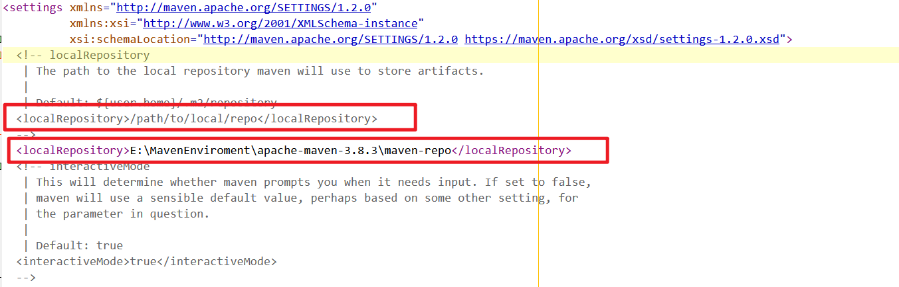

# 5、Maven

## 5.1Maven项目架构管理工具

目前作用是方便导入jar包的

Maven的核心思想：**约束大于配置**

- 有约束，不要去违反

Maven会规定好你应该如何去编写Java代码，必须按照这个规范来

## 5.2配置环境

- M2_HOME  maven目录
- path中配置 %M2_HOME%\bin


配置完成

## 5.3阿里云镜像

```xml
<mirror>
    <id>nexus-aliyun</id>
    <mirrorOf>*,!jeecg,!jeecg-snapshots</mirrorOf>
    <name>Nexus aliyun</name>
    <url>http://maven.aliyun.com/nexus/content/groups/public</url> 
</mirror>
```

## 5.4 设置maven默认jdk版本

在<profiles>标签下添加一个<profile>标签，修改maven默认的JDK版本。

```java
<profile>    
    <id>jdk-1.8</id>    
    <activation>    
        <activeByDefault>true</activeByDefault>    
        <jdk>1.8</jdk>    
    </activation>    
    <properties>    
        <maven.compiler.source>1.8</maven.compiler.source>    
        <maven.compiler.target>1.8</maven.compiler.target>    
        <maven.compiler.compilerVersion>1.8</maven.compiler.compilerVersion>    
    </properties>    
</profile>
```

## 5.5本地仓库

建立本地仓库：localRepository



```xml
  <localRepository>E:\MavenEnviroment\apache-maven-3.8.3\maven-repo</localRepository>
```

## 5.6 idea中使用Maven

```xml
<dependency>
    <groupId>com.alibaba</groupId>
    <artifactId>fastjson</artifactId>
    <version>1.2.62</version>
</dependency>
```


观察

## 5.6 pom文件

```xml
<!--    在build中配置resources ， 来防止我们资源导出失败的问题-->
    <build>
        <resources>
            <resource>
                <directory>src/main/resources</directory>
                <includes>
                    <include>**/*.properties</include>
                    <include>**/*.xml</include>
                </includes>
                <filtering>true</filtering>
            </resource>
            <resource>
                <directory>src/main/java</directory>
                <includes>
                    <include>**/*.properties</include>
                    <include>**/*.xml</include>
                </includes>
                <filtering>true</filtering>
            </resource>
        </resources>
    </build>
```

## 5.7maven项目的目录结构


