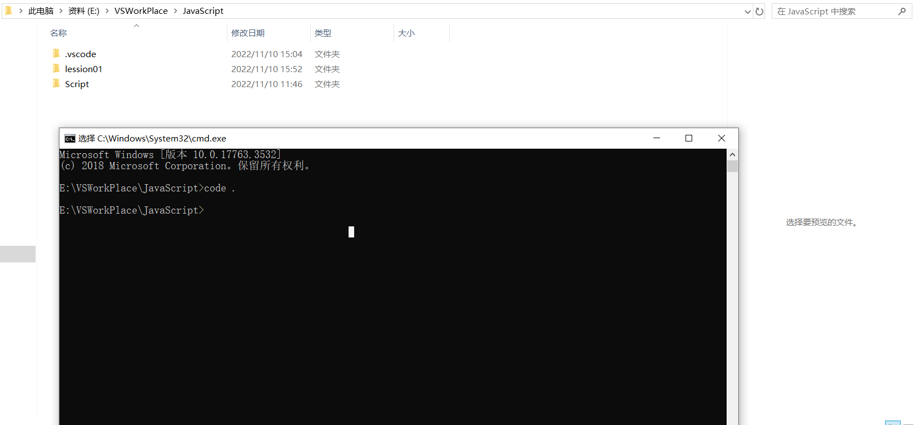

# Vscode设置:

> settings.json

```json
{
    "files.autoSave": "afterDelay",
    "files.autoSaveDelay": 500,
    "workbench.list.smoothScrolling": true,
    "workbench.startupEditor": "none",
    "editor.cursorSmoothCaretAnimation": true,
    "editor.smoothScrolling": true,
    "editor.cursorBlinking": "smooth",
    "editor.formatOnPaste": true,
    "editor.formatOnType": true,
    "editor.formatOnSave": true,
    "editor.wordWrap": "on",
    "editor.bracketPairColorization.enabled": true,
    "editor.suggest.snippetsPreventQuickSuggestions": false,
    "editor.acceptSuggestionOnEnter": "smart",
    "window.dialogStyle": "custom",
    "debug.showBreakpointsInOverviewRuler": true,
    "editor.tabCompletion": "on",//tab快捷导入
    "editor.linkedEditing": true,//linked editing自动修改
    // 以下是插件配置
    "open-in-browser.default": "Firefox",
    "workbench.iconTheme": "material-icon-theme",
    "liveServer.settings.CustomBrowser": "firefox",
}
```

其他版本:

```json
{
  "files.autoSave": "afterDelay",
  "files.autoGuessEncoding": true,
  "workbench.list.smoothScrolling": true,
  "editor.cursorSmoothCaretAnimation": true,
  "editor.smoothScrolling": true,
  "editor.cursorBlinking": "smooth",
  "editor.mouseWheelZoom": true,
  "editor.formatOnPaste": true,
  "editor.formatOnType": true,
  "editor.formatOnSave": true,
  "editor.wordWrap": "on",
  "editor.guides.bracketPairs": true,
  //"editor.bracketPairColorization.enabled": true, (此设置vscode在较新版本已默认开启)
  "editor.suggest.snippetsPreventQuickSuggestions": false,
  "editor.acceptSuggestionOnEnter": "smart",
  "editor.suggestSelection": "recentlyUsed",
  "window.dialogStyle": "custom",
  "debug.showBreakpointsInOverviewRuler": true,
}
```

Vscode插件

## 1.外观主题

>  One Dark Pro


## 2.图标主题

>  Material Icon Theme


> vscode-icons


## 3.常用功能类

> Error  Lens

【错误提示】可以将原先显示的问题显示在对应行右侧并高亮


> Path Intellisense

【路径补全】在输入路径时，有智能提示补全


> Image preview

【图像预览】可以预览引入的图像


# 其他操作

## code.快捷打开




``` json
{
    "files.autoSave": "afterDelay",
    "files.autoSaveDelay": 500,
    "workbench.list.smoothScrolling": true,
    "workbench.startupEditor": "none",
    "editor.cursorSmoothCaretAnimation": true,
    "editor.smoothScrolling": true,
    "editor.cursorBlinking": "smooth",
    "editor.formatOnPaste": true,
    "editor.formatOnType": true,
    "editor.formatOnSave": true,
    "editor.wordWrap": "on",
    "editor.bracketPairColorization.enabled": true,
    "editor.suggest.snippetsPreventQuickSuggestions": false,
    "editor.acceptSuggestionOnEnter": "smart",
    "window.dialogStyle": "custom",
    "debug.showBreakpointsInOverviewRuler": true,
    "editor.tabCompletion": "on",
    "editor.linkedEditing": true,
    "editor.fontFamily": "楷体, 'Courier New', monospace",
    "editor.fontSize": 17,
    "workbench.colorTheme": "One Dark Pro Darker",
    "liveServer.settings.AdvanceCustomBrowserCmdLine": "",
    "liveServer.settings.CustomBrowser": "firefox",
    "liveServer.settings.donotShowInfoMsg": true,
    "explorer.confirmDragAndDrop": false,
    "javascript.suggest.enabled": false,
    "liveServer.settings.port": 5555,
    "open-in-browser.default": "Chrome",
    "editor.snippetSuggestions": "top",
}
```


