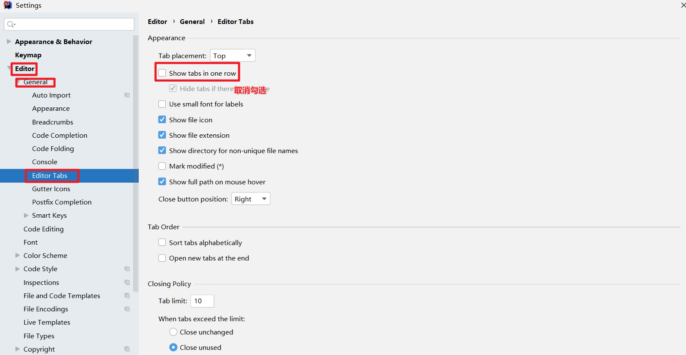

# 1.全局设置

## 全局jdk设置

## 关闭自动更新

Appearance & Behavior | System Settings | Updates 

## 忽略大小写

## 项目开启设置

> 默认打开上次关闭的项目

## 全局maven设置

# 2 字体

# 3 Tab页多行显示

# 4显示方法之间的分割线

# 5.模板设置文件头注释

# 6.自定义快捷键

*tips:快捷键作用范围默认define*

# 7.自动导包和自动优化

# 8.关闭中文插件提示

`localized Intellij IDEA `

> method1:

==tips==

> no popup设置的是不在界面上弹出,notification中还是有信息

method2:

# 9.关闭idea的提示

