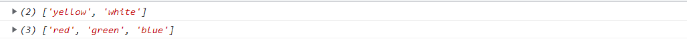

# 一、js基础语法

## 1、数据类型

### 1.0 JS 的变量类型：

- 数值类型： number

- 字符串类型： string：**" ",     ' '**

  > 引号可以相互嵌套 

- 对象类型： object

- 布尔类型： boolean

- 函数类型： function

JavaScript 里特殊的值：
==undefined== ：未定义，所有js 变量未赋于初始值的时候，默认值都是undefined.
==null== 空值
==NaN== 全称是：Not a Number。非数字。非数值。

### 1.1 JS 中的定义变量格式：

***let和var的区别***

let为了解决var存在的一些问题

var声明:

- 可以先使用再声明（不合理）
- var变量可以重复声明
- var变量可提升、全局变量、没有块作用域等

```js
let 变量名;
let  变量名= 值;
```

### 1.2 模板字符串

用于处理字符串使用 ''+'' 拼接繁琐的问题

> ```js
> let name = 'java';
> document.write(`张三学${name}!`)
> document.write("张三学"+name+"!")
> ```

### 1.3 类型转换

#### 1.3.1 隐式转换

某些运算符被执行时，系统内部会自动将数据类型进行转换，这种转换称为隐式转换

**规则：**

- +号两边只要有一个时字符串，都会把另一个转化为字符串
- *除+号*以外的算数运算符（-、*、/）都会把数据转换成数字类型

**缺点：**

- 转换类型不明确，靠经验总结

**小技巧：**

- +号做为正号解析可以转换成Number

```javascript
<script>
    console.log(11 + 11);      //22
    console.log('11' + 11);    //1111
    console.log(11 - 11);      //0
    console.log('11' - 11);    //0
    console.log(1 * 1);        //1
    console.log('1' * 1);      //1
    console.log(typeof '123'); //string
    console.log(typeof +'123');//number
    console.log(+'11' + 11);   //22
</script>
```

#### 1.3.2 显示转换

**转换为数字类型**

```js
console.log(Number('10')); //10
//转换数字型，只保留整数，没有四舍五入
console.log(parseInt('10'));//10
console.log(parseInt('10.1'));//10
console.log(parseInt('10.9'));//10
//转换数字型，保留小数 
console.log(parseFloat('10.999'));//10.999
/**/
```

<!--区别-->

```js
//Number（）只能放数字类型的字符，不能存放abc这种
//否则返回NaN
console.log(Number('10.9ab'));//NaN
console.log(parseFloat('10.9ab'))//10.9(经常用于过滤单位）
```

**转换为字符型**

```js
console.log(String(10));//10
let age = 10;
console.log(age.toString());//10
//括号里面如果是2，则表示转换为2进制
console.log(age.toString(2));//1010
```

## 2、运算符

### 2.1 关系（比较）运算

等于： == 等于是简单的做字面值的比较
全等于： === 除了做字面值的比较之外，还会比较两个变量的数据类型

```html
<head>
<meta charset="UTF-8">
<title>Title</title>
<script type="text/javascript">
var a = "12";
var b = 12;
alert( a == b ); // true
alert( a === b ); // false
</script>
</head>
```

### 2.2 逻辑运算

且运算： &&
或运算： ||
取反运算： !

> 在JavaScript 语言中，所有的变量，都可以做为一个boolean 类型的变量去使用。
> <u>0 、null、undefined、””(空串) 都认为是false</u>；

```javascript
 /*&& 且运算。
 有两种情况：
 第一种：当表达式全为真的时候。返回最后一个表达式的值。
 第二种：当表达式中，有一个为假的时候。返回第一个为假的表达式的值*/
 var a = "abc";
 var b = true;
 var d = false;
 var c = null;

 // alert( a && b );//true
 // alert( b && a );//abc
 // alert( a && d ); // false
 // alert( a && c ); // null

 /* || 或运算
 第一种情况：当表达式全为假时，返回最后一个表达式的值
 第二种情况：只要有一个表达式为真。就会把回第一个为真的表达式的值*/
 // alert( d || c ); // null
 // alert( c|| d ); //false
 // alert( a || c ); //abc
 // alert( b || c ); //true
```

## 3、流程控制

### 3.1 分支语句

**三元运算符**

<!--数字补零案例-->

```js
 let num=+prompt("请输入一个数字：");
 //判断条件是 小于10 则在数字前面加0，否则不加
 let re=num>10?num:'0'+num;
document.write(re);
```

**switch**

*switch是<u>全等匹配</u>（===），switch判断是字符类型，case对应也要使用字符类型*

> 1. switch语句一般用于等值判断，不适用与区间判断
> 2. switch case一般需要配合break关键字使用，没有break会造成case穿透

~~~js
switch (1) {
    case 1:
        document.write("hello word!");
        break;
    case 2:
        document.write("hello");
        break;
    case '3':
        document.write("3333");
        break;
    default:
        document.write('no');
}
~~~

<!--switch案例
简单计算器-->

```js
let operation = prompt("请输入运算符(+-*/)：");
let num1 = +prompt("请输入第一个数：");
let num2 = +prompt("请输入第二个数：");
switch (operation) {
    case '+':
        alert("计算结果为：" + (num1 + num2));
        break;
    case '-':
        alert("计算结果为：" + (num1 - num2));
        break;
    case '*':
        alert("计算结果为：" + (num1 * num2));
        break;
    case '/':
        if (num2 === 0) {
            alert("除数不能为零")
        } else {
            alert("计算结果为：" + (num1 / num2));
        }
        break;
    default:
        alert("不合法运算符")
}
```

### 3.2 循环语句

#### while循环

 <!--100以内偶数和-->

```js
let i = 1;
let sum = 0;
while (i <= 100) {
    if (i % 2 == 0) {
        sum += i;
    }
    i++;
}
document.write(sum)
```

<!--最小公倍数与最大公约数-->

```js
//2个数的最小公倍数最大公约数
let m = +prompt("第一个数：");
let n = +prompt("第二个数：");
let product=m*n;
let temp = m > n ? m - n : n - m;
while (temp !== 0) {
    if (m > n) {
        m = temp;
        temp = m > n ? m - n : n - m;
    } else {
        n = temp;
        temp = m > n ? m - n : n - m;
    }
}
document.write("最大公约数："+m+"<br>")
document.write("最小公倍数："+product/m+"<br>")
```

<!--简易atm-->

```js
//1.不断弹出对话框
let money = 20000;
let st = true;
while (st) {
    let str = prompt(`请选择操作：
    1.存钱
    2.取钱
    3.查看余额
    4.退出`)
    switch (str) {
        case '1':
            let m1 = +prompt("请输入存钱金额：")
            money += m1;
            break;
        case '2':
            let m2 = +prompt("请输入取钱金额：")
            money -= m2;
            break;
        case '3':
            alert("余额为：" + money)
            break;
        case '4':
            st = false;
            break;
    }
}
```

#### for循环

<!--水仙花数-->

```js
//输出所有水仙花数，abc=a^3+b^3+c^3; 951
for (let i = 100; i < 1000; i++) {
    let n1 = parseInt(i / 100);
    let n2 = parseInt(i % 100 / 10);
    let n3 = parseInt(i % 10);
    if (Math.pow(n1, 3) + Math.pow(n2, 3) + Math.pow(n3, 3) === i) {
        document.write("i:" + i + "<br> n1:" + n1 + "<br> n2:" + n2 + "<br> n3:" + n3)
        document.write("<hr>")
    }
}
```

 <!--最小公倍数最大公约数-->

```js
/*测试20 12 
60
4
*/
//2个数的最小公倍数最大公约数
let m = +prompt("第一个数：");
let n = +prompt("第二个数：");
let product = m * n;
let i;
//i等于m、n中较小的
for (i = m > n ? n : m; i > 0; i--) {
    if (m % i == 0 && n % i == 0) {
        break;
    }
}
document.write("最大公约数："+i+"<br>")
document.write("最小公倍数："+product/i+"<br>")
```

**嵌套循环**

##### <!--99乘法表-->

```js
for (let i = 9; i >=1; i--) {
    for (let j = 1; j <= i; j++) {
        document.write(`${j}×${i}=${i * j}&nbsp;&nbsp;`)
    }
    document.write('<br><br>')
}
```

#####  <!--打印星星-->

```js
//打印星星
/*
*         ⭐
*       ⭐⭐⭐
*     ⭐⭐⭐⭐⭐
*    ⭐⭐⭐⭐⭐⭐⭐
*  ⭐⭐⭐⭐⭐⭐⭐⭐⭐
*    ⭐⭐⭐⭐⭐⭐⭐
*      ⭐⭐⭐⭐⭐
*        ⭐⭐⭐
*          ⭐
* */
for (let i = 1; i <6 ; i++) {
    for (let k = 5-i; k >0 ; k--) {
        document.write("&nbsp;&nbsp;&nbsp;&nbsp;");
    }
    for (let j = 1; j <=2*i-1; j++) {
        document.write("⭐");
    }
    document.write("<br><br>");
}
for (let i = 4; i >0 ; i--) {
    for (let k = 5-i; k >0 ; k--) {
        document.write("&nbsp;&nbsp;&nbsp;&nbsp;");
    }
    for (let j = 1; j <=2*i-1; j++) {
        document.write("⭐");
    }
    document.write("<br><br>");
}
```

## 4、数组

#### 4.1 JS 中数组的定义：

格式：
var 数组名= []; // 空数组
var 数组名= [1 , ’abc’ , true]; // 定义数组同时赋值元素

```javascript
var arr = [true,1]; // 定义一个空数组
// alert( arr.length ); // 0
arr[0] = 12;
// alert( arr[0] );//12
// alert( arr.length ); // 0
// javaScript 语言中的数组，只要我们通过数组下标赋值，那么最大的下标值，就会自动的给数组做扩容操作。
arr[2] = "abc";
alert(arr.length); //3
// alert(arr[1]);// undefined
// 数组的遍历
for (var i = 0; i < arr.length; i++){
alert(arr[i]);
}
```

#### 4.2 向数组中添加元素

> <u>数组.push()</u>方法将一个或多个元素添加到数组的<u>末尾</u>，并返回该数组的新长度

==语法：==

~~~js
arr.push(元素1,元素2,...,元素n)
~~~

```js
let arr = ['red', 'green'];
//把blue放在arr后面
// arr.push('blue');
console.log(arr.push('blue'));//插入并返回数组长度
console.log(arr);
```


> <u>数组.unshift()</u>方法将一个或多个元素添加到数组的<u>开头</u>，并返回该数组的新长度

~~~js
arr.unshift(元素1,元素2,...,元素n)
~~~

```js
let arr = ['red', 'green'];
//arr.unshift('blue');
console.log(arr.unshift('blue'));//插入并返回数组长度
console.log(arr);
```


<!--筛选数组
将大于等于10的存入新数组-->

```js
let arr = [1, 3, 21, 12, 5, 7, 9, 56, 78, 99, 123];
let newArr = [];
for (let i = 0; i < arr.length; i++) {
    if (arr[i] >= 10) {
        //将arr[i]追加给newArr
        newArr.push(arr[i]);
    }
}
console.log(newArr);
```

#### 4.3删除数组元素

> <u>数组.pop()</u>方法从数组中删除<u>最后一个元素</u>，并返回该元素的值

==tips==:该方法一次只能删除一个元素，删除多个元素使用循环

```js
 let arr = ['red', 'green','blue'];
 console.log(arr.pop());//删除元素并返回该元素的值
 console.log(arr);
```


> <u>数组.shift()</u>方法从数组中删除<u>第一个元素</u>，并返回该元素的值

```
 let arr = ['red', 'green','blue'];
 console.log(arr.shift());
 console.log(arr);
```


> <u>数组.splice()</u>方法删除数组指定元素

语法：

~~~js
arr.splice(start,deleteCount)
arr.splice(起始位置,删除几个元素)
~~~

```js
 let arr = ['red', 'green','blue','yellow','white'];
 console.log(arr.splice(3,2));//从索引为三开始删除2个
 console.log(arr);
```



#### 4.4 冒泡排序

```js
let arr=[43, 34, -23, 9, 54, 33, 67, 82, -14, -2, -5, 0];
//循环次数数组长度减一
for (let i = 0; i <arr.length-1; i++) {
    //外层每执行一次，内层交换次数减一
    for (let j = 0; j <arr.length-1-i ; j++) {
        if(arr[j]>arr[j+1]){
            let temp=arr[j];
            arr[j]=arr[j+1];
            arr[j+1]=temp;
        }
    }
}
console.log(arr)
```

#### 4.5 综合案例-柱状图

```css
<style>
    * {
        margin: 0;
        padding: 0;
    }

    .box {
        display: flex;
        width: 700px;
        height: 300px;
        border-left: 1px solid black;
        border-bottom: 1px solid black;
        margin: 50px auto;
        justify-content: space-around;
        align-items: flex-end;
        text-align: center;
    }

    .box > div {
        display: flex;
        width: 50px;
        background-color: antiquewhite;
        flex-direction: column;
        justify-content: space-between;
    }

    .box div span {
        margin-top: -20px;
    }

    .box div h4 {
        margin-bottom: -35px;
        width: 70px;
        margin-left: -10px;
    }
</style>
```

```js
let arr = [];
for (let i = 1; i <= 4; i++) {
    arr.push(+prompt(`第${i}季度：`))
}
document.write(`<div class="box">`);
//循环四个div
for (let i = 0; i < arr.length; i++) {
document.write(`
<div style="height: ${arr[i]}px;">
    <span>${arr[i]}</span>
    <h4>第${i+1}季度</h4>
</div>`)
}
document.write(`</div>`);
```

## 5、函数

### 5.1 函数的定义

使用的格式如下:
function 函数名(形参列表){
函数体
}
在JavaScript 语言中，如何定义带有返回值的函数？
只需要在函数体内直接使用return 语句返回值即可！

```javascript
// 定义一个无参函数
function fun(){
    alert("无参函数fun()被调用了");
}
// 函数调用===才会执行
// fun();
function fun2(a ,b) {
    alert("有参函数fun2()被调用了a=>" + a + ",b=>"+b);
}
// fun2(12,"abc");
// 定义带有返回值的函数
function sum(num1,num2) {
    var result = num1 + num2;
    return result;
}
//alert( sum(100,50) );
```

> 注：在Java 中函数允许重载。但是在JS 中函数的重载会直接覆盖掉上一次的定义

### 5.2 函数的arguments 隐形参数（只在function 函数内）

就是在function 函数中不需要定义，但却可以直接用来获取所有参数的变量。我们管它叫隐形参数。
隐形参数特别像java 基础的可变长参数一样。
public void fun( Object ... args );
可变长参数其他是一个数组。
那么js 中的隐形参数也跟java 的可变长参数一样。操作类似数组。

```javascript
    function fun(a) {
        alert( arguments.length );//可看参数个数
        alert( arguments[0] );
        alert( arguments[1] );
        alert( arguments[2] );
        alert("a = " + a);
        for (var i = 0; i < arguments.length; i++){
            alert( arguments[i] );
        }
        alert("无参函数fun()");
    }
    // fun(1,"ad",true);
    // 需求：要求编写一个函数。用于计算所有参数相加的和并返回
    function sum(num1,num2) {
        var result = 0;
        f or (var i = 0; i < arguments.length; i++) {
            //类型为number才相加
            if (typeof(arguments[i]) == "number") {
                result += arguments[i];
            }
        }
        return result;
    }
    alert( sum(1,2,3,4,"abc",5,6,7,8,9) );
```

### 5.3 函数的返回值

#### 5.3.1函数的返回值

> - 函数体中使用return关键字能将内部的执行结果交给外部函数使用
> - 函数内部只能出现一次return，因为return后面的代码不会执行
> - return会立即结束当前函数
> - 函数可以没有return，这种情况下函数默认返回值为undefined

```js
function getSum(x,y) {
    x=x||0;
    y=y||0;
    //先计算再返回
    return x+y;
}
//将getSum()获得的结果赋值给sum变量
let sum=getSum(25,12);
document.write(sum);
```

<!--求数组的最大值-->

```js
function getMax(arr) {
    let max = arr[0];
    for (let i = 0; i < arr.length; i++) {
        if (arr[i] > max) {
            max = arr[i];
        }
    }
    return max;
}

let max = getMax([43, 34, -23, 9, 54, 33, 67, 82, -14, -2, -5, 0]);
document.write(max);
```

#### 5.3.2多个返回值

<!--求数组最大最小值-->

```js
function getMaxMin(arr) {
    //声明最大最小值
    let max = min = arr[0];
    //求最大最小值
    for (let i = 0; i < arr.length; i++) {
        max = arr[i] > max ? arr[i] : max;
        min = arr[i] < min ? arr[i] : min;
    }
    //将max,min存入对象
    return {
        "max": max,
        "min": min
    };
}

let result = getMaxMin([43, 34, -23, 9, 54, 33, 67, 82, -14, -2, -5, 0])
document.write(`数组的最大值为：${result.max}<br>
                    数组的最小值为：${result.min}`)
```

### 5.4 作用域及其域链

#### 5.4.1 作用域概述

> 通常来说，一段程序代码中用到的名字并不总是有效和可用的，而限定这个名字的<u>可用性的代码范围</u>就是这个名字的<u>作用域</u>。作用域的使用提高了程序逻辑的局部性，增强了程序的可靠性，减少了名字冲突

- 全局作用域：作用于所有代码的执行环境（整个script标签内部）或一个独立的js文件。
- 局部作用域：作用于函数内的代码环境。因为跟函数有关所以也叫函数作用域。
- 块作用域：块作用域由{}包括，if语句和for语句里面的{}等。

#### 5.4.2 变量的作用域

- 全局变量：全局变量在任何区域都可以访问。
- 局部变量：局部变量(函数内部的let变量)只能在当前函数内部访问很修改。
- 块级变量：{}内部的let变量，只能在块作用域里访问，不能跨块访问，也不能跨函数访问

#### 5.4.3 作用域链-变量访问原则

> 作用域链:采取就近原则的方式查找变量的最终值

```js
let a = 1;

function f1() {
    let a = 2;
    let b = '22';
    f2();
    function f2() {
        let a=3;
        f3();
        function f3() {
            let a=4;
            console.log(a);
            console.log(b)
        }
    }
}
f1();//a=4,b='22'
```

### 5.5 匿名函数

使用格式如下：

> let 函数名= function(形参列表) { 函数体}

~~~js
let fun = function () {
alert("无参函数");
}
// fun();
let fun2 = function (a,b) {
alert("有参函数a=" + a + ",b=" + b);
}
// fun2(1,2);
let fun3 = function (num1,num2) {
return num1 + num2;
}
alert( fun3(100,200) );
~~~

### 5.6 立即执行函数

场景介绍:避免全局变量之间的污染

语法:

~~~js
//方式一
(function () {console.log(111)})()
//方式二
(function () {console.log(111)}())
//不需要调用立即执行
~~~

==多个匿名函数必须加分号==


### 5.7 综合案例-转换时间

```js
//1.用户输入
let seconds = prompt();
//2.计算时间封装函数
function getTime(t) {
    let h = parseInt(t / 60 / 60 % 24)
    let m = parseInt(t / 60 % 60);
    let s = parseInt(t % 60)
    h = h < 10 ? '0' + h : h;
    m = m < 10 ? '0' + m : m;
    s = s < 10 ? '0' + s : s;
    return `计算之后的时间是${h}小时${m}分钟${s}秒`;
}

let time = getTime(seconds);
document.write(time);
```

## 6、JS 中的自定义对象

### 6.1 Object自定义对象

对象的定义：
var 变量名= new Object(); // 对象实例（空对象）
变量名.属性名= 值; // 定义一个属性
变量名.函数名= function(){} // 定义一个函数

对象的访问：
变量名.属性/ 函数名();

```javascript
var obj = new Object();
//alert(typeof (obj));
obj.name = "zhangsan"
obj.age = 18;
obj.fun = function () {
    alert("姓名：" + this.name + ",年龄：" + this.age)
}
obj.fun()
//alert(obj.name)
```

### 6.2 {}花括号自定义对象

 对象的定义：
var 变量名= { // 空对象
属性名：值, // 定义一个属性
属性名：值, // 定义一个属性
函数名：function(){} // 定义一个函数
};
对象的访问：

1. *对象.属性/ 函数名();*

2. *对象['属性名']*

```js
//声明对象
let person = {
    'name': 'zhangsan',
    'age': 108,
    'sex': '男',
    fun: function () {
        console.log("姓名：" + this.name + ",年龄：" + this.age);
    },
    movie: function (s) {
        console.log(s);
    }
}
//对象的访问 方法1 对象.属性
console.log(person.name + ':' + person.age);
//方法2 对象['属性名']
console.log(person['name']);
//访问方法
person.fun();
person.movie('无间道');
```

### 6.3对象操作

<!--增，删，改-->

```js
let obj={
name:'张三',
age:18,
}
//修改  对象.属性=新值
obj.name=20;

//增加 js可以很方便的动态添加属性和方法
obj.sex='男';
//会去对象里面找是否有sex这个属性，有则更新，否则添加属性
obj.fun=function(){
console.log("姓名：" + this.name + ",年龄：" + this.age);
}
console.dir(obj);
obj.fun();

//删除
delete  obj.name 
console.dir(obj);
```

<!--遍历对象-->

**for in**循环：只能获得对象的<u>键名</u>，不能直接获取<u>键值</u>，为遍历对象而设计

```js
let obj = {
    name: '张三',
    age: 18,
    sex: '男',
}
//for in 循环
let arr = [];
for (let k in obj) {
    console.log(k);//k为键即属性名
    console.log(obj[k]);
}
//k在这里是一个变量，for in 循环取得的是属性名即k==='name'==='age'==='sex'
//所以在循环中打印obj[k]等于打印obj['name'],obj['age']...
```

### 6.4 对象数组案例

```html
<style>
    table {
        width: 600px;
        text-align: center;
    }

    table, th, td {
        border: 1px solid #ccc;
        border-collapse: collapse;
    }

    caption {
        font-size: 18px;
        margin-bottom: 10px;
        font-weight: 700;
    }

    tr {
        height: 40px;
        cursor: pointer;
    }

    table tr:nth-child(1) {
        background-color: #ddd;
    }

    table tr:not(:first-child):hover {
        background-color: #eee;
    }
</style>
```

```js
<script>
    let students = [
        {name: '张三', age: 18, gender: '男', province: '河北'},
        {name: '李四', age: 19, gender: '男', province: '河南'},
        {name: '王五', age: 20, gender: '男', province: '山西'},
        {name: '赵六', age: 21, gender: '男', province: '山东'},
    ];
    //头部
    document.write(`
        <h2>学生信息</h2>
        <p>将数据渲染到页面</p>
        <table>
        <caption>学生列表</caption>
    <tr>
        <th>序号</th>
        <th>姓名</th>
        <th>年龄</th>
        <th>性别</th>
        <th>家乡</th>
    </tr>`)
    //中间循环 
    for (const k in students) {
        document.write(`
    <tr>
        <td>${(+k + 1)}</td>
        <td>${students[k].name}</td>
        <td>${students[k].age}</td>
        <td>${students[k].gender}</td>
        <td>${students[k].province}</td>
    </tr>`)
    }
    //尾部
    document.write(`</table>`)
</script>
```

### 6.5 内置对象

<!--点名案例-->

```js
<body>
<button onclick="click1()" id="bt">按钮1</button>
<script>
    //声明一个数组
    let arr = ['赵云', '张飞', '关羽', '马超', '刘备', '黄忠', '关平'];
    function click1() {
        function getRadom(min, max) {
            return Math.floor(Math.random() * (max - min + 1) + min)
        }
        let random = getRadom(0, arr.length-1);
        console.log(arr[random]);
        //随机到后删除
        arr.splice(random, 1)
        console.log(arr)
        // console.log(random);
    }
</script>
</body>
```

<!--猜数字-->

```js
function getRadom(min, max) {
    return Math.floor(Math.random() * (max - min + 1) + min)
};
let random = getRadom(1, 10);
console.log(random);
while (true){
    let getNum=+prompt("请输入一个数字：");
    if(getNum==random){
        alert("猜对了");
        break;
    }else if(getNum<random){
        alert("猜小了");
    }else {
        alert('猜大了');
    }
}
```

# 二、dom对象

- Dom对象：浏览器根据html标签生成的js对象
  - 所有的标签属性都可以在这个对象上找到
  - 修改这个对象的属性会自动映射到标签身上
- Dom核心思想
  - 把网页内容当作对象处理
- Document对象
  - 是dom中提供的一个对象
  - 它提供的内容的属性和方法都是用来访问和操作网页内容的
    - eg：document.write();
  - 网页的所有内容都在


# 7、js 中的事件

什么是事件？事件是电脑输入设备与页面进行交互的响应。我们称之为事件。
**常用的事件：**
onload 加载完成事件： 页面加载完成之后，常用于做页面js 代码初始化操作
onclick 单击事件： 常用于按钮的点击响应操作。
onblur 失去焦点事件： 常用用于输入框失去焦点后验证其输入内容是否合法。
onchange 内容发生改变事件： 常用于下拉列表和输入框内容发生改变后操作
onsubmit 表单提交事件： 常用于表单提交前，验证所有表单项是否合法。

**什么是事件的注册（绑定）？**
其实就是告诉浏览器，当事件响应后要执行哪些操作代码，叫事件注册或事件绑定。
静态注册事件：通过html 标签的事件属性直接赋于事件响应后的代码，这种方式我们叫静态注册。
动态注册事件：是指先通过js 代码得到标签的dom 对象，然后再通过dom 对象.事件名= function(){} 这种形式赋于事件
响应后的代码，叫动态注册。
动态注册基本步骤：
1、获取标签对象
2、标签对象.事件名= fucntion(){}

## 7.1 onload事件

```javascript
<head>
    <meta charset="UTF-8">
    <title>Title</title>
    <script>
        //onload事件的方法
        function f() {
            alert("静态注册onload事件，所有代码");
            alert("hello");
        }

        //onload事件动态注册
        window.onload = function () {
            alert("动态注册onload事件，所有代码")
        }
    </script>
</head>
<!--静态注册onload事件
onload事件是浏览器解析完页面后就会自动触发的事件-->
<body onload="f()">

</body>
```

## 7.2onclick事件

```javascript
<head>
    <meta charset="UTF-8">
    <title>Title</title>
    <script>
        function f() {
            alert("静态注册onclick事件")
        }

        //动态注册onclick事件
        // window.onload = function () {
        //     //1.获取标签对象
        //     /*
        //     * document 是JavaScript 语言提供的一个对象（文档）<br/>
        //     * get 获取
        //     * Element 元素（就是标签）
        //     * By 通过。。由。。经。。。
        //     * Id id 属性
        //     *
        //     * getElementById 通过id 属性获取标签对象
        //     **/
        //     var btnObj = document.getElementById("bt2")
        //     btnObj.onclick=function () {
        //         alert("动态注册onclick事件")
        //     }
        // }

    </script>
</head>
<body>
<!--静态注册onlick事件-->
<button onclick="f()" id="bt">按钮1</button>
<button id="bt2">按钮2</button>

</body>
```

## 7.3 onchange事件

```javascript
<head>
    <meta charset="UTF-8">
    <title>Title</title>
    <script>
        function f() {
            alert("女神已经改变了!")
        }

        window.onload = function () {
            //获取标签对象
            let elementById = document.getElementById("id1");
            elementById.onchange=function () {
                alert("男神已经改变了!")
            }

        }
    </script>
</head>
<body>
请选择你心中的女神:
<p><select onchange="f()">
    <!--    静态注册onchange事件-->
    <option value="">--女神--</option>
    <option value="">芳芳</option>
    <option value="">佳佳</option>
    <option value="">娘娘</option>
</select></p>
请选择你心中的男神:
<p><select id="id1">
    <option value="">--男神--</option>
    <option value="">国哥</option>
    <option value="">华仔</option>
    <option value="">康帅傅</option>
</select></p>
</body>
```

## 7.4 onsubmit事件

```javascript
<head>
    <meta charset="UTF-8">
    <title>Title</title>
    <script>
        function f() {
            alert("静态注册提交---发现不合法")
            return false;
        }

        //动态注册
        window.onload = function () {
            let elementById = document.getElementById("form1");

            elementById.onsubmit = function () {
                alert("动态注册提交---发现不合法")
                return false;
            }
        }
    </script>
</head>
<body>
<!--return false 可以阻止表单提交-->
<form action="http://localhost:8080" method="get" onsubmit="return f()">
    <input type="submit" value="静态注册">
</form>
<form action="http://localhost:8080" method="get" id="form1">
    <input type="submit" value="动态注册">
</form>
</body>
```

# 8、DOM 模型


Document 对象的理解：
第一点：Document 它管理了所有的HTML 文档内容。
第二点：document 它是一种树结构的文档。有层级关系。
第三点：它让我们把所有的标签都对象化
第四点：我们可以通过document 访问所有的标签对象。

## 8.1Document 对象中的方法介绍

**document.getElementById(elementId)**
通过标签的id 属性查找标签dom 对象，elementId 是标签的id 属性值
**document.getElementsByName(elementName)**
通过标签的name 属性查找标签dom 对象，elementName 标签的name 属性值
**document.getElementsByTagName(tagname)**
通过标签名查找标签dom 对象。tagname 是标签名
**document.createElement( tagName)**
方法，通过给定的标签名，创建一个标签对象。tagName 是要创建的标签名

***注：***
document 对象的三个查询方法，如果有id 属性，优先使用getElementById 方法来进行查询
如果没有id 属性，则优先使用getElementsByName 方法来进行查询
如果id 属性和name 属性都没有最后再按标签名查getElementsByTagName
以上三个方法，一定要在页面加载完成之后执行，才能查询到标签对象。

### 8.1.1 getElementById

```javascript
<head>
    <meta charset="UTF-8">
    <title>Title</title>
    <script>
        /*需求：当用户点击了较验按钮，要获取输出框中的内容。然后验证其是否合法。<br/>
        * 验证的规则是：必须由字母，数字。下划线组成。并且长度是5 到12 位。*/
        function onclickf() {
            //1 获取标签对象
            let elementById = document.getElementById("username");
            //2.获取输入框的内容
            let username = elementById.value;
            console.log(username);
            let patt = /^\w{5,12}$/;
            /*
            * test()方法用于测试某个字符串，是不是匹配我的规则，
            * 匹配就返回true。不匹配就返回false.
            * */
            if(patt.test(username)){
                alert("用户名合法!")
            }else {
                alert("用户名不合法!")
            }
        }

    </script>
</head>
<body>
用户名:<input id="username" type="text"/>
<button onclick="onclickf()">校验</button>
</body>
```

### 8.1.2  JavaScript验证

#### 8.1.2.1 onclick验证

```javascript
<head>
    <meta charset="UTF-8">
    <title>Title</title>
    <script>
        /*需求：当用户点击了较验按钮，要获取输出框中的内容。然后验证其是否合法。<br/>
        * 验证的规则是：必须由字母，数字。下划线组成。并且长度是5 到12 位。*/
        let patt = /^\w{5,12}$/;
        function onclickf1() {
            //1 获取标签对象
            let elementById1 = document.getElementById("username");
            //2.获取输入框的内容
            let username = elementById1.value;
            console.log(username);
            let tips = document.getElementById("tips");

            if (patt.test(username)) {
                tips.innerHTML = "!"
            } else {
                tips.innerHTML = "用户名不合法!"
            }
        }

        function onclickf2() {
            let elementById2 = document.getElementById("password");
            let password = elementById2.value;
            let tips = document.getElementById("tips");
            if (patt.test(password)) {
                tips.innerHTML = ""
            } else {
                tips.innerHTML = "密码不合法!"
            }
        }
    </script>
</head>
<body>
用户名:<input id="username" type="text" onclick="onclickf1()"/>
<span id="tips" style="color: red"></span>
<input id="password" type="text" onclick="onclickf2()"/>
</body>
```

#### 8.1.2.1 onchange验证
#### 8.1.2.1 onblur验证

### 8.1.3 getElementsByName

```javascript
<!DOCTYPE html>
<html lang="en">
<head>
    <meta charset="UTF-8">
    <title>Title</title>
    <script>
        //全选
        function checkAll() {
            /*            让所有复选框都选中
                        document.getElementsByName();是根据指定的name 属性查询返回多个标签对象集合
                        这个集合的操作跟数组一样
                        集合中每个元素都是dom 对象
                        这个集合中的元素顺序是他们在html 页面中从上到下的顺序*/
            let elementsByName = document.getElementsByName("hobby");
            // checked 表示复选框的选中状态。如果选中是true，不选中是false
            // checked 这个属性可读，可写
            for (const elementsByNameElement of elementsByName) {
                elementsByNameElement.checked = true;
            }
        }

        //全不选
        function checkNull() {
            let elementsByName = document.getElementsByName("hobby");
            for (const elementsByNameElement of elementsByName) {
                elementsByNameElement.checked = false;
            }
        }

        //反选
        function checkAnti() {
            let elementsByName = document.getElementsByName("hobby");
            for (const elementsByNameElement of elementsByName) {
                elementsByNameElement.checked = !elementsByNameElement.checked;
                // if (elementsByNameElement.checked === true) {
                //     elementsByNameElement.checked = false;
                // } else {
                //     elementsByNameElement.checked = true;
                // }
            }
        }
    </script>
</head>
<body>
<input type="checkbox" name="hobby" id="cpp" value="cpp">C++
<input type="checkbox" name="hobby" value="java">Java
<input type="checkbox" name="hobby" value="js">JavaScript
<br>
<button onclick="checkAll()">全选</button>
<button onclick="checkNull()">全不选</button>
<button onclick="checkAnti()">反选</button>
</body>
</html>
```

### 8.1.4 getElementsByTagName

<!DOCTYPE html>
<html lang="en">
<head>
<meta charset="UTF-8">
<title>Title</title>
<script type="text/javascript">
// 全选
function checkAll() {
// document.getElementsByTagName("input");
// 是按照指定标签名来进行查询并返回集合
// 这个集合的操作跟数组一样
// 集合中都是dom 对象
// 集合中元素顺序是他们在html 页面中从上到下的顺序。
var inputs = document.getElementsByTagName("input");
for (var i = 0; i < inputs.length; i++){
inputs[i].checked = true;
}
}
</script>
</head>
<body>
兴趣爱好：
<input type="checkbox" value="cpp" checked="checked">C++
<input type="checkbox" value="java">Java
<input type="checkbox" value="js">JavaScript
<br/>
<button onclick="checkAll()">全选</button>
</body>
</html>

### 8.1.4 createElement

## 8.2节点的常用属性和方法

节点就是标签对

### 方法：

通过具体的元素节点调用
*getElementsByTagName()*方法，

获取当前节点的指定标签名孩子节点

*appendChild( oChildNode )*方法，

可以添加一个子节点，oChildNode 是要添加的孩子节点

### 属性：
***childNodes***属性，

获取当前节点的所有子节点

***firstChild***属性，

获取当前节点的第一个子节点

***lastChild***属性，

获取当前节点的最后一个子节点

***parentNode***属性，

获取当前节点的父节点

***nextSibling***属性，

获取当前节点的下一个节点

***previousSibling***属性，

获取当前节点的上一个节点

***className***

用于获取或设置标签的class 属性值
***innerHTML***属性，

表示获取/设置起始标签和结束标签中的内容

***innerText***属性，

表示获取/设置起始标签和结束标签中的文本


 
