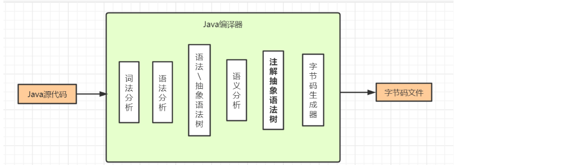

# 1、Lombok

## 0. Lombok原理

Java规范：JSR 269（Java Specification Requests）    插件化注解处理API（Pluggable Annotation Processing API）

JDK6提供的特性，在 Javac编译期（SOURCE标识）利用注解，在字节码文件中生成get、set等方法

Java编译器执行过程：



## 1.@NonNull

## **2.@Accessors**

- 用在类上

- 用来给类中set方法开启链式调用。

  > *value属性:用来指定是否开启set方法链式调用,true表示开启*

- 具体使用

```java
@Data
//开启链式调用
@Accessors(chain = true)
public class User {
    private String id;
    
    private String name;
    
    private Integer age;
    
    private Date date;
}
```

```java
public class testAccessors {
    public static void main(String[] args) throws ParseException {
        User user = new User();

        user.setId("1").setName("cxk").setAge(20)
                .setDate(new SimpleDateFormat("yyyy.MM.dd").parse("2000.12.12"));

        System.out.println(user);
    }
}
```

基于操作类的注解

## 3.@slf4j

- 用在类上
- 用来快速给类中定义一个日志变量
- 原理
  - 在对应类上加入这个注解相当于在这个类中声明了一个日志对象

```java
@Slf4j
public class Slf4jTest {
    //private Logger logger= LoggerFactory.getLogger(this.getClass());

    @Test
    public void test1(){
        //logger.info("执行操作....");
        log.info("执行操作....");
    }
}
```

==tips:==

==使用日志时需要注意依赖以及配置文件==

```xml
<!--slf4j依赖-->
<dependency>
    <groupId>org.slf4j</groupId>
    <artifactId>slf4j-api</artifactId>
    <version>1.7.36</version>
</dependency>
<!--log4j依赖-->
<!--<dependency>-->
<!--     <groupId>org.slf4j</groupId>-->
<!--     <artifactId>slf4j-log4j12</artifactId>-->
<!--	 <version>1.7.25</version>-->
<!--</dependency>-->
<dependency>
    <groupId>log4j</groupId>
    <artifactId>log4j</artifactId>
    <version>1.2.17</version>
</dependency>
```

`log4j.properties`:

```properties
# Set root category priority to INFO and its only appender to CONSOLE.
#log4j.rootCategory=INFO, CONSOLE            debug   info   warn error fatal
log4j.rootCategory=debug, CONSOLE
#log4j.rootCategory=debug, CONSOLE, LOGFILE

# Set the enterprise logger category to FATAL and its only appender to CONSOLE.
log4j.logger.org.apache.axis.enterprise=FATAL, CONSOLE

# CONSOLE is set to be a ConsoleAppender using a PatternLayout.
log4j.appender.CONSOLE=org.apache.log4j.ConsoleAppender
log4j.appender.CONSOLE.layout=org.apache.log4j.PatternLayout
log4j.appender.CONSOLE.layout.ConversionPattern=%d{ISO8601} %-6r [%15.15t] %-5p %30.30c %x - %m\n

# LOGFILE is set to be a File appender using a PatternLayout.
#log4j.appender.LOGFILE=org.apache.log4j.FileAppender
#log4j.appender.LOGFILE.File=e:\axis.log
#log4j.appender.LOGFILE.Append=true
#log4j.appender.LOGFILE.layout=org.apache.log4j.PatternLayout
#log4j.appender.LOGFILE.layout.ConversionPattern=%d{ISO8601} %-6r [%15.15t] %-5p %30.30c %x - %m\n
```

## 4.@Log

- 用在类上
- 作用同@Slf4j

```
@Data
@Builder
@NoArgsConstructor
@AllArgsConstructor
@Log
public class User {
    private String id;

    private String name;

    private Integer age;

    private Date date;
    public void  test(@NonNull String s){
        log.info("test");
        System.out.println(s);
    }

    public static void main(String[] args) {
        new User().test("ss");
    }
}
```

## **5.@Builder**

- 用在类上
- 使用次注解进行对象的创建,函数式编程/链式编程,省去逐行字段set

```java
@Data
@Builder
public class User {
    private String id;

    private String name;

    private Integer age;

    private Date date;
}
```

```java
/**
 * @author Liu
 * @create 2022-11-11-23:17
 * @description:
 */
public class BuilderTest {
    public static void main(String[] args) {
        User user = User.builder().id("12")
                .name("zhangsan")
                .date(new Date()).build();
        System.out.println(user);
    }
}
```

## 6.@Cleanup

> 对资源流进行清理,不需要手动关闭资源流

```java
public class CleanUPTest {
    public static void main(String[] args) throws IOException {
        @Cleanup FileInputStream fis = new FileInputStream("file1");
        @Cleanup FileOutputStream fos = new FileOutputStream("file1");

        byte[] bytes = new byte[1024];
        int len;
        while ((len = fis.read(bytes)) != -1) {
            fos.write(bytes, 0, len);
        }
    }
}
```

# 2、Hutool

##  0 .简介

> Hutool是一个小而全的Java工具类库,通过静态方法封装，降低相关API的学习成本，提高工作效率，使Java拥有函数式语言般的优雅，让Java语言也可以“甜甜的”

> Hutool中的工具方法来自每个用户的精雕细琢，它涵盖了Java开发底层代码中的方方面面，它既是大型项目开发中解决小问题的利器，也是小型项目中的效率担当；

> Hutool是项目中“util”包友好的替代，它节省了开发人员对项目中公用类和公用工具方法的封装时间，使开发专注于业务，同时可以最大限度的避免封装不完善带来的bug。

### 1Hutool如何改变我们的Coding方式

> Hutool的目标是使用一个工具方法代替一段复杂代码，从而最大限度的避免“复制粘贴”代码的问题，彻底改变我们写代码的方式。

以计算MD5为例:

- 【以前】打开搜索引擎 -> 搜“Java MD5加密” -> 打开某篇博客-> 复制粘贴 -> 改改好用
- 【现在】引入Hutool -> SecureUtil.md5()

### 2.Hutool包含的组件

一个 Java 基础工具类，对文件、流、加密解密、转码、正则、线程、XML 等 JDK 方法进行封装，组成各种 Util 工具类，同时提供以下组件：

| 模块               | 介绍                                                         | 与已有工具的的对应关系                          |
| ------------------ | ------------------------------------------------------------ | ----------------------------------------------- |
| hutool-aop         | JDK 动态代理封装，提供非 IOC 下的切面支持                    | *Spring*                                        |
| hutool-bloomFilter | 布隆过滤，提供一些 Hash 算法的布隆过滤                       | 无                                              |
| hutool-cache       | 简单缓存实现                                                 | *Guava的Cache模块.Jodd的Cache模块*              |
| <u>hutool-core</u> | 核心，包括 Bean 操作、日期、各种 Util 等                     | *Apache-Commons-Lang等*                         |
| hutool-cron        | 定时任务模块，提供类 Crontab 表达式的定时任务                | *Quartz、Cron4j*                                |
| hutool-crypto      | 加密解密模块，提供对称、非对称和摘要算法封装                 | *BourcyCastle*                                  |
| hutool-db          | JDBC 封装后的数据操作，基于 ActiveRecord 思想                | *Dbutils,Jfinal的db部分,Nutz的dao,JOOQ,Mybatis* |
| hutool-dfa         | 基于 DFA 模型的多关键字查找                                  | 无                                              |
| hutool-extra       | 扩展模块，对第三方封装（模板引擎、邮件、Servlet、二维码、Emoji、FTP、分词等） | *JavaMail、Zxing、Emojij、Commons-net、等*      |
| hutool-http        | 基于 HttpUrlConnection 的 Http 客户端封装                    | *OKHttp、HttpClient、Jodd的http模块*            |
| hutool-log         | 自动识别日志实现的日志门面                                   | *Slf4j*                                         |
| hutool-script      | 脚本执行封装，例如 Javascript                                | 无                                              |
| hutool-setting     | 功能更强大的 Setting 配置文件和 Properties 封装              | 无                                              |
| hutool-system      | 系统参数调用封装（JVM 信息等）                               | 无                                              |
| hutool-json        | JSON 实现                                                    | *FastJson、Jackson、Json-lib*                   |
| hutool-captcha     | 图片验证码实现                                               | *Jcaptcha*                                      |
| hutool-poi         | 针对 POI 中 Excel 和 Word 的封装                             | *POI、EasyPOI*                                  |
| hutool-socket      | 基于 Java 的 NIO 和 AIO 的 Socket 封装可以根据需求对每个模块单独引入，也可以通过引入 | *t-io、Smart-socket、Netty等*                   |
| hutool-jwt         | JSON Web Token (JWT) 封装实现                                |                                                 |

>  hutoo的使用:可以根据需求对每个模块单独引入,也可以通过引入`hutool-all`方式引入所有模块

Hutool的引入:

> 注意 Hutool 5.x支持JDK8+，对Android平台没有测试，不能保证所有工具类或工具方法可用。 如果你的项目使用JDK7，请使用Hutool 4.x版本

```xml
<dependency>
    <groupId>cn.hutool</groupId>
    <artifactId>hutool-all</artifactId>
    <version>5.6.0</version>
</dependency>
```

## 1.核心(Core)

### 1.1语言特性

### 1.1.1 Console类

> *控制台打印封装-Console*

[使用]()

> 1.`Console.log`这个方法基本等同于`System.out.println`,但是支持类似于Slf4j的字符串模板语法，同时也会自动将对象（包括数组）转为字符串形式。

```java
String[] a = {"abc", "bcd", "def"};
Console.log(a);//控制台输出：[abc, bcd, def]
```


### **1.1.2 Convert类**

>  *万能转换器-Convert类型转换*

> 在Java开发中我们要面对各种各样的类型转换问题，尤其是从命令行获取的用户参数、从HttpRequest获取的Parameter等等，这些参数类型多种多样，我们怎么去转换他们呢？常用的办法是先整成String，然后调用XXX.parseXXX方法，还要承受转换失败的风险，不得不加一层try catch，这个小小的过程混迹在业务代码中会显得非常难看和臃肿

[关于Convert类:]()

> `Convert`类可以说是一个工具方法类，里面封装了针对Java常见类型的转换，用于简化类型转换。`Convert`类中大部分方法为toXXX，参数为`Object`，可以实现将任意可能的类型转换为指定类型。同时支持第二个参数`defaultValue`用于在转换失败时返回一个默认值。

#### [Java常见类型转换]()

##### 1、转换为字符串

```java
String str="中123";
//含非汉字的字符串字符串
//使用Convert转换后结果为null(常规的valueOf和parseInt会抛出异常)
Integer integer = Convert.toInt(str);
Console.log(integer);//输出null
```

##### 2.数组转字符串

```java
int arr[] = {1, 3, 5, 8, 9};

String str = Convert.toStr(arr);
Console.log(str);//结果类似Arrays.toString(), 字符串长度为15
System.out.println(Arrays.toString(arr));
```

##### 3.转换为指定类型数组

```java
String[] str = {"1", "123", "4", "222", "67"};

//String数组转换成Interger数组
Integer[] intArray1 = Convert.toIntArray(str);
Console.log(intArray1);//[1, 123, 4, 222, 67]

//long数组转换成Integer数组
long[] c = {1, 2, 3, 4, 7};
Integer[] intArray2 = Convert.toIntArray(c);
Console.log(intArray2);

//long数组转换成String数组
String[] strArray = Convert.toStrArray(c);
Console.log(strArray);
```

> 此处使用工具类的好处:
>
> 1. 内部封装直接返回对应类型的数组（不需要自己定义）
> 2. 不需要自己写遍历赋值转换

##### 4.转换成日期对象

```java
String str = "2022.05.12";

//SimpleDateFormat解析字符串
Date parse = new SimpleDateFormat("yyyy.MM.dd").parse(str);
System.out.println("SimpleDateFormat:"+parse);
//Convert转换
Date date = Convert.toDate(str);
System.out.println("Convert:"+date);
```

##### 5.转换成集合

```java
//object转换成List
Object[] obj = {"a", "123", "中", " "};

List<String> convert = Convert.convert(List.class, obj);
Console.log(convert);

List<String> list = Convert.toList(String.class, obj);
Console.log(list);

int[] arr = {1, 2, 3, 4, 5};

//StreamAPI转换int数组为list
List<Integer> collect = Arrays.stream(arr).boxed().collect(Collectors.toList());
System.out.println(collect);

//Couvert直接转换成list
List<Integer> integerList = Convert.toList(Integer.class, arr);
System.out.println(integerList);
```

### **1.1.3 IOUtil**

> *IOUtil输入输出流工具类*

[简介:]()

> IO的操作包括*读*和*写*，应用场景包括网络操作和文件操作。IO操作在Java中是一个较为复杂的过程，我们在面对不同的场景时，要选择不同的`InputStream`和`OutputStream`实现来完成这些操作。而如果想读写字节流，还需要`Reader`和`Writer`的各种实现类。这些繁杂的实现类，一方面给我我们提供了更多的灵活性，另一方面也增加了复杂性。

[封装的工具类]()

| 工具类 | 描述         |
| ------ | ------------ |
| IoUtil | 流操作工具类 |
|        |              |
|        |              |
|        |              |
|        |              |
|        |              |

#### 1.IoUtil

> 文件拷贝

默认IO流进行拷贝

```java
@Test
public void IO流文件拷贝() {
    FileInputStream fis = null;
    FileOutputStream fos = null;
    try {
        //创建流
        fis = new FileInputStream("src/main/resources/aa.txt");
        fos = new FileOutputStream("src/main/java/IOUtils/bb.txt", true);
        //设置缓冲区大小
        byte[] bytes = new byte[64];
        int len;
        //读取文件
        while ((len = fis.read(bytes)) != -1) {
            fos.write(bytes, 0, len);
        }
    } catch (FileNotFoundException e) {
        throw new RuntimeException(e);
    } catch (IOException e) {
        throw new RuntimeException(e);
    } finally {
        try {
            if (fos != null) {
                fos.close();
            }
            if (fis != null) {
                fis.close();
            }
        } catch (IOException e) {
            throw new RuntimeException(e);
        }
    }
}
```

通过封装的IoUtil进行拷贝

```java
@Test
public void IoUtils文件拷贝() {
    //创建流
    try {
        FileInputStream fis = new FileInputStream("src/main/resources/aa.txt");
        FileOutputStream fos = new FileOutputStream("src/main/java/IOUtils/cc.txt", true);

        //参数1指定输入流,参数2指定输出流,参数3指定缓冲区大小默认为8192
        IoUtil.copy(fis, fos, 1024);
        //此方法会自动关闭流

    } catch (FileNotFoundException e) {
        throw new RuntimeException(e);
    }
}
```


# end.....


