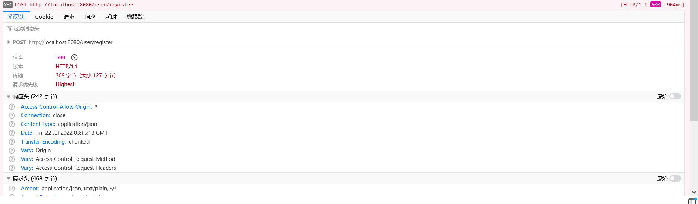

# Vue框架

## 一、Vue简介

### 1.1 使用Jquery的复杂性问题

- 使用jQuery进行前后端分离开发，即可以实现前后端交互（ajax），又可以完成数据渲染。
- 存在的问题：jQuery需要通过html标签拼接、DOM节点完成数据的操作。
- vue是继jQuery之后的一个优秀的前端框架，主要专注于前端数据的渲染---语法简单、渲染效率高。

### 1.2 Vue介绍

####  1.2.1 前端框架

- 前端三要素： HTML   CSS   JavaScript
  - HTML决定网页结构
  - CSS决定显示 效率
  - JavaScript决定网页功能（交互、数据显示）
- UI框架
  - Bootstrap
  - Layui
- Js框架
  - jQuery
  - React
  - angular
  - node.js-----后端 开发
  - vue

#### 1.2.2 MVVM

>项目结构经历的三个阶段：

`后端MVC`： 单体架构，流程控制是由后端控制器来完成的

`前端MVC` : 前后端分离，后端只负责接收响应请求

`MVVM`： 前端请求后端接口，后端返回数据，前端接收数据，并将接收的数据设置"VM",HTML从 "vm"取值。

- M  Model 数据模型  指的是后端接口返回的数据
- V   view  视图
- VM   viewModel  视图模型   数据模型与视图之间的桥梁，后端返回的model转换为前端所需的vm

## 二、VUE的入门使用

>Vue 被设计为可以自底向上逐层应用。Vue 的核心库只关注视图层，不仅易于上手，还便于与第三方库或既有项目整合。

### 2.1 vue的引入

- 离线引入：下载vue.js文件，添加到前端项目中，在网页中通过script标签引入vue.js文件
- CDN引入

```html
<script src="https://cdn.jsdelivr.net/npm/vue@2/dist/vue.js"></script>
```

### 2.2 入门案例

```html
<!DOCTYPE html>
<html lang="en">
  <head>
    <meta charset="UTF-8" />
    <meta http-equiv="X-UA-Compatible" content="IE=edge" />
    <meta name="viewport" content="width=device-width, initial-scale=1.0" />
    <title>Document</title>
  </head>
  <body>
    <div id="container">
      从vm中获取的数据为<span style="color: red">{{str}}</span>
    </div>
  </body>
  <script type="text/javascript" src="js/vue.js"></script>
  <script>
    var vm = new Vue({
      el: "#container", // element  用来给vue实例定义一个作用域范围
      data: {
        // 用来给vue实例定义一些相关的数据
        str: "aa",
        username: "admin",
        pwd: "123456",
      },
    });
  </script>
</html>
```

`注意事项：1. 获取vuedata中的数据使用{{}}进行获取,一定是在vue的作用范围之内`

`2. el属性可以书写任意的css选择器，但是在使用vue开发时推荐使用id选择器`

## 三、Vue的语法

### 3.1 基本类型数据和字符串


### 3.2 对象类型数据

- 支持ognl语法


### 3.3 条件 v-if


### 3.4 循环 v-for

循环使用 v-for 指令。

v-for 指令需要以 **site in sites** 形式的特殊语法， sites 是源数据数组并且 site 是数组元素迭代的别名(forin循环返回的是的site是key)。

> v-for 可以绑定数据到数组来渲染一个列表：

```html
<body>
    <div id="app">
        <ol>
            <li v-for="site in sites">
                {{ site.text }}
            </li>
        </ol>
    </div>
</body>
<script src="js/vue.js"></script>
<script>
    const app = new Vue({
        el: "#app",
        data:{  
                sites: [
                    { text: 'Google' },
                    { text: 'Runoob' },
                    { text: 'Taobao' }
                ]
        }
    })
</script>
```

> v-for 可以通过一个对象的属性来迭代数据：

```html
<body>
    <div id="app">
        <ul>
            <li v-for="value in object">
                {{ value }}
            </li>
        </ul>
    </div>

</body>
<script src="js/vue.js"></script>


<script>
    const app = new Vue({
        el: "#app",
        data: {
            object: {
                name: 'Google',
                url: 'http://www.runoob.com',
                slogan: '学的不仅是技术，更是梦想！'
            }
        }
    })
</script>
```


> v-for 还支持一个可选的第二个参数，参数值为当前项的索引：

```html
<!DOCTYPE html>
<html lang="en">
  <head>
    <meta charset="UTF-8" />
    <meta http-equiv="X-UA-Compatible" content="IE=edge" />
    <meta name="viewport" content="width=device-width, initial-scale=1.0" />
    <title>Document</title>
  </head>
  <body>
    <div id="container">
      <table border="1" cellspacing="0" width="400">
        <tr>
          <th>编号</th>
          <th>学号</th>
          <th>姓名</th>
          <th>性别</th>
          <th>年龄</th>
        </tr>
        <tr v-for="s,index in stus"> //index参数2索引
          <td>{{index+1}}</td>
          <td>{{s.stuNum}}</td>
          <td>{{s.stuName}}</td>
          <td v-if="s.stuGender=='M'">男</td>
          <td v-if="s.stuGender=='N'">女</td>
          <td>{{s.stuAge}}</td>
        </tr>
      </table>
    </div>
  </body>
  <script type="text/javascript" src="js/vue.js"></script>
  <script>
    var vm = new Vue({
      el: "#container", // element  用来给vue实例定义一个作用域范围
      data: {
        // 用来给vue实例定义一些相关的数据
        stus: [
          {
            stuNum: "10001",
            stuName: "tom",
            stuGender: "M",
            stuAge: 20,
          },
          {
            stuNum: "10002",
            stuName: "lucy",
            stuGender: "N",
            stuAge: 18,
          },
          {
            stuNum: "10003",
            stuName: "jim",
            stuGender: "M",
            stuAge: 22,
          },
        ],
      },
    });
  </script>
</html>
```

### 3.5 v-bind绑定标签属性

- v-bind  可以简写为 ：


### 3.6 表单标签的双向绑定 v-model

- 只能使用在表单输入标签
- v-model:value    可以简写为: v-model


### 3.7 v-on绑定事件

```html
<!DOCTYPE html>
<html lang="en">

<head>
    <meta charset="UTF-8">
    <meta http-equiv="X-UA-Compatible" content="IE=edge">
    <meta name="viewport" content="width=device-width, initial-scale=1.0">
    <title>Document</title>
</head>

<body>
    <div id="container">
        <h2 id="ages">年龄：{{age}}</h2>
        <!-- <input type="button" value="点我改变年龄" @click="changeAge" />
            v-on 可以简写 为 @
        -->
        <p><input type="button" value="点我改变年龄" @click="changeAge" onclick="f()"></p>
    </div>
</body>
<script src="js/vue.js"></script>
<script>
    var vm = new Vue({
        el: "#container",
        data: {
            age: 20,
        },
        methods: {
            //用来定义vue中事件
            changeAge: function () {
                this.age++; //this代表获取当前vue实例中相关的数据
            }
        }
    })
    // var age=20;
    // document.getElementById("ages").innerHTML="年龄："+age;
    // function f() {
    //     age=age+1;
    //     document.getElementById("ages").innerHTML="年龄："+age;
    // }

</script>
</html>
```

`注意事项：1. 在vue中绑定事件通过v-on指令来完成 ， v-on:事件名 如：v-on:click`

`2. 在vue定义的事件中可以通过this关键字来获取当前vue实例中的相关数据`

`3. v-on 可以简写为@`

## 四、Axios的基本使用

### 4.1 axios介绍

>`Axios`是一个异步请求技术，核心作用就是用来在页面中发送异步请求，并获取对应数据在页面中渲染， 页面局部更新技术   Ajax

### 4.2 Axios第一个程序

> ```
> npm install --save axios vue-axios
> ```

中文网站：http://www.axios-js.com/

安装：https://unpkg.com/axios@0.27.2/dist/axios.min.js

- 相比于原生ajax来讲，简洁、高效，对restful支持良好

#### 4.2.1 GET方式的请求

```html
<!DOCTYPE html>
<html lang="en">

<head>
    <meta charset="UTF-8">
    <meta http-equiv="X-UA-Compatible" content="IE=edge">
    <meta name="viewport" content="width=device-width, initial-scale=1.0">
    <title>Document</title>
</head>

<body>
    <div id="container">
        <button type="button" @click="change">测试</button>
    </div>
</body>
<script src="js/vue.js"></script>
<script src="js/axios.min.js"></script>
<script>
    var vm = new Vue({
        el: container,
        data: {},
        methods: {
            change: function () {
                 axios
                .get(
                    "http://localhost:8080/user/loginusername=zhangsan&password=88888888"
                    )
                .then(function (res) {
                    console.log(res);
                }).catch(function (err) {
                })
            }
        }
    })
</script>

</html>
```

`传参数方式：`

```html
<!DOCTYPE html>
<html lang="en">

<head>
    <meta charset="UTF-8">
    <meta http-equiv="X-UA-Compatible" content="IE=edge">
    <meta name="viewport" content="width=device-width, initial-scale=1.0">
    <title>Document</title>
</head>

<body>
    <div id="container">
        <button type="button" @click="change">测试</button>
    </div>
</body>
<script src="js/vue.js"></script>
<script src="js/axios.min.js"></script>
<script>
    var vm = new Vue({
        el: container,
        data: {},
        methods: {
            change: function () {
                //result返回结果
                // axios
                // .get(
                // "http://localhost:8080/user/login?username=zhangsan&password=88888888"
                // )
                // .then((result) => {
                //     console.log(result)
                // }).catch((err) => {    
                // });
                
                // 使用axios的get请求传递参数，需要将参数设置在params下 （restful支持风格）
                axios.get("http://localhost:8080/user/login", {
                    params: {
                        username: "zhangsan",
                        password: "88888888"
                    }
                }).then((result) => {
                    console.log(result)
                }).catch((err) => { });
            }
        }
    })
</script>

</html>
```

#### 4.2.2 Post方式的请求

- 前端代码

```html
<body>
    <div id="container">
        <button type="button" @click="change">测试</button>
    </div>
</body>
<script src="js/vue.js"></script>
<script src="js/axios.min.js"></script>
<script>
    var vm = new Vue({
        el: container,
        data: {},
        methods: {
            change: function () {
                //后端以对象进行接收
                let data = { username: "zhangsi", password: "88888888" }
                //post请求
                axios.post("http://localhost:8080/user/register", data).then((result) => {
                    console.log(result);
                }).catch((err) => { });
            }
        }
    })
</script>
```

- 后端代码


未添加请求体可能出现的问题这里出现的500错误

浏览器报错：



idea报错：


#### 4.2.3 报错与解决

使用@RequestBody后启动swagger报错（前端请求可以正常访问？？，去掉@RequestBody后swagger可以使用）


但在使用原Users实体，swagger注册请求错误提示


idea提示


> 错误信息：default message [Failed to convert property value of type 'java.lang.String' to required type 'int' for property 'userId'; nested exception is java.lang.NumberFormatException: For input string: ""]

User实体类：


## 五、Vue生命周期


```markdown
# vue生命周期：
   1. 初始化阶段：
    beforeCreate()： 生命周期的第一个函数，该函数在执行时vue实例仅仅完成了自身事件的绑定和声明周期函数的初始化工作。
   	created(): 生命周期的第二个函数，该函数在执行时vue实例已经初始化了data属性和methods中相关的方法
   	beforeMount(): 生命周期中第三个函数，该函数在执行vue时将EL中指定作用范围作为模板编译
   	mounted(): 生命周期中第四个函数，该函数在执行过程中，已经将数据渲染到界面中 并且已经更新页面
   	
  2. 运行阶段
    beforeUpdate(): 生命周期中第五个函数，该函数是data中数据发生变化时执行，这个事件执行时仅仅是vue实例中data数据变化页面显示的依然是原始数据
    updated():  生命周期第六个函数，该函数执行时data中数据发生变化，页面中数据也发生了变化，页面中数据已经和data中数据一致。
    
  3. 销毁阶段
  	beforeDestroy(): 生命周期第七个函数，该函数执行时vue中所有数据methods 都没销毁
  	destroyed(): 生命周期第八个函数，该函数执行时，vue实例彻底销毁。
```

## 六、Vue中的组件

### 6.1 组件的作用

>组件作用：用来减少vue实例对象中代码量，可以根据不同的业务功能将页面划分不同的组件，由多个组件去完成整个页面的布局，便于维护。

### 6.2 组件的使用

#### 6.2.1 局部组件

1. 第一种开发方式

```html
<!DOCTYPE html>
<html lang="en">

<head>
    <meta charset="UTF-8">
    <meta http-equiv="X-UA-Compatible" content="IE=edge">
    <meta name="viewport" content="width=device-width, initial-scale=1.0">
    <title>Document</title>
</head>

<body>
    <div id="container">
        <!-- 使用组件 -->
        <mytemplate></mytemplate>
    </div>
    <!-- 1.声明组件 template标签 注意：在vue实例作用范围外声明 -->
    <template id="logintemp">
        <h1>用户登录</h1>
    </template>
</body>
<script src="../js/vue.js"></script>
<script>
    // 2.定义组件
    let loginTemplate = {//组件名称
        template: "#logintemp",
    }
    var vm = new Vue({
        el: "#container",
        data: {},
        components: {
            //3.注册组件
            //事件使用的组件名          定义的组件名称
            'mytemplate': loginTemplate,
        }
    })
</script>

</html>
```

2. 第二种开发方式

```html
<!DOCTYPE html>
<html lang="en">

<head>
    <meta charset="UTF-8">
    <meta http-equiv="X-UA-Compatible" content="IE=edge">
    <meta name="viewport" content="width=device-width, initial-scale=1.0">
    <title>Document</title>
</head>

<body>
    <div id="container">
        <!-- 3.使用组件 -->
        <login></login>
    </div>
</body>
<script src="../js/vue.js"></script>
<script>
    // 1.定义组件
    let login = {//组件名称
        template: "<h1>用户注册</h1>"
    }
    var vm = new Vue({
        el: "#container",
        data: {},
        components: {
            //2.注册组件
            'login': login,
        }
    })
</script>

</html>
```

#### 6.2.2 全局组件

>说明：全局组件注册给 vue实例，日后可以在任意 vue实例的范围内使用该组件

```html
<!DOCTYPE html>
<html lang="en">

<head>
    <meta charset="UTF-8">
    <meta http-equiv="X-UA-Compatible" content="IE=edge">
    <meta name="viewport" content="width=device-width, initial-scale=1.0">
    <title>Document</title>
</head>

<body>
    <div id="container">
        <!-- 2.使用组件 vue实例范围内 -->
        <login></login>
    </div>
</body>
<script src="../js/vue.js"></script>
<script>
     //1. 开发全局组件
     Vue.component("login", {
      template: "<div><h3>用户登录</h3></div>",
    });

    let vm = new Vue({
      el: "#container",
      data: {},
    });

</script>

</html>
```

## 七、vue的路由

> router是由vue官方提供的用于实现组件跳转的插件。

### 7.1 路由插件的引用

#### 7.1.1 离线引入

```js
<script type="text/javascript" src="js/vue.js"></script>
<script type="text/javascript" src="js/vue-router.js"></script>
```

#### 7.1.2 在线cdn

```js
<script type="text/javascript" src="https://unpkg.com/vue-router@4.0.15/dist/vue-router.global.js"></script>
```

### 7.2 路由的使用

1. 引入路由

```
<script type="text/javascript" src="js/vue.js"></script>
<script type="text/javascript" src="js/vue-router.js"></script>
```

2. 创建组件对象

````html
 let login = {
      template: "<h3>用户登录</h3>",
    };

let register = {
	template: "<h3>用户注册</h3>",
};
````

3. 定义路由对象 的规则

```html
let router=new VueRouter({
        routes:[
            {path:"/login",component:login},  // path：路由的路径   component:路径对应的组件
            {path:"/register",component:register}
        ]
    })
```

4. 将路由对象注册到vue实例中

```html
 let app=new Vue({
        el:"#container",
        data:{

        },
        router:router  // 设置路由对象
  })
```

5. 在页面中显示路由的组件

```html
<router-view></router-view>
```

6. 根据连接切换路由

```html
<!-- <a href="#/login">点我登录</a>
<a href="#/register">点我注册</a> -->
<router-link to="/login">用户登录</router-link>
<router-link to="/register">用户注册</router-link>
```

### 7.3 路由案例

```html
<!DOCTYPE html>
<html lang="en">
  <head>
    <meta charset="UTF-8" />
    <meta http-equiv="X-UA-Compatible" content="IE=edge" />
    <meta name="viewport" content="width=device-width, initial-scale=1.0" />
    <title>路由案例</title>
    <style>
      * {
        margin: 0px;
        padding: 0px;
      }
      ul {
        list-style: none;
      }
      ul li {
        display: inline;
        float: left;
        margin-left: 20px;
        margin-bottom: 20px;
      }
      ul li a {
        text-decoration: none; /*去掉下划线*/
        color: white;
        font-size: 20px;
        font-weight: bold;
      }
      ul li a:hover {
        color: yellow;
      }
    </style>
  </head>
  <body>
    <div id="container">
      <div style="width: 100%; height: 70px; background: gray">
        <table>
          <tr>
            <td>
              <ul>
                <li><a href="#/stu1">首页</a></li>
                <li><a href="#/stu2">学生信息</a></li>
                <li><a href="#/stu3">学生添加</a></li>
                <li><a href="#/stu4">学生修改</a></li>
                <li><a href="#/stu5">学生删除</a></li>
              </ul>
            </td>
          </tr>
        </table>
      </div>
      <div style="width: 100%; height: 400px">
        <!-- 显示路由 -->
        <router-view></router-view>
      </div>
    </div>
  </body>
  <script type="text/javascript" src="js/vue.js"></script>
  <script type="text/javascript" src="js/vue-router.js"></script>
  <script>
    //定义组件
    let stu1 = {
      template: "<h3>首页</h3>",
    };
    let stu2 = {
      template: "<h3>学生信息</h3>",
    };
    let stu3 = {
      template: "<h3>学生添加</h3>",
    };
    let stu4 = {
      template: "<h3>学生修改</h3>",
    };
    let stu5 = {
      template: "<h3>学生删除</h3>",
    };

    let routes = new VueRouter({
      routes: [
        { path: "/stu1", component: stu1 }, // path：路由的路径   component:路径对应的组件
        { path: "/stu2", component: stu2 },
        { path: "/stu3", component: stu3 },
        { path: "/stu4", component: stu4 },
        { path: "/stu5", component: stu5 },
      ],
    });

    let app = new Vue({
      el: "#container",
      data: {},
      router: routes, // 设置路由对象
    });
  </script>
</html>
```

### 7.4 router-link的使用

- 作用：用来替换我们在切换路由时使用a标签切换路由
- 好处：就是可以自动给路由路径加入#不需要手动加入

```html
<li><router-link to="/stu1" tag="a">首页</router-link></li>
<li><router-link to="/stu2" tag="a">学生信息</router-link></li>
<li><router-link to="/stu3" tag="a">学生添加</router-link></li>
<li><router-link to="/stu4" tag="a">学生修改</router-link></li>
<li><router-link to="/stu5" tag="a">学生删除</router-link></li>
```

```markdown
# 总结：
    1.router-link 用来替换使用a标签实现路由切换  好处不需要书写#号路由路径
    2.router-link to属性用来书写路由路径  tag属性：用来将router-link渲染成指定的标签
```

### 7.5 默认路由

- 作用：用来在第一次进入界面是显示一个默认的组件

```js
 //2.定义路由规则
    let routes = new VueRouter({
      routes: [
        { path: "/", redirect: "/stu1" },  //redirect：用来当访问的是默认路由时，跳转到指定的路由展示
        { path: "/stu1", component: stu1 }, // path：路由的路径   component:路径对应的组件
        { path: "/stu2", component: stu2 },
        { path: "/stu3", component: stu3 },
        { path: "/stu4", component: stu4 },
        { path: "/stu5", component: stu5 },
      ],
    });
```

### 7.6  路由中参数传递

- 第一种方式传递参数（传统方式）

1. 通过？号形式拼接参数

```js
<router-link to="/stu2?id=2&name=aa" tag="a">学生信息</router-link>

//路由定义
  let routes = new VueRouter({
      routes: [
        { path: "/stu2", component: stu2 }
      ],
    });
```

2. 组件中获取参数

```js
 //1. 定义组件
    let stu2 = {
      template: "<h3>学生信息</h3>",
      data() {
        return {};
      },
      methods: {},
      created() {
        console.log(
          this.$route.query.id + "----------------" + this.$route.query.name
        );
      },
    };
```

- 第二种方式传递参数 restful

1. 通过使用路径方式传递参数

```js
<router-link to="/stu2/20/zhangsan" tag="a">学生信息</router-link>
//路由定义
  let routes = new VueRouter({
      routes: [
        { path: "/stu2/:id/:name", component: stu2 }
      ],
    });
```

2. 组件中获取参数

```js
  let stu2 = {
      template: "<h3>学生信息</h3>",
      data() {
        return {};
      },
      methods: {},
      created() {
        console.log(
          this.$route.params.id+"==============="+this.$route.params.name
        );
      },
    };
```

### 7.7 嵌套路由

1. 声明最外层和内层路由

```html
 <template id="product">
      <div>
        <h1>商品管理</h1>
        <router-link to="/add" tag="a">商品添加</router-link>
        <router-link to="/edit" tag="a">商品编辑</router-link>
        <router-view></router-view>
      </div>
    </template>
```

2. 声明组件

```js
//1.声明组件
    let product = {
      template: "#product",
    };

    let add = {
      template: "<h4>商品添加</h4>",
    };

    let edit = {
      template: "<h4>商品编辑</h4>",
    };

```

3. 创建路由对象含有嵌套路由

```js
//2.定义路由的规则
    //创建路由对象含有嵌套路由
    let router = new VueRouter({
      routes: [
        {
          path: "/product",
          component: product,
          children: [
            {
              path: "/add",
              component: add,
            },
            {
              path: "/edit",
              component: edit,
            },
          ],
        },
      ],
    });
```

4. 注册路由对象

```js
   //3. 注册路由对象
    const app = new Vue({
      el: "#container",
      data: {},
      router, //定义路由对象
    });
```

5. 测试路由

```html
<div id="container">
      <router-link to="/product">商品管理</router-link>
      <!-- 显示路由内容 -->
      <router-view></router-view>
    </div>
```

6.


```html

<!DOCTYPE html>
<html lang="en">

<head>
    <meta charset="UTF-8">
    <meta http-equiv="X-UA-Compatible" content="IE=edge">
    <meta name="viewport" content="width=device-width, initial-scale=1.0">
    <title>Document</title>
</head>
<div id="container">
    <router-link to="/product">商品管理</router-link>
    <router-view></router-view>
</div>
<template id="product">
    <div>
        <h1>商品管理</h1>
        <router-link to="add" tag="a">商品添加</router-link>
        <router-link to="/edit" tag="a">商品编辑</router-link>
        <router-view></router-view>
    </div>
</template>

<body>

</body>
<script src="js/vue.js"></script>
<script src="js/vue-router.js"></script>
<script>
    //1.声明组件
    let product = {
        template: "#product"
    }
    let add = {
        template: "<h4>商品添加</h4>"
    }
    let edit = {
        template: "<h4>商品编辑</h4>"
    }
    //2.定义路由的规则
    //创建路由对象含有嵌套路由
    let router = new VueRouter({
        routes: [
            {
                path: "/product",
                component: product,
                children: [
                    {
                        path: "/add",
                        component: add,
                    },
                    {
                        path: "/edit",
                        component: edit,
                    },
                ]
            }
        ]
    })
    //3. 注册路由对象
    let vm = new Vue({
        el: "#container",
        router,
    })
</script>

</html>
```

# Element UI

## 1. VUE CLI脚手架

### 1.1 什么是CLI

```
命令行界面：简称CLI 是在图形用户界面得到普及之前使用最为广泛的用户界面。它通常不支持鼠标，用户通过键盘输入指令，计算机接收到指令开始执行，字符界面
```

### 1.2 什么是VUE CLI

```
VUE CLI 是一个基于vue.js进行快速开发的完整系统。使用vue脚手架之后我们开发的页面将是一个完整的系统(项目)
```

### 1.3 VUE CLI优势

- 通过 `@vue/cli` 实现的交互式的项目脚手架。

- 通过 `@vue/cli` + `@vue/cli-service-global` 实现的零配置原型开发。

- 一个运行时依赖 (

  ```
  @vue/cli-service
  ```

  )，该依赖：

  - 可升级；
  - 基于 webpack 构建，并带有合理的默认配置；
  - 可以通过项目内的配置文件进行配置；
  - 可以通过插件进行扩展。

- 一个丰富的官方插件集合，集成了前端生态中最好的工具。

- 一套完全图形化的创建和管理 Vue.js 项目的用户界面。

### 1.4 VUE CLI安装

#### 1.4.1 环境准备

```markdown
# 1.下载node.js
	https://nodejs.org/en/download/
       windows系统： .msi 安装包(exe)指定安装位置
                    .zip  直接解压
                    
                    
# 2. 配置node.js环境变量
   windows系统：
      计算机右键属性---->高级系统变量---->选中path，编辑:
      D:\Program Files\nodejs
      
# 3. 验证node.js环境是否成功
     node -v

# 4. npm 介绍
     npm是前端用于依赖管理的包管理工具，跟java中的maven是一样的作用。
     
# 5. 配置淘宝镜像
   npm config set registry https://registry.npm.taobao.org
   原始镜像：
   npm config set registry https://registry.npmjs.org/
   
# 6. 配置npm下载依赖位置
   windows：
      npm config set cache "D:\Program Files\nodereps\npm-cache"
      npm config set prefix "D:\Program Files\nodereps\npm_global"
      
# 7.验证node.js环境配置
   npm config ls
# 8.查看vue-clic版本
vue -V
```

vue执行报错：


创建vue项目时，提示 **无法加载文件 E:\Software\Node.js\node_global\vue.ps1，因为在此系统上禁止运行脚本。**


> 1.查看当前执行策略

``` cmd
Get-ExecutionPolicy //默认为Restricted：禁止运行任何脚本和配置文件
```

> 修改执行策略

```
Set-ExecutionPolicy -Scope CurrentUser
```

再输入

``` cmd
RemoteSigned  //RemoteSigned:可以运行脚本，但要求从网络上下载的脚本和配置文件由可信发布者签名； 不要求对已经运行和已在本地计算机编写的脚本进行数字签名
```

#### 1.4.2 安装脚手架

```markdown
# 卸载脚手架
      npm uninstall -g @vue/cli   // 卸载3.x版本脚手架
      npm uninstall -g vue-cli    //卸载2.x版本脚手架
      
# vue cli官方地址
          https://cli.vuejs.org/zh/guide/
          
# 安装vue cli
     npm install -g vue-cli //安装2版本
     npm install -g @vue/cli //安装3版本
```

#### 1.4.3 第一个脚手架项目

``` markdown
# 1.创建vue脚手架第一个项目
   vue init webpack 项目名
```


```markdown
# 2. 如何运行
    - 先进入项目目录下
    - 输入命令： npm run dev  /  npm  start
    停止服务： Ctrl+C
    
# 3. 项目结构
	▽hello--------------项目名称
	  ▷build-------------- 用来使用webpack打包使用build依赖
	  ▷config------------- 用来做整个项目配置目录
	  ▷node_modules-----------用来管理项目中使用依赖
	  ▽src----------------------------------书写vue的源代码（重点）
	    ▷assets------------------用来存放静态资源的（重点）
	    ▷components--------------用来书写vue组件（重点）
	    ▷router------------------用来配置项目中路由(重点)
	    App.vue-----------------项目中根组件（重点）
	    main.js-----------------项目中主入口（重点）
      ▷static-------------------------------其它静态资源
     .babelrc-----------------------------将es6语法转为es5运行
     .editorconfig------------------------项目编辑配置
     .gitignore---------------------------git版本控制忽略文件
     .postcssrc.js------------------------源码相关js
      index.html--------------------------项目主页
      package.json-----------------------类似于pom.xml， 依赖管理
      package-lock.json------------------- 对package.json加锁
      README.md---------------------------项目说明文件
     
   
# 4.项目访问
	http://localhost:8080
```

### 1.5 VUE CLI开发方式

`注意:一切皆组件   一个组件中：html代码 css代码  js代码`

`1. vuecli开发方式是在项目中开发一个一个组件对应一个一个业务功能模块，日后多个组件组合到一起就一是一个完整的系统 。`

`2. 日后在使用vuecli进行开发时不再书写html，编写的是一个一个组件（组件的后缀：.vue结尾的文件）,日后打包后会自动编译成html文件。`

### 1.6 在脚手架中使用axios

#### 1.6.1 安装axios

```markdown
# 1. 安装axios
   npm install --save axios vue-axios
   
# 2. 配置main.js中引入axios
   
   import axios from "axios";
   import VueAxios from "vue-axios";

   Vue.use(VueAxios, axios);
   
# 3. 使用axios
   Vue.axios.get(api).then((response) => {
     console.log(response.data)
   })

    this.axios.get(api).then((response) => {
      console.log(response.data)
    })

    this.$http.get(api).then((response) => {
      console.log(response.data)
    })
```

## 2. Element  UI

### 2.1 ELement UI引言

官网地址：https://element.eleme.cn/#/zh-CN

#### 2.1.1 官方定义

`网站快速成型工具`和`桌面端组件库`

#### 2.1.2 定义

`element ui就是基于vue的一个ui框架，该框架基于vue开发了很多相关组件，方面快速开发页面`

### 2.2 安装

#### 2.2.1 通过vue脚手架创建项目

`vue init webpack element(项目)`

#### 2.2.2 在vue脚手架项目中安装element ui

```markdown
# 1. 下载element ui的依赖
   npm i element-ui -S
# 2. 指定当前项目中使用element ui(main.js引入)
    import ElementUI from 'element-ui';
    import 'element-ui/lib/theme-chalk/index.css';
    
    //在vue脚手架中使用 element ui
    Vue.use(ElementUI);
```

### 2.3 按钮组件


#### 2.3.1 默认样式按钮

```html
<el-row>
  <el-button>默认按钮</el-button>
  <el-button type="primary">主要按钮</el-button>
  <el-button type="success">成功按钮</el-button>
  <el-button type="info">信息按钮</el-button>
  <el-button type="warning">警告按钮</el-button>
  <el-button type="danger">危险按钮</el-button>
</el-row>
```

#### 2.3.2 简洁按钮

```html
<el-row>
  <el-button plain>朴素按钮</el-button>
  <el-button type="primary" plain>主要按钮</el-button>
  <el-button type="success" plain>成功按钮</el-button>
  <el-button type="info" plain>信息按钮</el-button>
  <el-button type="warning" plain>警告按钮</el-button>
  <el-button type="danger" plain>危险按钮</el-button>
</el-row>
```

#### 2.3.3 圆角按钮

```html
<el-row>
  <el-button round>圆角按钮</el-button>
  <el-button type="primary" round>主要按钮</el-button>
  <el-button type="success" round>成功按钮</el-button>
  <el-button type="info" round>信息按钮</el-button>
  <el-button type="warning" round>警告按钮</el-button>
  <el-button type="danger" round>危险按钮</el-button>
</el-row>
```

#### 2.3.4 图标按钮

```html
<el-row>
  <el-button icon="el-icon-search" circle></el-button>
  <el-button type="primary" icon="el-icon-edit" circle></el-button>
  <el-button type="success" icon="el-icon-check" circle></el-button>
  <el-button type="info" icon="el-icon-message" circle></el-button>
  <el-button type="warning" icon="el-icon-star-off" circle></el-button>
  <el-button type="danger" icon="el-icon-delete" circle></el-button>
</el-row>
```

`总结： 日后使用element-ui的相关组件需要注意的是：所有组件都是以el-组件名称开头`

### 2.4 按钮组件的详细使用

#### 2.4.1 创建按钮

`<el-button>默认按钮</el-button>`

#### 2.4.2 按钮组

```html
<el-button-group>
  <el-button type="primary" icon="el-icon-arrow-left">上一页</el-button>
  <el-button type="primary">下一页<i class="el-icon-arrow-right el-icon--right"></i></el-button>
</el-button-group>
```

### 2.5 Link 文字链接

	#### 2.5.1 文字链接组件的创建

```
<el-link>默认链接</el-link>
```

### 2.6 layout(栅格布局)组件

`通过基础的24分栏，迅速简便的创建布局`

`在element ui中布局组件将页面划分为多个行row,每行最多分为24栏（列）`

```html
    <el-row :gutter="20">
      <el-col :span="18"
        ><div class="grid-content bg-purple">我占18份</div></el-col
      >

      <el-col :span="6"
        ><div class="grid-content bg-purple-light">我占6份</div></el-col
      >
    </el-row>
```

### 2.7 Container布局容器组件

```markdown
用于布局的容器组件，方便快速搭建页面的基本结构：

<el-container>：外层容器。当子元素中包含 <el-header> 或 <el-footer> 时，全部子元素会垂直上下排列，否则会水平左右排列。

<el-header>：顶栏容器。

<el-aside>：侧边栏容器。

<el-main>：主要区域容器。

<el-footer>：底栏容器。
```

#### 2.7.1 创建布局容器

```
<el-container>  </el-container>
```

#### 2.7.2 容器嵌套使用

```html
 <el-container>
      <el-header>Header</el-header>
      <el-container>
        <el-aside width="200px">Aside</el-aside>
        <el-main>Main</el-main>
      </el-container>
      <el-footer>Footer</el-footer>
    </el-container>
```

### 2.8 导航菜单

```html
  <el-menu
      default-active="2"
      class="el-menu-vertical-demo"
      @open="handleOpen"
      @close="handleClose"
      background-color="#545c64"
      text-color="#fff"
      active-text-color="#ffd04b">
      <el-submenu index="1">
        <template slot="title">
          <i class="el-icon-location"></i>
          <span>导航一</span>
        </template>
        <el-menu-item-group>
          <el-menu-item index="1-1">选项1</el-menu-item>
          <el-menu-item index="1-2">选项2</el-menu-item>
        </el-menu-item-group>
    </el-menu>
```


