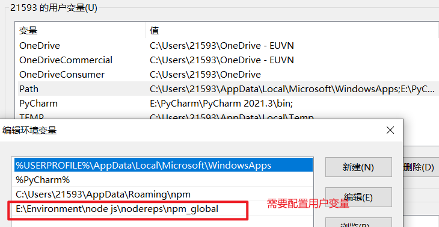
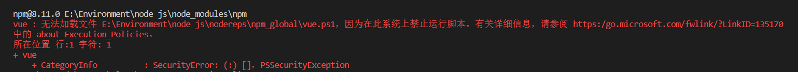
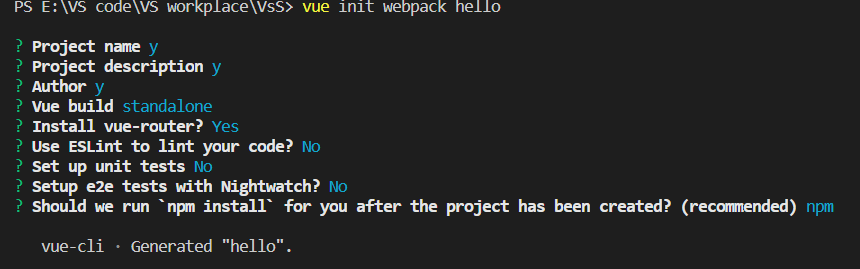

# Element UI

## 1. VUE CLI脚手架

### 1.1 什么是CLI

```
命令行界面：简称CLI 是在图形用户界面得到普及之前使用最为广泛的用户界面。它通常不支持鼠标，用户通过键盘输入指令，计算机接收到指令开始执行，字符界面
```

### 1.2 什么是VUE CLI

```
VUE CLI 是一个基于vue.js进行快速开发的完整系统。使用vue脚手架之后我们开发的页面将是一个完整的系统(项目)
```

### 1.3 VUE CLI优势

- 通过 `@vue/cli` 实现的交互式的项目脚手架。

- 通过 `@vue/cli` + `@vue/cli-service-global` 实现的零配置原型开发。

- 一个运行时依赖 (

  ```
  @vue/cli-service
  ```

  )，该依赖：

  - 可升级；
  - 基于 webpack 构建，并带有合理的默认配置；
  - 可以通过项目内的配置文件进行配置；
  - 可以通过插件进行扩展。

- 一个丰富的官方插件集合，集成了前端生态中最好的工具。

- 一套完全图形化的创建和管理 Vue.js 项目的用户界面。

### 1.4 VUE CLI安装

#### 1.4.1 环境准备

```markdown
# 1.下载node.js
	https://nodejs.org/en/download/
       windows系统： .msi 安装包(exe)指定安装位置
                    .zip  直接解压
                    
                    
# 2. 配置node.js环境变量
   windows系统：
      计算机右键属性---->高级系统变量---->选中path，编辑:
      D:\Program Files\nodejs
      
# 3. 验证node.js环境是否成功
     node -v

# 4. npm 介绍
     npm是前端用于依赖管理的包管理工具，跟java中的maven是一样的作用。
     
# 5. 配置淘宝镜像
   npm config set registry https://registry.npm.taobao.org
   原始镜像：
   npm config set registry https://registry.npmjs.org/
   
# 6. 配置npm下载依赖位置
   windows：
      npm config set cache "D:\Program Files\nodereps\npm-cache"
      npm config set prefix "D:\Program Files\nodereps\npm_global"
      
# 7.验证node.js环境配置
   npm config ls
# 8.查看vue-clic版本
vue -V
```

vue执行报错：



创建vue项目时，提示 **无法加载文件 E:\Software\Node.js\node_global\vue.ps1，因为在此系统上禁止运行脚本。**



> 1.查看当前执行策略

``` cmd
Get-ExecutionPolicy //默认为Restricted：禁止运行任何脚本和配置文件
```

> 修改执行策略

```
Set-ExecutionPolicy -Scope CurrentUser
```

再输入

``` cmd
RemoteSigned  //RemoteSigned:可以运行脚本，但要求从网络上下载的脚本和配置文件由可信发布者签名； 不要求对已经运行和已在本地计算机编写的脚本进行数字签名
```

#### 1.4.2 安装脚手架

```markdown
# 卸载脚手架
      npm uninstall -g @vue/cli   // 卸载3.x版本脚手架
      npm uninstall -g vue-cli    //卸载2.x版本脚手架
      
# vue cli官方地址
          https://cli.vuejs.org/zh/guide/
          
# 安装vue cli
     npm install -g vue-cli //安装2版本
     npm install -g @vue/cli //安装3版本
```

#### 1.4.3 第一个脚手架项目

``` markdown
# 1.创建vue脚手架第一个项目
   vue init webpack 项目名
```



```markdown
# 2. 如何运行
    - 先进入项目目录下
    - 输入命令： npm run dev  /  npm  start
    停止服务： Ctrl+C
    
# 3. 项目结构
	▽hello--------------项目名称
	  ▷build-------------- 用来使用webpack打包使用build依赖
	  ▷config------------- 用来做整个项目配置目录
	  ▷node_modules-----------用来管理项目中使用依赖
	  ▽src----------------------------------书写vue的源代码（重点）
	    ▷assets------------------用来存放静态资源的（重点）
	    ▷components--------------用来书写vue组件（重点）
	    ▷router------------------用来配置项目中路由(重点)
	    App.vue-----------------项目中根组件（重点）
	    main.js-----------------项目中主入口（重点）
      ▷static-------------------------------其它静态资源
     .babelrc-----------------------------将es6语法转为es5运行
     .editorconfig------------------------项目编辑配置
     .gitignore---------------------------git版本控制忽略文件
     .postcssrc.js------------------------源码相关js
      index.html--------------------------项目主页
      package.json-----------------------类似于pom.xml， 依赖管理
      package-lock.json------------------- 对package.json加锁
      README.md---------------------------项目说明文件
     
   
# 4.项目访问
	http://localhost:8080
```

### 1.5 VUE CLI开发方式

`注意:一切皆组件   一个组件中：html代码 css代码  js代码`

`1. vuecli开发方式是在项目中开发一个一个组件对应一个一个业务功能模块，日后多个组件组合到一起就一是一个完整的系统 。`

`2. 日后在使用vuecli进行开发时不再书写html，编写的是一个一个组件（组件的后缀：.vue结尾的文件）,日后打包后会自动编译成html文件。`

### 1.6 在脚手架中使用axios

#### 1.6.1 安装axios

```markdown
# 1. 安装axios
   npm install --save axios vue-axios
   
# 2. 配置main.js中引入axios
   
   import axios from "axios";
   import VueAxios from "vue-axios";

   Vue.use(VueAxios, axios);
   
# 3. 使用axios
   Vue.axios.get(api).then((response) => {
     console.log(response.data)
   })

    this.axios.get(api).then((response) => {
      console.log(response.data)
    })

    this.$http.get(api).then((response) => {
      console.log(response.data)
    })
```

## 2. Element  UI

### 2.1 ELement UI引言

官网地址：https://element.eleme.cn/#/zh-CN

#### 2.1.1 官方定义

`网站快速成型工具`和`桌面端组件库`

#### 2.1.2 定义

`element ui就是基于vue的一个ui框架，该框架基于vue开发了很多相关组件，方面快速开发页面`

### 2.2 安装

#### 2.2.1 通过vue脚手架创建项目

`vue init webpack element(项目)`

#### 2.2.2 在vue脚手架项目中安装element ui

```markdown
# 1. 下载element ui的依赖
   npm i element-ui -S
# 2. 指定当前项目中使用element ui(main.js引入)
    import ElementUI from 'element-ui';
    import 'element-ui/lib/theme-chalk/index.css';
    
    //在vue脚手架中使用 element ui
    Vue.use(ElementUI);
```

### 2.3 按钮组件


#### 2.3.1 默认样式按钮

```html
<el-row>
  <el-button>默认按钮</el-button>
  <el-button type="primary">主要按钮</el-button>
  <el-button type="success">成功按钮</el-button>
  <el-button type="info">信息按钮</el-button>
  <el-button type="warning">警告按钮</el-button>
  <el-button type="danger">危险按钮</el-button>
</el-row>
```

#### 2.3.2 简洁按钮

```html
<el-row>
  <el-button plain>朴素按钮</el-button>
  <el-button type="primary" plain>主要按钮</el-button>
  <el-button type="success" plain>成功按钮</el-button>
  <el-button type="info" plain>信息按钮</el-button>
  <el-button type="warning" plain>警告按钮</el-button>
  <el-button type="danger" plain>危险按钮</el-button>
</el-row>
```

#### 2.3.3 圆角按钮

```html
<el-row>
  <el-button round>圆角按钮</el-button>
  <el-button type="primary" round>主要按钮</el-button>
  <el-button type="success" round>成功按钮</el-button>
  <el-button type="info" round>信息按钮</el-button>
  <el-button type="warning" round>警告按钮</el-button>
  <el-button type="danger" round>危险按钮</el-button>
</el-row>
```

#### 2.3.4 图标按钮

```html
<el-row>
  <el-button icon="el-icon-search" circle></el-button>
  <el-button type="primary" icon="el-icon-edit" circle></el-button>
  <el-button type="success" icon="el-icon-check" circle></el-button>
  <el-button type="info" icon="el-icon-message" circle></el-button>
  <el-button type="warning" icon="el-icon-star-off" circle></el-button>
  <el-button type="danger" icon="el-icon-delete" circle></el-button>
</el-row>
```

`总结： 日后使用element-ui的相关组件需要注意的是：所有组件都是以el-组件名称开头`

### 2.4 按钮组件的详细使用

#### 2.4.1 创建按钮

`<el-button>默认按钮</el-button>`

#### 2.4.2 按钮组

```html
<el-button-group>
  <el-button type="primary" icon="el-icon-arrow-left">上一页</el-button>
  <el-button type="primary">下一页<i class="el-icon-arrow-right el-icon--right"></i></el-button>
</el-button-group>
```

### 2.5 Link 文字链接

	#### 2.5.1 文字链接组件的创建

```
<el-link>默认链接</el-link>
```

### 2.6 layout(栅格布局)组件

`通过基础的24分栏，迅速简便的创建布局`

`在element ui中布局组件将页面划分为多个行row,每行最多分为24栏（列）`

```html
    <el-row :gutter="20">
      <el-col :span="18"
        ><div class="grid-content bg-purple">我占18份</div></el-col
      >

      <el-col :span="6"
        ><div class="grid-content bg-purple-light">我占6份</div></el-col
      >
    </el-row>
```

### 2.7 Container布局容器组件

```markdown
用于布局的容器组件，方便快速搭建页面的基本结构：

<el-container>：外层容器。当子元素中包含 <el-header> 或 <el-footer> 时，全部子元素会垂直上下排列，否则会水平左右排列。

<el-header>：顶栏容器。

<el-aside>：侧边栏容器。

<el-main>：主要区域容器。

<el-footer>：底栏容器。
```

#### 2.7.1 创建布局容器

```
<el-container>  </el-container>
```

#### 2.7.2 容器嵌套使用

```html
 <el-container>
      <el-header>Header</el-header>
      <el-container>
        <el-aside width="200px">Aside</el-aside>
        <el-main>Main</el-main>
      </el-container>
      <el-footer>Footer</el-footer>
    </el-container>
```

### 2.8 导航菜单

```html
  <el-menu
      default-active="2"
      class="el-menu-vertical-demo"
      @open="handleOpen"
      @close="handleClose"
      background-color="#545c64"
      text-color="#fff"
      active-text-color="#ffd04b">
      <el-submenu index="1">
        <template slot="title">
          <i class="el-icon-location"></i>
          <span>导航一</span>
        </template>
        <el-menu-item-group>
          <el-menu-item index="1-1">选项1</el-menu-item>
          <el-menu-item index="1-2">选项2</el-menu-item>
        </el-menu-item-group>
    </el-menu>
```


